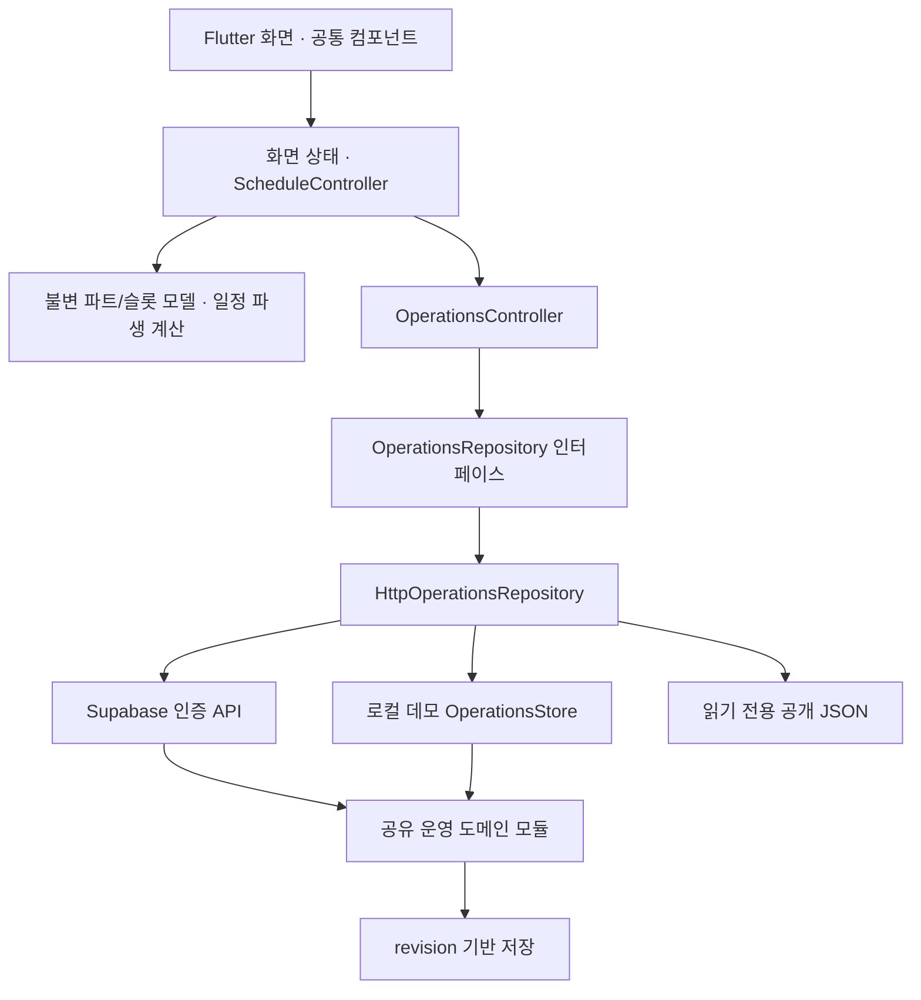

## 임시 공용 로그인·저장 최적화 · 2026-09-29

사용자 승인으로 지정한 기존 계정의 매장을 모든 방문자가 함께 조회·수정한다. 고정 아이디와 마스킹 필드는 서버 세션 발급 진입점이며 실제 비밀번호를 배포하지 않는다. 로그인 버튼 후 Supabase 세션을 유지해 재방문 자동 로그인한다. SSO는 앱 등록 시 적용한다. 이전 D-051 무로그인 샘플 자동 진입을 대체하며 별도 샘플 둘러보기만 읽기 전용이다.

설정은 영역별 문서와 매장 revision으로 저장한다. 활성 화면에서 30초 간격 변경 확인, 동일 revision/권한/매장/시간창에서는 전체 상태를 전송하지 않는다. [데이터 계약·한계](DATABASE_AND_PERFORMANCE.md).

# tap2work 아키텍처와 UI 운영 기준

최종 수정: 2026-09-30. 이 문서는 **현재 구현의 구조와 변경 규칙**을 관리한다. 제품 결정의 원본은 [project-state.json](project-state.json), 제품 범위는 [PRODUCT.md](../PRODUCT.md)다. UI/UX 변경은 [맞춤 UI/UX 가이드라인](UI_UX_GUIDELINES.md)을 우선 읽는다. 새 화면은 [공통 UI 규칙](TOSS_UI_PROMPT_TEMPLATE.md)과 [스크린샷 참조 기록](REFERENCE_REDESIGN_2026-09-28.md)을 함께 읽고 만든다. 미구현 기능을 구현된 것으로 취급하지 않는다.

설정값과 화면 진입·저장·파생 화면의 연결은 [UI_SETTINGS_RELATIONSHIP_MAP.md](UI_SETTINGS_RELATIONSHIP_MAP.md)에 관리한다. 연결 변경은 해당 표와 `npm run check:ui-links` 및 관련 실행 테스트를 함께 갱신한다. 임시 `AUTO_SAMPLE_STORE=true` 진입은 샘플 owner를 열고, `false`에서 인증 진입을 복원한다. 공개 사이트 샘플의 입력은 저장되지 않으며 인증 매장 저장과 구별한다.

## 제품 구조

| 주요 메뉴 | 책임 | 하위 기능 |
|---|---|---|
| 업무 | 파트별 오늘의 실행 | 전체 파트/주방/홀/관리 필터, TAP·Task 수행, 준비품, 설정 시에만 주문처리 보드 |
| 매뉴얼 | 공통 지식과 실행 방법 | 검색, 디렉토리, Task 연결 매뉴얼, 메뉴·레시피 |
| 근무표 | 시간과 파트별 크루 배정 | 주간·월간 일정, 크루 정보, 인건비, 첫 근무 교육, 채용 초안 |
| 우리매장 | 매장 운영 설정 | 파트, 영업시간대, 주문 시스템 설정, 권한, 재고·발주·입고, 배치·동선 |

사람의 제품 명칭은 **크루**로 통일한다. **파트**(주방·홀·관리·추가 파트)는 업무 분류이며, **직책**(사장·매니저·크루)은 접근 권한이다. 파트를 바꿔도 직책이 올라가거나 급여 정보가 노출되지 않는다. 직무를 별도의 관리 축으로 추가하지 않는다. 채용은 게시되지 않는 초안으로 유지한다.

## 구현 계층

| 디렉토리/파일 | 소유 책임 |
|---|---|
| `app/lib/ui/` | 화면, 사용자 입력, 접근성, 시트, 화면 크기 대응 |
| `design_tokens.dart`, `design_system.dart`, `components.dart` | 색·글자·간격·모션·선택 컴포넌트의 단일 구현 |
| `app/lib/state/schedule_controller.dart` | 주/월·선택 날짜·파트 필터·편집 가능 상태 |
| `app/lib/domain/part_schedule.dart` | `WorkPart`, `RosterSlot`, 요일별 슬롯과 날짜별 덮어쓰기 합성, 야간 시각, 중복 인원 없는 충족률 |
| `app/lib/state/operations_controller.dart` | 서버 스냅샷, refresh, 작업 상태, actor 변경, revision 충돌 처리 |
| `app/lib/domain/operations_repository.dart` | 운영 읽기/쓰기 계약 |
| `app/lib/data/http_operations_repository.dart` | 로컬/공개/인증 HTTP 전송 |
| `developer/operations.mjs` | 운영 요청 진입점, 저장 직렬화, 권한별 응답 투영, 도메인 호출 |
| `developer/parts.mjs` | 파트 ID 검증, 기존 데이터 분류 이관, 영업시간 기반 슬롯 생성 |
| `developer/workplace.mjs` | 파트·요일 시간대·날짜별 슬롯·주문 보드·직책 제한 설정 |
| `developer/staff.mjs`, `labor.mjs` | 크루·배정·출퇴근·야간 중복 검증·인건비 계산 |
| `developer/checklists.mjs`, `task_settings.mjs` | 업무 양식·스냅샷·순서·수량·파트별 수행 검증 |
| `developer/supabase_backend.mjs` | 검증된 계정과 매장 멤버십, 클라우드 저장 경계 |
| `app/lib/state/work_controller.dart` | 기기 내 첫 근무 연습과 별도의 버디 확인 |

근무표부터 도메인/화면 상태를 분리했다. 기존 화면에는 JSON 접근과 로컬 상태가 남아 있다. 전체 앱이 완전히 정규화된 도메인 모델이나 일괄 MVVM으로 전환되었다고 표현하지 않는다. 앞으로 변경하는 기능부터 계산·검증을 도메인으로 이동하고 화면에는 표현과 입력만 남긴다. 기존 repository를 거치지 않는 화면별 HTTP 호출을 만들지 않는다.

## 데이터 계약과 이관

- `workplace.parts[]`: 안정적인 `id`, 표시 `name`, 정렬 순서, `hidden`. 숨김은 삭제가 아니며 과거 근무/업무/매뉴얼의 연결을 보존한다. `roles`/`duties`는 과거 데이터 분류를 위한 호환 정보이며 새 설정에서 편집하지 않는다.
- 크루의 `workProfile.partIds[]`가 담당 파트다. 빈 배열은 기존 설정의 ‘전체 파트’ 의미를 유지한다. `bands[]`는 선호 시간대 정보이며 자동 근무 배정이나 접근 권한이 아니다.
- 업무 양식·실행 업무·근무 배정은 `partId`로 연결한다. 업무의 `partId: null`은 전체 파트다. 단계의 `settings.partOverride`는 특정 단계의 담당 파트를 바꾸며 null은 TAP을 따른다. 기존 `requiredRole`/`roleOverride` 검증은 구 데이터 호환에만 남긴다.
- 저장 키 `tappers`, `tapperId`, `save_tapper`와 과거 ID는 API·인건비·출퇴근 기록의 연결을 깨지 않도록 유지한다. 이 이름을 UI나 신규 제품 용어로 노출하지 않는다. 키를 일괄 치환하는 데이터 손실성 이관은 하지 않는다.
- `partModelVersion`으로 이관 버전을 기록하고 누락된 분류만 보완한다. 이미 저장된 파트 선택을 기존 직무에서 다시 추론해 덮어쓰지 않는다.
- `docs/project-state.json`은 운영 데이터베이스가 아니다. `.local/operations-demo.json`, 인증 매장 저장소, 기기 내 학습 진도와 분리한다. 개인정보·토큰을 문서/샘플에 넣지 않는다.

## 근무표와 영업시간

1. 서버의 `rosterTemplates[]`는 요일 × 활성 파트 × 영업시간대를 생성한다. 요일별 `workplace.days`가 있으면 우선 사용한다. 빈 목록은 해당 요일 휴무다. 요일별 설정이 없으면 매장 기본 `profile.hours`, 그마저 없으면 과거 `staffingSlots`를 호환한다.
2. 이 슬롯은 **필요 시간**이고 크루를 자동 배정한 기록이 아니다. `staffShifts[]`가 실제 계획 배정이다. 근무 배정은 출퇴근이나 지급 기록과도 다르다.
3. `rosterOverrides[]`는 날짜·파트·원본 슬롯 ID별 시간 조정이다. 다른 날짜나 전체 영업시간을 바꾸지 않는다. 원본 시간이 나중에 바뀌어도 명시적으로 조정한 날짜와 기존 근무 배정은 유지한다. ‘영업시간으로 되돌리기’로 조정을 해제한다.
4. 슬롯 클릭 시 시작/종료를 30분 단위로 수정하거나 크루를 지정한다. 배정된 근무는 수정·배정 해제가 가능하다. 새 배정은 선택 요일에 4주/12주 반복할 수 있다. 반복·단건 배정 모두 서버가 파트 소속, 날짜, 시간과 자정을 넘는 중복 근무를 검증한다.
5. 주간 보기는 왼쪽 시간축을 고정한다. 가로 방향은 요일, 요일 아래는 파트다. 30분은 최소 48px 높이이며 동시 근무가 많으면 열 폭을 늘려 이름을 가리지 않는다. 가로·세로 스크롤로 접근하고 글자를 줄여 맞추지 않는다. 야간 근무는 원래 시작일 열에서 ‘다음 날’ 종료로 표시한다.
6. 충족률은 30분마다 한 크루를 한 필요 슬롯에만 집계한다. 자정 이전에 시작한 근무도 해당 실제 시간에 반영한다. 월간 인원 표시는 배정 건수 기반이다.
7. 새 편집은 열 때의 revision으로 저장한다. 충돌은 자동 덮어쓰지 않는다. 파트/시간대 설정은 충돌 시 초안을 보존한다. 근무 슬롯 시트는 저장 실패 메시지를 보여주고 다시 열어 현재 상태에서 수정한다.

## 업무 필터와 주문 연결

업무 메뉴의 필터는 파트만 사용한다. TAP그룹 필터를 재도입하지 않는다. 매뉴얼/양식의 폴더 ID와 디렉토리는 지식 구성과 과거 기록을 위해 유지한다.

`store.profile.orderSystem.enabled`는 사장님이 설정하는 주문처리 보드 사용 여부다. 기본 OFF이고 서버가 `orderBoardEnabled`를 응답한다. OFF면 진행 중/완료 주문 카드 모두 업무 보드에서 숨기며 주문 기록은 삭제하지 않는다. 토글이 외부 POS 인증·동기화를 수행하지 않는다. 현재 `connectionStatus: not_connected`이며 실제 연동 기능은 별도 통합 작업이다.

## 공통 UI/UX 규칙

폼·시트·시작 화면의 현재 구현은 [가독성 개선 기준](UI_READABILITY_2026-09-28.md)을 따른다. `AppEditorScaffold`/`AppSheetFooter`/`AppFormSection`은 제목·저장·섹션의 공통 구현이다. `AppStartup`은 첫 Flutter 화면을 먼저 그린 뒤 초기화하며, 웹 bootstrap 덮개는 첫 프레임에서 제거하고 매장 데이터는 `AppLoadingScreen`에서 기다린다.

앱 전체 모션의 계약·범위·검증 기준은 [MOTION_GUIDE.md](MOTION_GUIDE.md)로 관리한다. `AppMotionScope`가 공통 버튼의 상태 반응을 적용하고 `AppContentTransition`·`showAppDialog`·시트 timing이 화면 이동을 통일한다. 모션은 서버 저장 상태를 만들거나 지연시키지 않는다.

- 스크린샷의 차콜 배경, 다크 카드, 밝은 Pretendard, 초록/코랄 강조색을 사용한다. 참조 앱의 개인 이름·매장 정보는 복제하지 않는다.
- 단일 선택은 `AppPicker`/`AppPillField`/`AppChoiceGroup`/`AppSegmented`가 제공하는 동일한 pill 스타일이다. 필터는 `전체 파트`와 동적 파트 이름을 사용한다. 복수 선택도 같은 pill의 선택 상태로 표현한다.
- 긴 선택 목록은 내부 스크롤, 주요 메뉴는 가로 스크롤을 허용한다. 터치 영역과 글자 확대를 보존한다. 빈 상태·읽기 전용·저장 실패를 명확히 보여준다.
- 화면별 색상·별도 dropdown 스타일을 추가하지 않는다. 설정/상세는 공통 시트, 진행 작업에는 기존 press/reduced-motion 규칙을 적용한다.

## 보존해야 할 경계

직책 권한은 서버에서 검증한다. 파트 소속은 급여 접근을 부여하지 않는다. 급여·연락처와 사장 전용 설정은 서버 응답에서 분리한다. 직책별 설정은 기존 권한을 줄일 수만 있다. 데모 actor 헤더는 실제 인증이 아니다.

발주로 재고를 증가시키지 않는다. 입고가 실제 재고를 바꾼다. 재고 점검은 마지막 발주 N일 후 1회이며 중간 실사/입고로 미뤄지지 않는다(D-017). 배치도 수정은 bounds/overlap과 연결된 장소 ID를 보존한다. 첫 근무 연습과 버디 승인은 별도로 유지한다.

## 변경·검증·배포 절차

1. 이 문서, PRODUCT, 최신 project-state, UI 규칙을 읽는다. 사용자의 새 지시와 충돌하는 기존 결정을 수정할 때 이전/이후/이유를 기록한다.
2. 데이터/권한은 서버 모듈에, 계산은 도메인에, 화면 상태는 controller에 둔다. 변경된 데이터 계약과 UX를 이 문서에 같은 작업으로 반영한다.
3. `flutter analyze`, 관련 Flutter 테스트 및 전체 회귀 테스트, `npm run test:console`, `npm run check`, `git diff --check`를 실행한다. 근무표는 320/390/1200px·확대 글자·야간·동시 근무·충돌을 검증한다.
4. `npm run build:app`은 로컬 Flutter 웹, `npm run build:site`는 별도 공개 빌드다. 공개 빌드는 새 샘플만 포함하고 `.local`과 로컬 쓰기 API를 포함하지 않는다.
5. 승인된 배포는 Supabase `operations` 함수와 GitHub Pages를 각각 배포/검증한다. main push의 Pages workflow는 분석·테스트·빌드를 다시 실행한다. 도메인 응답과 workflow 결과를 확인한다.
6. 실제 수행한 결과/실패/미수행 검증을 project-state의 새 history에 기록하고 revision을 올린다. 웹 성공을 iOS/Android 네이티브 검증으로 적지 않는다.

## 후속 과제

현재 정산 정책·저장 연결은 아래 추가 계약을 따른다.

실제 주문 시스템 동기화, 실계정 초대, 보건증 보안 저장, GPS/Wi-Fi 출퇴근 인증, 개별 권한 예외와 추가 정산 정책은 미구현이다. 인증/개인정보가 필요한 기능은 데모 UI를 완성된 연동으로 표시하지 않는다. 기존 화면의 도메인 모델 전환은 기능별로 진행한다.

## 매장 공통 정산 정책 · 2026-09-28

`developer/payroll_settings.mjs`가 정책 검증·정산 기간·일별 순근무 시간 반올림을 담당한다. 사장님만 `save_payroll_settings`를 호출하며 이전 정책은 `payrollSettingsHistory`에 보존한다. 우리매장/인건비/시급 편집에서 동일한 `PayrollSettingsScreen`으로 접근한다.

- `cycle`: monthly/weekly. 월급은 시급제의 월 단위 지급 주기이며 고정 월급 계약 계산이 아니다.
- `monthStartDay`: 1–31, 짧은 달은 말일로 보정한다. `weekStartDay`: 월=1…일=7. 한국 날짜 경계를 사용한다.
- `roundingMinutes`: 0/1/5/10/30. 휴게를 제외하고 중복 구간을 합친 일별 순근무 분을 한 번 반올림한다. 출퇴근 증빙과 연장/야간/휴일 발생 기준은 원본 시간을 보존한다. 반올림 설정은 법적 임금 의무를 면제하지 않는다.
- `businessSize`: under5/fivePlus. 첫 저장 전 unknown을 유지하고 사용자가 선택해야 저장한다. 이후 주간 계산도 매장 공통 값을 사용한다.
- `includeWeeklyRest`: OFF면 발생 주수와 발생 예상액은 유지하고 합계에서 금액을 제외한다. 발생 요건 미확인은 미확인으로 남긴다. 계약·근태·휴일 검토를 보존한다.

최초 저장 전 기존 계산을 유지한다. 저장 후 기간·기본급 예상에 반영하되 과거 지급 기록은 다시 쓰지 않는다. 주간 인건비는 주간 예상이며 정산 기간 전체의 확정 명세서는 아니다. 지원 범위는 WEEKLY_LABOR_2026-09-27.md를 따른다. 규모별 수당은 [고용노동부 안내](https://1350.moel.go.kr/rtmview.do?id=1000274239)를 확인했다.

## Supabase 기본 진입과 저장

`CloudWorkspace`는 로그인 → 새 계정의 매장 생성 → 인증된 운영 화면 순서로 진입한다. 모두 공통 MaterialApp 테마 내부에 둔다. 로그인 전 샘플 API를 자동 요청하지 않는다. 공개 빌드에 Supabase URL/공개 키가 없으면 빌드를 실패시킨다.

설정은 `OperationsController.act` → Bearer 인증 → `createCloudHandler`의 소속/직책 검사 → `OperationsStore` → `tap2work_patch_state`로 저장한다. 파트/영업시간/권한/주문 보드/정산은 서버 전용 `tap2work_documents` 영역별 문서에 저장하며 `tap2work_state`는 revision 잠금과 이관 전 복구 사본을 보유한다. revision 충돌은 409로 거절하고 직책별 응답을 반환한다. 비로그인 쓰기를 허용하지 않는다.

보건증·위치/Wi-Fi 인증·실계정 초대·외부 POS는 저장 연결만으로 구현된 기능이 아니다. 미연동 표시를 유지한다. 첫 근무 학습 진도는 기존 기기 로컬 범위다.

로고는 기존 `generate_brand.py` 도형을 유지하며 외곽만 alpha=0으로 렌더링한다. Flutter와 일반 웹 아이콘은 투명 PNG, 네이티브/마스커블 아이콘은 불투명 청록 배경이다.

## TAP → Task → 매뉴얼 편집 계약 · 2026-09-29

업무 보드에는 TAP 추가와 길게 누르기 안내를 제공한다. 길게 누르면 이름·이동·삭제를 직접 처리하고 선택 TAP의 규칙은 해당 원본 ID로만 연다. 기존 보드 편집 진입을 대체한다. 매뉴얼의 Task 설정은 templateId/sourceStepId로 해당 Task의 규칙만 표시한다. 사라진 대상은 오류를 표시하며 다른 양식을 대신 열지 않는다.

`save_task_step(taskId, stepId?, title, manual, revision)`은 오늘의 미완료 실행을 수정한다. stepId가 없으면 서버가 UUID로 새 Task를 끝에 추가한다. 사용자 확정에 따라 선택한 실행과 연결된 기본 양식을 함께 갱신하고 원본 버전을 올린다. sourceTemplateId/sourceStepId가 있으면 이를 우선하며 원본이 없는 주문 Task는 실행만 변경한다. 완료된 형제, 다른 실행, 과거 기록, 수량/순서 규칙은 보존한다. 전체 완료/완성 재고 반영 TAP은 편집할 수 없으며 30개 한도와 Korean day/revision/직책 제한을 서버에서 검사한다. 기존 내용은 manualHistory에 남긴다.

서버 `canEditTasks`는 사장 또는 tasks 제한이 꺼지지 않은 매니저에만 true다. Flutter의 보드/TAP/Task/매뉴얼 편집과 정렬 UI가 이를 소비하고 서버는 새 저장 액션 및 기존 정렬 액션을 tasks 제한으로 검증한다. 파트와 접근 권한은 분리한다. 크루 파트 미선택=전체 파트 가능은 사용자 확인을 거쳐 유지하며 UI에 명시한다.

TaskStepEditor는 원래 자리에서 포커스되는 제목·매뉴얼 입력과 저장/취소를 제공한다. 열 때 actor/revision을 고정하고 저장 실패는 초안을 유지한다. 공개 체험은 OperationsController의 인메모리 편집만 사용하며 POST하지 않는다. 자동 드래그 손잡이를 끄고 왼쪽 손잡이를 명시해 오른쪽 매뉴얼 동작과 겹치지 않게 한다. 재고 상세의 반복 제목을 제거하고 상태 표시는 Wrap으로 좁은 화면/확대 글자를 수용한다.

## 직접 편집 계약 · 2026-09-29

`direct_edit.dart`의 DirectEditFrame/Bar는 길게 누르기·우클릭·접근성 진입과 명시적 완료를 제공한다. AppMotion의 180ms·작은 회전 토큰을 사용하고 동작 줄이기/비활성 TickerMode/권한 회수/화면 해제에서 반복 애니메이션을 중지한다. 업무·매뉴얼·근무표는 같은 모드를 사용한다. 별도의 보드/구조 편집 진입 버튼은 제거하고 상세 규칙/본문/배정 설정만 문맥 안에 유지한다.

`developer/direct_edit.mjs`는 `edit_work_node`와 `edit_manual_node`의 이름·추가·삭제를 담당한다. 업무 변경은 오늘 미완료 실행과 연결된 양식, 매뉴얼 변경은 양식만 대상으로 한다. 원본 삭제 사본은 서버 전용 operationEditHistory에 보관하고 응답에서 제외한다. 기본/연결 그룹, 마지막 Task, 완료/재고 반영/주문 연결 실행을 보호한다. 현재 완료 이력은 수정하지 않는다. 영역별 문서 저장/CAS가 새 영역도 그대로 보존한다.

근무표는 `canEditSchedule` 서버 투영을 사용한다. 편집 중 DragTarget이 날짜·파트·30분 위치를 결정하고 원래 revision으로 저장한다. 기존 중복 근무·파트 자격 검증을 재사용한다. 배정 근무는 label, 필요 슬롯은 날짜별 name을 지원한다. `delete_roster_slot`은 해당 날짜 override의 hidden=true로 표시하고 기본 영업시간을 보존한다. 빈 슬롯 드래그는 같은 날짜/파트 안에서 시간만 이동하며 배정 근무는 날짜·파트를 옮길 수 있다. 근무 이름을 크루 이름과 분리하는 것은 질의 답변 전 적용한 기본 구현이며 사용자 선택은 아직 proposed다.

## 2026-09-29 근무 배정·변경 승인·개인 언어 준비

`crew_patterns.mjs`는 재사용 양식(crewPatterns)과 날짜별 유효 근무(staffShifts)를 분리한다. generated shift의 patternId/base는 원본 계약이며 달력 저장은 유효 필드만 바꾼다. A/B주는 저장한 월요일 anchor를 기준으로 계산한다. 명시적 적용 기간(오늘 이후 최대 90일)의 해당 pattern만 교체하며 별도 배정·출퇴근은 보존한다. 이미 시작했거나 승인 반영된 근무, 범위 밖으로 옮긴 근무는 교체를 거절한다. 전체 후보에 대한 겹침·파트 검증이 성공한 뒤 원자 저장한다. 기존 section DB CAS를 재사용해 별도 마이그레이션/정기 배치 비용을 추가하지 않는다.

`shift_requests.mjs`의 shiftChangeRequests는 본인 근무 휴무/단축 신청과 사장님 승인에 한정한다. pending은 근무를 바꾸지 않고 approved에서만 status/time을 변경한다. before/after/version/신청·처리 시각을 저장하고 원본 근무가 바뀌었으면 승인을 거절한다. 직원은 자신의 신청만 투영받는다. 출퇴근/급여 지급 원본은 역수정하지 않는다.

임시 공용 계정의 계정 메뉴에서 직원 화면으로 전환할 수 있다. 기존 owner 멤버십을 검증한 서버가 지정 sharedEmployeeId의 active crew만 선택해 권한을 축소한다. 실제 employee JWT는 이 경로로 owner가 될 수 없다. 이 기능은 같은 공용 인증 세션의 역할 보기 전환이며 개인별 SSO 계정을 발급한 것이 아니다. 신규 단기 계약 크루 연결은 명시적 setup_shared_employee action으로 수행하며 기존 크루 계약·급여·근무는 변경하지 않는다. 시급 0은 신규 미설정 초기값으로 실제 계약 금액을 의미하지 않는다. actor/controller를 교체해 이전 역할의 초안을 재사용하지 않는다.

영업시간 설정은 휴무 → 교대 수 → 경계 시간/파트별 인원으로 통일한다. workplace.days[weekday]는 **배열**이며 band.headcounts[partId]가 필요 슬롯 수다. save_workplace_hours는 7일 원자 저장, 기존 save_workplace_day는 구버전 호환 API로 유지한다. 프로필 운영 탭은 공통 영업시간/파트 관리로 이동해 중복 편집을 제거한다. 자정을 넘긴 후의 추가 교대는 다음 요일에 설정한다. 날짜별 overrides와 기존 배정은 기본시간 변경으로 삭제하지 않는다.

달력 drag target은 컬럼 전체 한 곳이다. 실제 저장과 같은 30분 floor 경계에 ghost/시각 라벨을 표시하고 하단 handle로 종료를 조절한다. gesture 시작 revision/actor를 보존하며 끝에서만 저장한다. 움직임 줄이기, 기존 키보드 시간 시트, 파트 ID 연결을 유지한다.

공휴일은 [holidays-kr](https://github.com/hyunbinseo/holidays-kr)의 공개 연도별 JSON을 날짜 정보만으로 읽는다. 월력요항 가공 자료의 출처와 MIT license를 번들에 보존한다. 캘린더에서만 비동기 조회하며 연도별 메모리 캐시와 번들 fallback을 사용해 최초 앱 로딩·매장 DB 비용에 추가하지 않는다. 실패 시 저장 달력 또는 미확인 표시, 공휴일 때문에 자동 휴무로 바꾸지 않는다. 2026-09-29 가져온 번들은 업데이트 시 갱신하며 런타임은 새로 열린 세션에서 최신 연도를 확인한다.

다국어는 [개인 언어 계획](LOCALIZATION_PLAN.md)의 BCP-47 선호/유효 언어 계약과 기본 fallback만 준비했다. 실제 번역·언어 선택·다국어 초대 발송은 미구현이다.

## 매뉴얼 영역별 직접 편집 · 2026-09-29

`ManualWorkspace`의 편집 상태는 nullable directory/content 범위다. 한 영역만 흔들림과 편집 동작을 활성화한다. 디렉토리의 `DirectEditFrame(controls: false)`는 기존 트리 행을 감싸고, 행 안의 ⋯ 메뉴와 손잡이가 이동·이름·삭제를 담당한다. 들여쓰기와 종류별 아이콘/펼치기를 유지한다. 오른쪽 Task 카드 편집 모양은 유지한다. Task를 폴더에 드롭하면 그 폴더의 TAP을 고르는 UI를 거쳐 기존 `move_manual_node` 계약에 전달한다. Task를 폴더 직속에 저장하지 않는다. revision/actor 검증, 마지막 Task 보호, 실행 스냅샷 보존은 기존 서버 정책을 사용한다. 좁은 화면 영역 전환과 권한/계정 변경은 편집 상태를 종료한다.

## 영업시간 진입과 근무표 버튼 정렬 · 2026-09-29

우리매장 영업시간 설정·준비 목록·프로필 운영과 근무표 영업시간·인원은 `openWorkplaceHours` 하나로 같은 `WorkplaceSettings(section: hours)`를 연다. 휴무/교대/파트별 필요 인원과 저장 계약은 동일하며 별도 폼/DB를 만들지 않는다. 근무표 두 동작은 동일한 버튼 치수와 부모 폭/글자 배율 기반 2열 또는 세로 배치를 사용한다.

## Empty manual definitions (2026-09-29)

The user confirmed folders and TAPs may be empty. ManualWorkspace keeps taskTemplates metadata independently from manualSearch rows, including public-preview moves. Long press selects the add parent. New TAPs start with steps: []; last Task move/delete preserves the TAP. Shared checklist validation accepts 0-30 Tasks. ensureDueTasks skips empty definitions; existing execution snapshots and work-action protections remain. This supersedes the earlier last-Task protection for manual definitions only.

## 설정 시트 정렬 · 2026-09-29

AppEditorScaffold는 688px 공통 읽기 폭과 위쪽 본문 정렬, AppSheetFooter는 640px 입력 폭을 사용한다. AppSheetActions는 같은 폭·최소 높이의 반응형 버튼 행이다. PreparedItemEditor가 준비품/실제 수량 입력의 컨트롤러·초안·opening actor/revision을 소유하며 성공 시에만 닫는다. API/DB 계약은 기존 save_prepared_item/count_prepared_item을 유지한다. 파트·직책 권한·크루 파트 저장도 고정 footer를 사용한다. [검토 범위·검증](SETTINGS_SHEET_AUDIT_2026-09-29.md). 매뉴얼 트리의 이름 텍스트는 편집 모드에서 이름 변경을 열고 화살표/손잡이는 펼치기/이동을 유지한다. 메뉴 연결 항목은 표시 이름을 별도로 저장하며 삭제 제한을 유지한다.

### Manual display names (2026-09-29)

Sales-linked template/step `manualTitle` is an optional display override. `edit_manual_node(rename)` stores this override without changing sales menu names or canonical titles. Manual tree/search/detail/editor use `manualTitle ?? title`; `save_checklists` validates and preserves overrides, while menu synchronization updates canonical titles only. An alias follows a moved Task. Existing revision/role guards and linked-menu delete protection remain. No SQL migration is required for this JSON metadata.

## Work assignment integration · 2026-09-30

`developer/work_assignments.mjs` owns assignment validation, occurrence expansion, effective roster projection, completion eligibility and completion evidence. All metadata uses the existing JSON state/CAS; no SQL migration. Schedule writers remain responsible for stable `workplace.days[weekday][].id` and `staffShifts[].timeBandId`. Validation and occurrence band lookup both consume `workplaceBandDays(state,{includeHours:true})`, the same advertised stable legacy/profile-hours band contract as workplaceView/rosterTemplates.

- `taskTemplates[].settings.assignment`: `{mode:'scheduled', timeBandIds:[bandId], partId:requiredPartId, crewIds:[]}`, `{mode:'crew',crewIds:[tapperId],timeBandIds:[],partId:null}`, or `anyone`/`legacy` with empty IDs/null part. Task `steps[].settings.assignment` accepts these plus `{mode:'inherit'}`. Missing TAP assignment means legacy; missing Task assignment means inherit. Older clients omitting fields preserve existing assignment settings. Comparison normalizes absent TAP legacy and Task inherit defaults and ID-list ordering, so adding explicit defaults cannot regenerate today’s work. Scheduled saves require every selected band to have positive headcounts[partId]; only non-custom legacy bands default missing counts to one. `save_tap_settings` remains the sole settings action.
- Scheduled Tasks generate one shared occurrence per template/day/stable band ID, never per crew or required headcount. Task scheduled overrides appear only in their selected band occurrences; non-scheduled Tasks accompany the TAP occurrences. Existing recurrence/enabled rules still apply. Overlapping bands remain distinct; their required headcounts are additive in the schedule domain.
- `assignmentView` is result-only on TAP/Task: `{mode,assignees:[{id,nickname,actorId?,start,end,startDate?,endDate?}],partId,timeBandId,timeBandName,unassigned,isMine}`. IDs identify tappers; interval strings are effective `HH:mm` roster intervals, clipped to the immutable occurrence band window (scheduled) or KST calendar day (anyone), including split OFF segments. startDate/endDate distinguish midnight boundaries. Parent assignees are the deduplicated union of Task intervals. Crew mode names active explicitly selected people even without a shift (`start/end:null`). All-legacy TAP/Task responses omit assignmentView; UI labels legacy eligibility as possible, never actual assignment. A parent with differently assigned Task overrides exposes mode:mixed and its actual assignee union; mixed is projection-only, never a saved assignment mode. `isMine` means actual assignment, not support permission.
- Scheduled matching requires the effective shift part and overlapping interval. Explicit `timeBandId` must equal the occurrence band; no fallback to another overlapping band. Old shifts without a band ID use part+overlap. Overnight next-day segments are matched by absolute KST interval. Generated occurrences persist assignmentWindow:{id,name,date,start,end}; renaming/deleting/changing a band cannot erase or change an existing occurrence window. Anyone means active people with a non-OFF/non-leave effective shift overlapping the task date’s KST 00:00–24:00, including previous-night shifts, with no part restriction.
- Server completion uses the same assignment rules. Scheduled tasks permit active eligible part teammates as support even without a scheduled shift. Crew mode permits selected active people; anyone permits today's scheduled active people. Owner/manager overrides and existing workplace completion restrictions remain. Client assignmentView/canComplete input is never trusted.
- Pending leave keeps effective shifts unchanged. Approved leave/partial OFF/replacement changes unfinished projections immediately. On completion the server stores `assignmentSnapshot` evidence on the Task and completed TAP; responses expose it as assignmentView. Completed evidence and prior-day records are not recomputed. Reopening clears the corresponding evidence before the next completion.
- Assignment setting changes archive/regenerate **today's unstarted** executions with current band occurrences. Started means a completed Task or processing TAP; started/completed executions keep their settings and evidence. A started legacy daily execution blocks additional same-day occurrences. Other settings-only changes retain existing next-occurrence behavior. UI action label: “설정 저장”; explanatory text distinguishes assignment changes today on unstarted work, other rules next occurrence, and preserved started/completed records.

Verification: `developer/test/work_assignments.test.mjs` exercises generation/idempotency, distinct overlapping bands, fallback matching, support/wrong-part/manager restrictions, anyone/OFF, actual approval and replacement APIs, partial OFF, snapshots/history, settings timing, Task overrides, recurrence and overnight intervals.

## Approved schedule exceptions · 2026-09-30

`crew_patterns.mjs` owns recurring entries `{week,weekday,partId,timeBandId?,start,end}`. `timeBandId` references the stable `workplace.days[weekday][].id`; generated shifts and `base` retain it. Reapply preserves entire occurrence dates with approved exceptions, linked replacements, pending requests, started shifts, attendance or out-of-range moves, updating other dates atomically. Independent shifts remain; unrelated overlaps still reject the application. Attendance dates are Korean dates.

`shift_requests.mjs` owns request/review/cancel. `request_shift_change(kind: leave|shorten|partial_off,start?,end?,reason)` leaves effective shifts unchanged while pending. `partial_off` start/end designate the OFF interval, including next-day clocks for overnight work. Requests retain `before`, `after`, `segments`, `vacancies[{id,date,partId,timeBandId?,start,end}]` and version. Owner approval checks the unchanged shift/timeBandId, start time and attendance, then keeps the original shift ID on the first effective work segment and creates a second with `sourceShiftId` when needed. Each segment keeps `approvedRequestId`, pattern/base and timeBandId; full leave retains the original row with status leave. `appliedShiftIds` links the resulting rows. These ordinary staffShifts are the task handover source.

Owner-only `review_shift_change(decision: assign_replacement,id,vacancyId,tapperId)` fills one approved vacancy. The server checks active eligible same-part crew, time overlap, approved OFF, attendance and start time. The new shift retains vacancy timeBandId and has `replacementForRequestId`, `replacementForShiftId`, `vacancyId`; vacancy stores `replacementShiftId/replacementTapperId`. Duplicate assignments reject. No notification is sent. Existing action dispatch and revision checks are reused.

`ShiftChangePanel` distinguishes pending/applied, offers partial OFF controls and approved vacancy replacement selection, and preserves failed request/replacement drafts. `CrewPatternScreen` chooses part plus stable time band and explains reapply preservation. Calendar renders effective segments with crewColor(id), names and approval/replacement text. Shared palettes never replace text status. Tests: schedule_exceptions.test.mjs, schedule_exceptions_test.dart plus existing schedule/calendar workflows.

## 시간대별 공동 업무·근무 예외 · 2026-09-30

[시간대·업무 담당 계약](SCHEDULE_WORK_ASSIGNMENTS.md)이 D-063의 적용 기준이다. 과거의 동일 파트 시간대 중복 금지 제안은 폐기하고 필요 인원을 합산한다. TAP/Task의 settings.assignment는 시간대·파트, 지정 크루, 그날 근무하는 누구나, 기존 규칙, Task 상속을 구분한다. 시간대마다 공유 실행을 생성하고 실제 근무 구간으로 담당을 파생하며 완료 기록은 보존한다. UI는 서버 assignmentView와 canComplete를 각각 담당·권한에 사용한다. 시간대 연결 업무와 TAP 설정은 같은 저장 경로다. 승인된 부분 OFF·대타를 반복 배정 재적용에서 보존하도록 이전의 전체 범위 거절 정책을 대체한다. 정확한 구현·검증 상태는 최신 project-state 이력에 기록한다.

Assignment projection performance: one response-scoped assignmentContext indexes active people/shifts and memoizes each Task/parent projection. Parent aggregation and step capability projection reuse the same values; the context never persists or crosses mutations. Existing 30-Task template and 100-ID assignment-list validation bounds apply; each band occurrence stores only matching Tasks and a scalar window snapshot, not the roster or a persisted projection. Legacy completions do not add empty assignment snapshots. Actual completed assignee evidence is retained without truncation.

## 영업일과 파트별 교대 · D-064

- `workplace.businessDayStart`는 KST 30분 단위 HH:mm이며 미설정은 00:00이다. `business_day.mjs`가 업무 날짜, 영업일→실제 시작 날짜 변환, 파트별 유효 시간을 제공한다.
- `workplace.days[weekday][].partTimes[partId] = {start,end}`는 동일 시간대 ID의 파트별 예외다. 파트별 예외가 없으면 공통 시간을 따른다. 슬롯 생성·TAP 담당·크루 배정 시간 선택이 같은 유효 시간을 사용한다. 공통 교대 재분할은 기존 파트 예외와 인원·ID를 보존한다.
- 설정 요일과 반복 배정의 입력 날짜는 영업일이다. 경계 전 시작 시각은 다음 실제 날짜로 변환한다. `staffShifts.date`와 출퇴근은 실제 날짜/시각을 유지하고, 조회 응답의 `businessDate`로 근무표를 묶는다. `dateIsBusinessDay:true`는 근무표 입력을 서버에서 실제 날짜로 바꾸는 명시적 플래그다. 반복 근무 `base.businessDate`는 재적용 범위를 보존한다.
- 일별 업무의 `date`와 `state.day`는 영업일이다. 새로운 실행은 `businessDayStart`와 시간대의 `assignmentWindow`/파트 예외를 스냅샷으로 보관한다. 기존 실행·완료 이력은 재날짜 지정하지 않는다. 누구나 담당은 해당 실행 영업일 경계부터 24시간의 실제 근무 교집합이다. 출퇴근 원본, 급여·매출의 실제 날짜 계산은 바꾸지 않는다.
- 숫자 휠은 `time_wheel.dart` 한 구현을 사용한다. 영업시간, 시간대, 반복 배정, 날짜별 근무, OFF·단축 신청에서 동일한 24시간/30분 입력·취소/적용을 사용한다.
- `hours_timetable.dart`는 공통/파트별 요일 시간표를 렌더링한다. 왼쪽 시간축, 가로 스크롤 요일열, 겹침 레인, 독립적인 시작/종료 드래그와 적용 예정 시각을 제공한다. 수치 편집을 대안으로 제공한다. 시간표는 설정 초안을 수정하고 상위 화면의 revision 기반 일괄 저장을 사용한다.

## Weekly assignment results (2026-10-01)

slotsForDay subtracts effective crew coverage from required slots in 30-minute increments, counting each person once per instant. Consecutive uncovered intervals become vacancy blocks; partial, split and previous-night shifts count. includeCovered retains requirements for coverage totals. Assigned blocks use crew colors; vacancies use coral and an explicit assignment action. A truncated vacancy is assignment-only: it cannot overwrite, resize or delete the source requirement. Fully empty source slots retain date-specific time editing.

CrewWeekGrid replaces the vertical weekday list with weekday columns and time rows for the selected crew's weekly/A-B draft. Empty cells open a one-hour draft starting at the selected half hour; existing blocks open edit/delete. Common time wheels, parts and stable band selection remain. Drafts write only through save_crew_pattern; explicit range application retains existing protections. Overlapping drafts use adjacent lanes and server validation. The time axis stays fixed during horizontal scrolling. The shared sheet/editor has an optional maximum width of 1440 for this grid; ordinary form defaults remain unchanged.

## 근무표 날짜별 파트 카드 · 2026-10-01

기본 주간 보기는 날짜 탭에서 선택한 하루의 파트를 세로 카드로 표시한다. 같은 `ScheduleController.slots`와 주간 `rosterCoverage`를 소비하며 크루 배정 색상/이름과 미배정 상태를 구분한다. 날짜 탭은 조회 상태만 변경한다. 파트별 카드 클릭은 기존 날짜별 시간·크루 편집 또는 본인 변경 신청으로 연결한다. 시간표 보기에는 기존 고정 시간축과 드래그/높이 편집을 유지한다. 카드 높이는 시간을 의미하지 않으며 정확한 시간 비교는 시간표에서 한다. 저장 API·revision·권한·영업일 계약은 그대로다.

## 영업시간·브레이크 편집 · 2026-10-03

`BusinessHoursSlider`는 영업 시작/종료와 교대 구분선을 가로 24시간축에 표시하고 브레이크를 코랄로 표시한다. 영업시간 설정(휴무일·교대·브레이크)/인원 배치 탭은 동일한 초안을 공유하고 상단 탭과 하단 다음/저장 버튼을 고정한다. 교대×활성 파트 Table의 셀은 0–12명 카운터를 연다. 전체 변경은 기본 교대 순서로 매칭하고 추가 시간대는 같은 ID만 매칭한다. 두 탭의 상세 설정 진입은 제거하고 저장된 추가 시간대·파트 예외·업무 연결 데이터는 유지한다. 숫자 휠은 드래그 대안으로 유지한다. 상위 `WorkplaceSettings`가 opening revision과 7일 초안을 소유하고 전체/개별 범위·교대 수·시간 경계·휴무를 반영한다. 기본 영업일은 06:00–22:00 1교대이며 저장된 기존 값은 자동 변경하지 않는다. 교대 수는 1–3, 기본 경계는 2교대 15:00 / 3교대 12:00·18:00이다. 각 교대는 최소 30분이며 짧은/야간 영업은 범위 안에서 나눈다. 커스텀 시간대와 참조된 기존 ID는 보존한다.

선택적 `workplace.breaks`는 요일 키 → `{start,end}`다. 키 없음은 OFF, 체크 시 기본 15:00–17:00(영업 구간 안으로 보정). `save_workplace_hours`는 `days`, `breaks`, `businessDayStart`를 한 revision에 저장한다. 구 클라이언트가 `breaks`를 생략하면 기존 값을 보존하고, 휴무로 바꾼 요일은 제거한다. 기존 `save_workplace_day`에도 브레이크 범위 검증을 적용한다. `business_breaks.mjs`가 영업일 경계와 자정 넘김을 해석해 검증·구간 차집합을 담당하고 `parts.mjs`가 각 파트/인원의 필요 슬롯을 생성한다. 브레이크 뒤 분할 슬롯은 `-after-break` ID suffix를 갖고 `bandId`는 원본을 유지한다. 날짜별 예외·실제 배정·출퇴근은 변경하지 않는다. 업무 연결 시간대와 반복 배정 자체를 재작성하거나 실제 휴게/급여에서 공제하지 않는다.

야간 브레이크 뒤 분할 슬롯에는 필요한 경우 `dayOffset: 1`을 투영한다. Flutter `part_schedule.dart`가 이를 소비해 00:00 경계에서도 다음 실제 날짜를 보존한다.

영업일 경계 입력은 최신 사용자 요청으로 제거했다. Flutter 저장 시 영업일의 가장 이른 시작 시각을 `businessDayStart`로 함께 전달한다(주 전체 휴무는 이전 경계 유지). 단일 경계 서버 계약을 유지하므로 요일별 다른 경계는 도입하지 않는다. 자동 경계 선택을 코드에 주석으로 명시했다. 기존 snapshot·배정·출퇴근은 재작성하지 않는다. 이전 D-064의 수동 경계 UI와 D-067의 세로 슬라이더 UI는 이 흐름으로 대체된다.

2026-10-03 후속 UI 변경: `BusinessHoursSlider` 내부 `_HoursTrack`/`_TimeHandle`을 영업시간과 브레이크가 공유한다. 24시간축·30분 스냅·드래그 시작값 기준 이동·숫자 휠 대안을 통일하고 브레이크는 영업 범위와 최소 30분을 지킨다. 시간은 조정선에만 표시하며 가까운 시간은 겹치지 않는 행에 배치한다. `shiftLabel`은 기본 교대의 표시 이름을 오픈/미들/마감으로 통일하며 저장된 이름/ID를 덮어쓰지 않는다. 원래의 시간대 추가/삭제/수정·요일별 시간표·파트 관리/연결 업무 진입은 이 영업시간 시트에서 제거했다. 독립 화면/업무 담당 설정·서버 데이터 계약은 유지한다.

영업시간 설정 옵션은 휴무일/2교대 이상/브레이크 타임 순서의 토글이다. 휴무일 펼침 상태는 기존 빈 요일 배열에서 초기화하며 새 저장 필드를 추가하지 않는다. OFF에서 휴무 요일을 다시 열 때 현재 편집 세션의 openDayDrafts/openBreakDrafts로 원래 ID·시간·인원·브레이크를 복원한다. 이미 저장된 휴무일처럼 복원 초안이 없으면 기존 새 영업일 기본 06:00–22:00/1교대를 사용한다. 복수 교대 토글은 편집 대상 요일의 기본 교대 수에서 계산한다. ON→preset(2), OFF→preset(1)이고 관련 ID·추가 시간대 보존 및 30분 최소 교대 검증을 재사용한다. `days`/`breaks`/opening revision의 일괄 저장 계약은 유지한다.

## 웹 배포 캐시 · 2026-10-03

`build-flutter.mjs`는 성공한 웹 빌드에 `version-web-assets.mjs`를 적용한다. main.dart.js 내용 해시를 entrypoint 파일명에 넣고, 이 경로를 포함한 bootstrap의 해시도 파일명에 넣는다. index의 preload/script는 같은 버전을 참조해 앱만 바뀌어도 HTML·loader·entrypoint 주소가 함께 갱신된다. 이전 문서와의 전환을 위해 안정된 원래 파일도 유지한다. Flutter 생성 형식이 달라지면 배포를 실패시켜 버전 처리 누락을 방지한다. 시작 실패의 다시 불러오기는 기존 경로·쿼리·fragment를 유지하고 `_refresh`를 추가해 캐시된 HTML을 우회한다. 인증 저장소·매장 데이터는 삭제하지 않는다. 이미 실행 중인 홈 화면 앱은 자동 재시작하지 않으며 사용자가 종료 후 다시 열어야 한다. GitHub Pages의 HTML 캐시 유효기간은 별도로 존재한다.

영업시간 설정 컨트롤 배치 후속: 휴무일 토글은 ON일 때 나타나는 요일 선택 줄 아래, 2교대 이상 토글·선택 칩은 영업시간 바 아래, 브레이크 토글은 ON일 때 나타나는 주황색 바·시간 아래에 둔다. `BusinessHoursSlider.shiftControls`는 영업시간 바와 브레이크 바 사이에 상위 화면의 교대 컨트롤을 배치하는 슬롯이다. 토글 순서와 조건부 표시·초안·저장 계약은 유지한다.

휴무일 요일 칩 크기 후속: 7개 칩의 외부 너비는 48, 라벨은 최소 24×24의 동일 영역에서 중앙 정렬한다. 글자 모양·선택 상태에 따라 버튼 크기가 달라지지 않으며 기존 줄바꿈·휴무 토글·저장 동작을 유지한다.

Latest weekday-selector correction (2026-10-03): supersedes the preceding closed-day placement and sizing notes. The closed-day switch comes BEFORE its weekday selector. Closed-day FilterChip and individual-day ChoiceChip share the existing ChipTheme, plain text labels, 8px spacing and no checkmark. Remove closed-day-only 48px width / 24px label constraints. Both rows now have matching button geometry; multiple closed-day selection and single editing-day selection retain their existing actions and save consumers. Shift and break switches remain below their tracks. Capture both rows together at 320/390/1200px.

2026-10-04 사용자 수정: 탭 이름은 `영업시간 설정 / 인원 배치`다. 영업시간 바 아래에 휴무일 토글과 ON일 때 나타나는 월~일 선택 버튼을 함께 배치하고, 그 아래에 2교대 이상 토글·선택을 둔다. 영업일이 없을 때도 휴무일 컨트롤을 유지해 영업일을 다시 열 수 있다. S03의 `workplace.days` → 휴무일 토글·요일 선택 → `toggleClosedDays`/`setClosedDay` → `save_workplace_hours` → 근무표·업무 담당 연결과 저장 계약을 유지한다.

## 근무 배정 3단계 · 2026-10-04 최신 사용자 변경

이 절은 위의 날짜별 카드/별도 시간표 및 브레이크 슬롯 차감 규칙을 대체한다.

- 영업시간·인원 → 크루별 기본 배정 → 날짜별 근무표 조정. 설정 변경은 기존 `staffShifts`를 자동 재생성하지 않는다. `workplace.hoursVersion`, 패턴의 `hoursVersion/version/appliedVersion/appliedHoursVersion/appliedRange`로 재검토/기간 적용 필요를 표시한다. 적용 상태는 마지막 명시적 기간에 관한 것으로 전체 미래 달력 동기화를 뜻하지 않는다.
- 브레이크는 독립 참고 정보다. 토글 아래 별도 조정 바를 두고 전체 영업시간 바 하단에 amber 띠를 겹쳐 표시한다. `parts.mjs`의 필요 슬롯 생성은 브레이크를 빼거나 분할하지 않는다. 교대 ID·시각, 기존 배정·휴게/급여는 변경하지 않는다.
- 영업시간/인원 배치에서 전체·개별 모두 월~일 칩을 표시한다. 전체는 영업일만 초록 선택하고 휴무일은 취소선·비선택으로 표시한다.
- `CrewAllocationScreen`의 최초 교대×파트 DnD 표는 아래 최신 복수 요일·터치 배정 구조로 대체했다. 교대별 세로 섹션/파트 카드, 중립 점선 빈 슬롯, 후보 바텀 시트와 고스트 일괄 확정을 사용한다. A/B 패턴과 anchor는 유지한다.
- `save_crew_allocations(patterns[])`는 변경한 크루 패턴들을 원자 저장하고 `apply_crew_allocations(from,until)`는 모든 활성 크루의 저장된 패턴을 원자 적용한다. 기존 단일 크루 API 검증·revision·직책 제한·승인/출퇴근/대기 신청 보호를 재사용한다. 실패 시 초안을 유지한다.
- 근무표의 유일한 일별 보기는 파트 가로축·시간 세로축이다. 날짜 탭은 주간 이동을 유지하며 시간표 메뉴와 파트 필터를 제거한다. 배정된 크루만 보여주고 직원은 본인 배정만 표시한다. 미배정은 기본 배정 화면에서 확인한다. 실제 배정 블록의 휠 편집/드래그/종료 손잡이는 기존 날짜별 저장을 유지한다.
- `workplace.dateOverrides[YYYY-MM-DD]`: `{closed:true}` 또는 `{closed:false,weekday:1..7}`. `save_calendar_day(date,mode,weekday?)`는 월간 날짜 예외이며 정기 영업 요일을 바꾸지 않는다. 추가 영업은 참고 요일의 시간·기본 크루를 명시적 기간 적용 시 사용한다. 추가 휴무는 해당 영업일의 미래·미시작·보호되지 않은 배정을 해제하고 `calendarDayHistory`에 원본을 보존한다(응답에서는 제외). 시작/승인/대타/출퇴근/대기 신청이 있으면 전체 변경을 거절한다. reset은 예외를 제거하며 휴무 복귀 시 보호 기록/배정 해제를 검사한다. 해제된 근무의 자동 복원은 하지 않는다. 추가 영업/복원 후 기간 적용이 필요함을 UI에서 알린다.

Schedule density (2026-10-04): use 48px/hour for long assignments; if any assignment is shorter than two hours, expand to 48px/half-hour. Resize uses the same scale. Monthly cells focus on operating-day exceptions and omit duplicate crew counts.

### TAP 단일 정책 첫 구현 · 2026-10-04

신규 양식은 `assignmentScopeVersion:2`로 생성하며 TAP의 `settings.assignment`, `completionPolicy`, `estimatedMinutes`, 기존 파트/직급/장소·반복·순서·일괄 완료를 공유한다. Task는 행동과 매뉴얼·팁·태그·자료 및 `contentRevision`만 편집한다. 매뉴얼의 설정 링크도 부모 TAP을 연다. 시간대마다 전체 Task를 생성하며 dateOverrides의 휴무/추가 영업과 활성 파트·필요 인원 판정을 반영한다. 실제 담당은 근무 배정 projection을 따른다.

기존 v1 실행/예외는 읽기 호환한다. 양식 통합은 기존 예외 확인·명시적 확인 후 원본을 비공개 tapPolicyHistory에 보관한다. 일반 TAP의 Task별 분리는 각 예외를 별도 TAP 정책으로 옮겨 다음 영업일부터 생성하고 오늘/과거 실행을 보존한다. 메뉴·주문·준비 특수 TAP과 절차 순서가 연결된 TAP의 자동 분리는 거절한다. API revision/operationId로 충돌·중복을 차단한다. TAP 수량은 모든 Task 체크 후 최종 완료 시 한 번 저장하며 재고를 증가시키지 않는다.

위의 “런타임 구현 전/구조 재현 미수정” 설명은 설계 작성 시점 기록이다. 이번 첫 구현이 해당 부분을 대체한다. 중앙 콘텐츠 주간 검수·발행/선택 업데이트·3-way 비교와 로컬 초안/내보내기 백업·복원은 계속 계획 단계다. 중앙 발행 없이 매장 콘텐츠 편집의 공동 버전 기반만 구현했다.

### 2026-10-04 복수 요일·터치 크루 배정 (이전 DnD 표 대체)

`WeekdayScopeSelector`를 영업시간·인원·크루 배정이 공유한다. 개별은 복수 요일이며 전체는 휴무 제외 영업일이다. 선택만으로 저장하지 않는다. `CrewAllocationScreen`은 교대별 세로 섹션과 파트 tint 카드, 중립 점선 + 슬롯, 후보/예상 시간 바텀 시트를 사용한다. 가로 표·크루 DnD는 제거했다. 현재 슬롯과 다른 실제 초안은 시간 카드로 보존해 해제 가능하다.

`domain/crew_allocation.dart`는 분 정수 구간·슬롯·선택 주 합계·일괄 배정/해제·이전 배정 제안을 맡는다. A/B 주기·anchor를 보존하며 정원·파트·야간/주 경계 중복을 선택 범위 전체에서 검사한다. `crew_allocation_components.dart`는 시간 뱃지·파트 카드·점선 슬롯을 맡는다. 저장 API는 여전히 30분 단위이며 5분 편집·급여 연동은 미구현이다.

서버는 저장 시 직전 anchor/cycleWeeks/entries만 `crewPatterns.previous`에 보관한다(재귀 이력 없음). 이전 스케줄 불러오기는 직전 스냅샷, 없으면 현재 저장본을 고스트로 제안한다. 안정 ID 또는 정확한 시간으로 매칭하고 불일치·정원·중복 제외 수를 알린다. 배정 확정은 선택 요일/표시 A·B 주의 기존 배정을 원자 교체하며 실패 시 고스트·초안을 유지한다. 날짜별 근무표는 명시적 기간 적용이 별도다.

크루 캐러셀은 선택 주 기본 배정의 합집합 시간과 예상 시간을 표시한다. 실근로 누적·급여가 아니며 매장 브레이크를 차감하지 않는다. 15h 이상은 조건 확인, 36h 이상은 40h 참고선 접근 표시다. 36h는 UI 참고 임계치이지 법정 한도가 아니다. 주휴는 4주 평균 소정근로시간·출근 등 조건 확인이 필요하다. 근거: [고용노동부 주휴 안내](https://1350.moel.go.kr/rtmview.do?id=1000092981), [소정근로시간 안내](https://1350.moel.go.kr/rtmview.do?id=1000320034).

월간은 현재 휴무→추가 영업, 현재 영업→추가 휴무를 기본 선택한다. 같은 상태는 UI 메시지와 서버 무변경 거절이다. 기본 요일 상태로 돌아오면 중복 예외를 지운다. reset으로 휴무에 복귀할 때도 보호 기록/배정 해제를 검사한다. 해제된 근무는 자동 복원하지 않는다.
