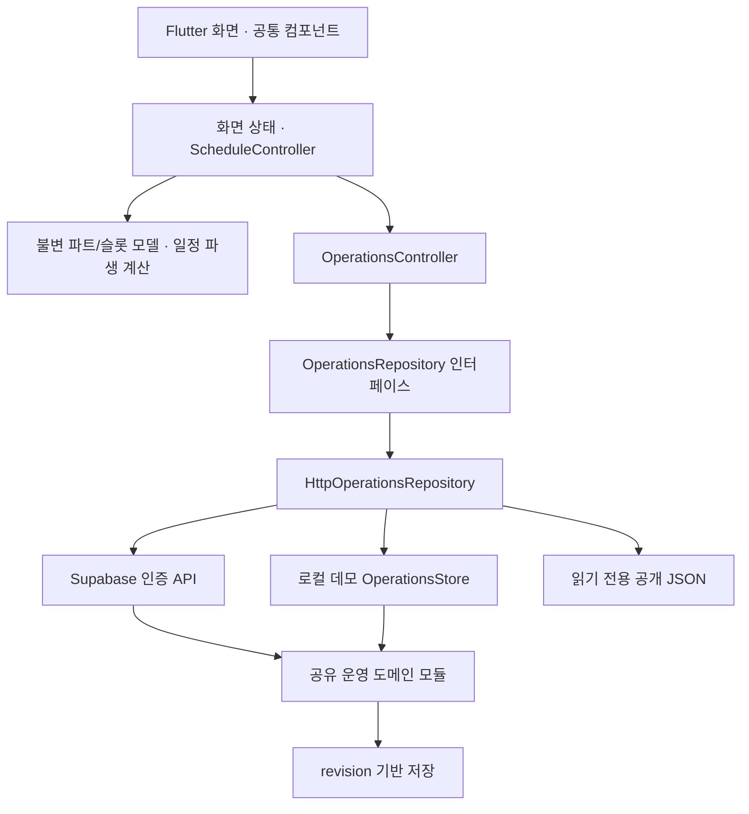

# tap2work 아키텍처와 UI 운영 기준

최종 수정: 2026-09-28. 이 문서는 **현재 구현의 구조와 변경 규칙**을 관리한다. 제품 결정의 원본은 [project-state.json](project-state.json), 제품 범위는 [PRODUCT.md](../PRODUCT.md)다. 새 화면은 [공통 UI 규칙](TOSS_UI_PROMPT_TEMPLATE.md)과 [스크린샷 참조 기록](REFERENCE_REDESIGN_2026-09-28.md)을 함께 읽고 만든다. 미구현 기능을 구현된 것으로 취급하지 않는다.

## 제품 구조

| 주요 메뉴 | 책임 | 하위 기능 |
|---|---|---|
| 업무 | 파트별 오늘의 실행 | 전체 파트/주방/홀/관리 필터, TAP·Task 수행, 준비품, 설정 시에만 주문처리 보드 |
| 매뉴얼 | 공통 지식과 실행 방법 | 검색, 디렉토리, Task 연결 매뉴얼, 메뉴·레시피 |
| 근무표 | 시간과 파트별 크루 배정 | 주간·월간 일정, 크루 정보, 인건비, 첫 근무 교육, 채용 초안 |
| 우리매장 | 매장 운영 설정 | 파트, 영업시간대, 주문 시스템 설정, 권한, 재고·발주·입고, 배치·동선 |

사람의 제품 명칭은 **크루**로 통일한다. **파트**(주방·홀·관리·추가 파트)는 업무 분류이며, **직책**(사장·매니저·크루)은 접근 권한이다. 파트를 바꿔도 직책이 올라가거나 급여 정보가 노출되지 않는다. 직무를 별도의 관리 축으로 추가하지 않는다. 채용은 게시되지 않는 초안으로 유지한다.

## 구현 계층

| 디렉토리/파일 | 소유 책임 |
|---|---|
| `app/lib/ui/` | 화면, 사용자 입력, 접근성, 시트, 화면 크기 대응 |
| `design_tokens.dart`, `design_system.dart`, `components.dart` | 색·글자·간격·모션·선택 컴포넌트의 단일 구현 |
| `app/lib/state/schedule_controller.dart` | 주/월·선택 날짜·파트 필터·편집 가능 상태 |
| `app/lib/domain/part_schedule.dart` | `WorkPart`, `RosterSlot`, 요일별 슬롯과 날짜별 덮어쓰기 합성, 야간 시각, 중복 인원 없는 충족률 |
| `app/lib/state/operations_controller.dart` | 서버 스냅샷, refresh, 작업 상태, actor 변경, revision 충돌 처리 |
| `app/lib/domain/operations_repository.dart` | 운영 읽기/쓰기 계약 |
| `app/lib/data/http_operations_repository.dart` | 로컬/공개/인증 HTTP 전송 |
| `developer/operations.mjs` | 운영 요청 진입점, 저장 직렬화, 권한별 응답 투영, 도메인 호출 |
| `developer/parts.mjs` | 파트 ID 검증, 기존 데이터 분류 이관, 영업시간 기반 슬롯 생성 |
| `developer/workplace.mjs` | 파트·요일 시간대·날짜별 슬롯·주문 보드·직책 제한 설정 |
| `developer/staff.mjs`, `labor.mjs` | 크루·배정·출퇴근·야간 중복 검증·인건비 계산 |
| `developer/checklists.mjs`, `task_settings.mjs` | 업무 양식·스냅샷·순서·수량·파트별 수행 검증 |
| `developer/supabase_backend.mjs` | 검증된 계정과 매장 멤버십, 클라우드 저장 경계 |
| `app/lib/state/work_controller.dart` | 기기 내 첫 근무 연습과 별도의 버디 확인 |

근무표부터 도메인/화면 상태를 분리했다. 기존 화면에는 JSON 접근과 로컬 상태가 남아 있다. 전체 앱이 완전히 정규화된 도메인 모델이나 일괄 MVVM으로 전환되었다고 표현하지 않는다. 앞으로 변경하는 기능부터 계산·검증을 도메인으로 이동하고 화면에는 표현과 입력만 남긴다. 기존 repository를 거치지 않는 화면별 HTTP 호출을 만들지 않는다.

## 데이터 계약과 이관

- `workplace.parts[]`: 안정적인 `id`, 표시 `name`, 정렬 순서, `hidden`. 숨김은 삭제가 아니며 과거 근무/업무/매뉴얼의 연결을 보존한다. `roles`/`duties`는 과거 데이터 분류를 위한 호환 정보이며 새 설정에서 편집하지 않는다.
- 크루의 `workProfile.partIds[]`가 담당 파트다. 빈 배열은 기존 설정의 ‘전체 파트’ 의미를 유지한다. `bands[]`는 선호 시간대 정보이며 자동 근무 배정이나 접근 권한이 아니다.
- 업무 양식·실행 업무·근무 배정은 `partId`로 연결한다. 업무의 `partId: null`은 전체 파트다. 단계의 `settings.partOverride`는 특정 단계의 담당 파트를 바꾸며 null은 TAP을 따른다. 기존 `requiredRole`/`roleOverride` 검증은 구 데이터 호환에만 남긴다.
- 저장 키 `tappers`, `tapperId`, `save_tapper`와 과거 ID는 API·인건비·출퇴근 기록의 연결을 깨지 않도록 유지한다. 이 이름을 UI나 신규 제품 용어로 노출하지 않는다. 키를 일괄 치환하는 데이터 손실성 이관은 하지 않는다.
- `partModelVersion`으로 이관 버전을 기록하고 누락된 분류만 보완한다. 이미 저장된 파트 선택을 기존 직무에서 다시 추론해 덮어쓰지 않는다.
- `docs/project-state.json`은 운영 데이터베이스가 아니다. `.local/operations-demo.json`, 인증 매장 저장소, 기기 내 학습 진도와 분리한다. 개인정보·토큰을 문서/샘플에 넣지 않는다.

## 근무표와 영업시간

1. 서버의 `rosterTemplates[]`는 요일 × 활성 파트 × 영업시간대를 생성한다. 요일별 `workplace.days`가 있으면 우선 사용한다. 빈 목록은 해당 요일 휴무다. 요일별 설정이 없으면 매장 기본 `profile.hours`, 그마저 없으면 과거 `staffingSlots`를 호환한다.
2. 이 슬롯은 **필요 시간**이고 크루를 자동 배정한 기록이 아니다. `staffShifts[]`가 실제 계획 배정이다. 근무 배정은 출퇴근이나 지급 기록과도 다르다.
3. `rosterOverrides[]`는 날짜·파트·원본 슬롯 ID별 시간 조정이다. 다른 날짜나 전체 영업시간을 바꾸지 않는다. 원본 시간이 나중에 바뀌어도 명시적으로 조정한 날짜와 기존 근무 배정은 유지한다. ‘영업시간으로 되돌리기’로 조정을 해제한다.
4. 슬롯 클릭 시 시작/종료를 30분 단위로 수정하거나 크루를 지정한다. 배정된 근무는 수정·배정 해제가 가능하다. 새 배정은 선택 요일에 4주/12주 반복할 수 있다. 반복·단건 배정 모두 서버가 파트 소속, 날짜, 시간과 자정을 넘는 중복 근무를 검증한다.
5. 주간 보기는 왼쪽 시간축을 고정한다. 가로 방향은 요일, 요일 아래는 파트다. 30분은 최소 48px 높이이며 동시 근무가 많으면 열 폭을 늘려 이름을 가리지 않는다. 가로·세로 스크롤로 접근하고 글자를 줄여 맞추지 않는다. 야간 근무는 원래 시작일 열에서 ‘다음 날’ 종료로 표시한다.
6. 충족률은 30분마다 한 크루를 한 필요 슬롯에만 집계한다. 자정 이전에 시작한 근무도 해당 실제 시간에 반영한다. 월간 인원 표시는 배정 건수 기반이다.
7. 새 편집은 열 때의 revision으로 저장한다. 충돌은 자동 덮어쓰지 않는다. 파트/시간대 설정은 충돌 시 초안을 보존한다. 근무 슬롯 시트는 저장 실패 메시지를 보여주고 다시 열어 현재 상태에서 수정한다.

## 업무 필터와 주문 연결

업무 메뉴의 필터는 파트만 사용한다. TAP그룹 필터를 재도입하지 않는다. 매뉴얼/양식의 폴더 ID와 디렉토리는 지식 구성과 과거 기록을 위해 유지한다.

`store.profile.orderSystem.enabled`는 사장님이 설정하는 주문처리 보드 사용 여부다. 기본 OFF이고 서버가 `orderBoardEnabled`를 응답한다. OFF면 진행 중/완료 주문 카드 모두 업무 보드에서 숨기며 주문 기록은 삭제하지 않는다. 토글이 외부 POS 인증·동기화를 수행하지 않는다. 현재 `connectionStatus: not_connected`이며 실제 연동 기능은 별도 통합 작업이다.

## 공통 UI/UX 규칙

- 스크린샷의 차콜 배경, 다크 카드, 밝은 Pretendard, 초록/코랄 강조색을 사용한다. 참조 앱의 개인 이름·매장 정보는 복제하지 않는다.
- 단일 선택은 `AppPicker`/`AppPillField`/`AppChoiceGroup`/`AppSegmented`가 제공하는 동일한 pill 스타일이다. 필터는 `전체 파트`와 동적 파트 이름을 사용한다. 복수 선택도 같은 pill의 선택 상태로 표현한다.
- 긴 선택 목록은 내부 스크롤, 주요 메뉴는 가로 스크롤을 허용한다. 터치 영역과 글자 확대를 보존한다. 빈 상태·읽기 전용·저장 실패를 명확히 보여준다.
- 화면별 색상·별도 dropdown 스타일을 추가하지 않는다. 설정/상세는 공통 시트, 진행 작업에는 기존 press/reduced-motion 규칙을 적용한다.

## 보존해야 할 경계

직책 권한은 서버에서 검증한다. 파트 소속은 급여 접근을 부여하지 않는다. 급여·연락처와 사장 전용 설정은 서버 응답에서 분리한다. 직책별 설정은 기존 권한을 줄일 수만 있다. 데모 actor 헤더는 실제 인증이 아니다.

발주로 재고를 증가시키지 않는다. 입고가 실제 재고를 바꾼다. 재고 점검은 마지막 발주 N일 후 1회이며 중간 실사/입고로 미뤄지지 않는다(D-017). 배치도 수정은 bounds/overlap과 연결된 장소 ID를 보존한다. 첫 근무 연습과 버디 승인은 별도로 유지한다.

## 변경·검증·배포 절차

1. 이 문서, PRODUCT, 최신 project-state, UI 규칙을 읽는다. 사용자의 새 지시와 충돌하는 기존 결정을 수정할 때 이전/이후/이유를 기록한다.
2. 데이터/권한은 서버 모듈에, 계산은 도메인에, 화면 상태는 controller에 둔다. 변경된 데이터 계약과 UX를 이 문서에 같은 작업으로 반영한다.
3. `flutter analyze`, 관련 Flutter 테스트 및 전체 회귀 테스트, `npm run test:console`, `npm run check`, `git diff --check`를 실행한다. 근무표는 320/390/1200px·확대 글자·야간·동시 근무·충돌을 검증한다.
4. `npm run build:app`은 로컬 Flutter 웹, `npm run build:site`는 별도 공개 빌드다. 공개 빌드는 새 샘플만 포함하고 `.local`과 로컬 쓰기 API를 포함하지 않는다.
5. 승인된 배포는 Supabase `operations` 함수와 GitHub Pages를 각각 배포/검증한다. main push의 Pages workflow는 분석·테스트·빌드를 다시 실행한다. 도메인 응답과 workflow 결과를 확인한다.
6. 실제 수행한 결과/실패/미수행 검증을 project-state의 새 history에 기록하고 revision을 올린다. 웹 성공을 iOS/Android 네이티브 검증으로 적지 않는다.

## 후속 과제

현재 정산 정책·저장 연결은 아래 추가 계약을 따른다.

실제 주문 시스템 동기화, 실계정 초대, 보건증 보안 저장, GPS/Wi-Fi 출퇴근 인증, 개별 권한 예외와 추가 정산 정책은 미구현이다. 인증/개인정보가 필요한 기능은 데모 UI를 완성된 연동으로 표시하지 않는다. 기존 화면의 도메인 모델 전환은 기능별로 진행한다.

## 매장 공통 정산 정책 · 2026-09-28

`developer/payroll_settings.mjs`가 정책 검증·정산 기간·일별 순근무 시간 반올림을 담당한다. 사장님만 `save_payroll_settings`를 호출하며 이전 정책은 `payrollSettingsHistory`에 보존한다. 우리매장/인건비/시급 편집에서 동일한 `PayrollSettingsScreen`으로 접근한다.

- `cycle`: monthly/weekly. 월급은 시급제의 월 단위 지급 주기이며 고정 월급 계약 계산이 아니다.
- `monthStartDay`: 1–31, 짧은 달은 말일로 보정한다. `weekStartDay`: 월=1…일=7. 한국 날짜 경계를 사용한다.
- `roundingMinutes`: 0/1/5/10/30. 휴게를 제외하고 중복 구간을 합친 일별 순근무 분을 한 번 반올림한다. 출퇴근 증빙과 연장/야간/휴일 발생 기준은 원본 시간을 보존한다. 반올림 설정은 법적 임금 의무를 면제하지 않는다.
- `businessSize`: under5/fivePlus. 첫 저장 전 unknown을 유지하고 사용자가 선택해야 저장한다. 이후 주간 계산도 매장 공통 값을 사용한다.
- `includeWeeklyRest`: OFF면 발생 주수와 발생 예상액은 유지하고 합계에서 금액을 제외한다. 발생 요건 미확인은 미확인으로 남긴다. 계약·근태·휴일 검토를 보존한다.

최초 저장 전 기존 계산을 유지한다. 저장 후 기간·기본급 예상에 반영하되 과거 지급 기록은 다시 쓰지 않는다. 주간 인건비는 주간 예상이며 정산 기간 전체의 확정 명세서는 아니다. 지원 범위는 WEEKLY_LABOR_2026-09-27.md를 따른다. 규모별 수당은 [고용노동부 안내](https://1350.moel.go.kr/rtmview.do?id=1000274239)를 확인했다.

## Supabase 기본 진입과 저장

`CloudWorkspace`는 로그인 → 새 계정의 매장 생성 → 인증된 운영 화면 순서로 진입한다. 모두 공통 MaterialApp 테마 내부에 둔다. 로그인 전 샘플 API를 자동 요청하지 않는다. 공개 빌드에 Supabase URL/공개 키가 없으면 빌드를 실패시킨다.

설정은 `OperationsController.act` → Bearer 인증 → `createCloudHandler`의 소속/직책 검사 → `OperationsStore` → `tap2work_save_state`로 저장한다. 파트/영업시간/권한/주문 보드/정산은 서버 전용 `tap2work_state.payload`에 저장하므로 별도 컬럼이 필요하지 않다. revision 충돌은 409로 거절하고 직책별 응답을 반환한다. 비로그인 쓰기를 허용하지 않는다.

보건증·위치/Wi-Fi 인증·실계정 초대·외부 POS는 저장 연결만으로 구현된 기능이 아니다. 미연동 표시를 유지한다. 첫 근무 학습 진도는 기존 기기 로컬 범위다.

로고는 기존 `generate_brand.py` 도형을 유지하며 외곽만 alpha=0으로 렌더링한다. Flutter와 일반 웹 아이콘은 투명 PNG, 네이티브/마스커블 아이콘은 불투명 청록 배경이다.
