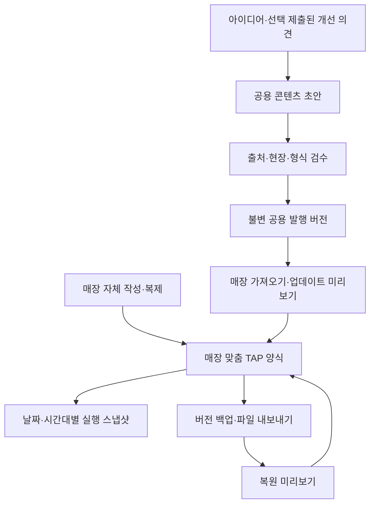

# 체크리스트 콘텐츠 공급·매장 커스터마이즈·백업 상세 구현안

- 작성일: 2026-10-04
- 개정: 2026-10-04 · TAP 단위 배정/제약과 Task·매뉴얼 공동 개선 반영
- 상태: **TAP 단위 배정·Task별 배분 금지·Task/매뉴얼 공동 개선은 사용자 확정 요구사항. 세부 구현은 proposed, 구현 전**
- 대상: tap2work의 Flutter 앱(`app/`), 공유 운영 서버, 서비스 제공자용 콘텐츠 관리 도구
- 목적: 단일 모델/단일 구현자가 대화 원문 없이 요구사항을 이해하고, 아래 순서로 설계·구현·검증할 수 있게 한다. 특정 모델이나 다중 에이전트 실행을 전제로 하지 않는다.
- 문서 작성 범위: 상세 구현안과 프로젝트 연속성 기록. 이 문서가 기능 구현·테스트 통과·배포 완료를 뜻하지 않는다.

## 0. 읽는 순서와 의사결정 범위

먼저 [프로젝트 결정](project-state.json), [제품 범위](../PRODUCT.md), [현재 아키텍처](ARCHITECTURE.md), [UI/UX 기준](UI_UX_GUIDELINES.md), [Flutter UI 템플릿](TOSS_UI_PROMPT_TEMPLATE.md), [설정 관계표](UI_SETTINGS_RELATIONSHIP_MAP.md), [현재 저장 구조](DATABASE_AND_PERFORMANCE.md)를 읽는다. 코드와 문서는 구현 시점의 최신 파일을 다시 확인한다.

### 0.1 사용자가 명시한 요구사항

1. 서비스 제공자가 매주 체크리스트 아이디어를 수집·추가·개선하여 업데이트할 수 있는 파이프라인.
2. 최초 설정과 운영 도중 공용 체크리스트를 앱에 쉽게 추가·적용하는 흐름.
3. 드래그 앤 드롭으로 가져올 수 있는 공용 업무와, 메뉴·레시피처럼 자체 작성·수정이 필요한 업무 모두 지원.
4. 사용 중인 체크리스트를 매장에 맞게 커스터마이즈하고 로컬 저장·백업·복원.
5. 새 체크리스트를 TAP 단위로 추가.
6. 위 구조를 단일 모델이 설계·구현할 수 있도록 상세 Markdown 문서 작성.
7. 시간대·파트 매칭과 주요 한계/제약은 TAP 레벨에 두고 Task별 배분은 허용하지 않는다.
8. Task는 매뉴얼과 함께 업데이트·개선하여 중앙 시스템의 체크리스트·매뉴얼을 점진적으로 고도화한다.
9. 이번 단계는 현재 구조 검증과 상세안 개정이다. 개정안을 기준으로 후속 Sol 모델 구현을 시작할 수 있게 한다. 이번 문서 작업으로 앱 코드를 변경하거나 모델 실행을 시작하지 않는다.

### 0.2 이 문서의 제안 기본값

TAP만 배정·주요 운영 제약을 소유하고 Task와 매뉴얼을 함께 개선하는 원칙은 최신 사용자 요구로 확정되었다. 그 밖의 공용 원본/매장 양식/실행 기록 분리, 3-way 비교, 다음 생성분 적용, 로컬 초안 후 명시적 공유 저장, 파일 형식, DB 테이블, API 이름, 일정, 용량, 권한 기본값은 **구현 제안**이다. 요구사항을 구체화하기 위한 기본값이며 사용자가 개별 세부 정책까지 확정한 것으로 기록하지 않는다. 구현 요청을 받으면 이 기본값으로 진행하되 기존 확정 결정에 영향을 주는 변경은 그 차이를 명확히 남긴다.

### 0.3 변경하지 않을 기존 계약

- 네 주요 목적지: 업무·매뉴얼·근무표·우리매장. 별도 다섯 번째 라이브러리 탭을 만들지 않는다.
- 실행 구조: TAP → Task → 연결 매뉴얼. 폴더는 분류, 패키지는 가져오기 묶음이며 완료 단계가 아니다.
- 파트는 업무 분류, 직책은 서버 권한. 크루가 제품 용어다.
- 오늘 직접 편집(D-053): 선택한 오늘 미완료 Task와 연결된 기본 양식을 함께 수정하며 완료된 형제·다른 실행·과거 기록은 보존한다.
- 배정 설정(D-063): 시간대·실제 근무 매칭과 진행/완료 증빙은 유지한다. **Task 개별 배정 허용 부분은 최신 사용자 지시로 대체**한다. v2 양식/새 실행은 TAP만 배정하며, 기존 Task 예외가 있는 실행은 읽기/완료 호환으로 보존한다. 전체 D-063을 그대로 재구현하지 않는다.
- 판매 메뉴 연결 표시명(D-061): 매뉴얼 이름 수정이 판매 메뉴 이름·가격을 수정하지 않는다.
- 빈 폴더/빈 TAP 허용. 빈 TAP은 실제 실행을 생성하지 않는다.
- 주문·준비품·재고 확인은 기존 도메인 규칙을 따른다. 가져오기/복원/업데이트가 주문 생성, 재고 증감, 발주 전송을 일으키지 않는다.
- 개인 첫 근무 연습과 버디 확인은 공유 체크리스트 실행·백업과 분리한다.
- 공개 샘플은 읽기 전용 체험. 실제 저장·백업·인증 매장과 혼동하지 않는다.

## 1. 현재 구현과 차이

다음은 문서 작성 시 로컬 코드에서 확인한 출발점이다. 작업 트리에 기존 변경이 많으므로 일괄 초기화·정리·커밋하지 않는다.

| 현재 파일/계약 | 확인된 동작 | 이번 확장 연결점 |
| --- | --- | --- |
| `docs/wiki/checklist-library.json` | 업종별 내장 체크리스트 원본 | 최초 발행본의 입력 자료. 이후 발행 카탈로그와 구분 |
| `developer/checklists.mjs` | 라이브러리 복사, 양식 검증·버전 증가, 미착수 실행 보관 | 원본 연결 보존, 명시적 적용 범위, 기존 저장 호환 |
| `app/lib/domain/checklist_draft.dart` | `ChecklistImportPlan`, 없는 기본 목록만 가져오기 | 새 가져오기/중복/매핑 계획으로 점진 확장 |
| `app/lib/ui/checklist_library.dart` | 업종 검색·선택 후 초안에 추가 | 공용 라이브러리·설정 필요 상태·변경 비교 진입 |
| `developer/work_recommendations.mjs` | POS/배달 설정 기반 추천 TAP 별도 가져오기 | 새 라이브러리와 중복 추천 방지, 기존 provenance 보존 |
| `developer/direct_edit.mjs`, `manual_directory.mjs` | 이름·추가·삭제·Task 이동 | 삭제 표식·원본 매핑·다른 TAP 이동 처리 |
| `developer/operations.mjs` | 액션 진입, `ensureDueTasks`, 메뉴 매뉴얼 자동 정리, 응답 투영 | 새 명령·권한·실행 재생성 차단·메뉴 연결 보존 |
| `developer/task_settings.mjs`, `work_assignments.mjs` | 설정, 시간대별 실행, 담당 파생 | 새 양식 활성화 시 기존 검증 재사용 |
| `OperationsRepository` / HTTP 구현 | 네트워크·인증과 화면 분리 | 카탈로그/계획/백업 계약 추가. 화면 직접 HTTP 금지 |
| `developer/section_storage.mjs`, Supabase backend | 변경 section 저장 + 매장 revision CAS | 새 메타데이터 section, 원자 적용·백업 인덱스 확장 |

### 1.1 구현 전에 해결할 실제 위험

1. `validateChecklists`는 지정 필드로 객체를 새로 구성한다. 새 origin/매핑 메타데이터를 단순히 객체에 추가하면 다음 기존 저장에서 사라질 수 있다. 서버 소유 메타데이터는 별도 section에 두거나 명시적 보존 코드를 추가한다.
2. `saveChecklists`는 버전이 달라진 미착수 실행을 보관 처리한다. 새 업데이트의 `next_generation`을 이 액션으로 우회 구현하면 오늘 실행이 바뀔 수 있다. 기존 액션 의미를 유지하고 새 적용 경로를 만든다.
3. 가져온 양식의 ID는 현재 `library-업종-항목`이다. 이 ID만으로 최초 원본 내용을 복원할 수 없다. 현재 라이브러리와 비슷하다고 과거 버전을 추정하지 않는다.
4. Flutter 가져오기 한도와 추천 가져오기는 150 TAP, 일반 서버 양식/직접 편집은 650 TAP이다. 우선 650을 공통 최대값으로 정리하는 안을 제안하되 실제 payload·렌더 성능을 검증한다. 30폴더/30 Task 기존 한도는 유지한다. 숫자는 공통 계약/응답 capabilities로 제공하고 사용자 승인 사실로 적지 않는다.
5. 기존 라이브러리는 장소 미일치 시 첫 장소를 대입하는 경로가 있다. 새 가져오기에서는 임의 장소 추정 대신 미연결/null과 필수 설정 확인을 사용한다. 구 매장 장소를 자동 재배정하지 않는다.
6. 메뉴 대표 TAP을 생성·갱신하는 `ensureMenuManuals`와 충돌하면 사용자 매뉴얼이 되돌아갈 수 있다. 같은 메뉴의 대표 TAP을 중복 생성하지 않고 기존 양식 ID에 연결한다.
7. 현재 임시 공용 로그인은 방문자가 같은 권한을 공유한다. 콘텐츠 발행 권한을 이 계정에 부여하지 않는다. 실제 개별 작업자 식별을 제공한다고 표시하지 않는다.

### 1.2 현재 시간대·파트 구조 검증 결과

2026-10-04 로컬 소스 및 기존 서버 테스트 18개를 확인했다. 다음은 **현재 구현**이며 목표 구조와 다르다.

| 지점 | 현재 확인한 동작 | 목표 변경 |
| --- | --- | --- |
| `validateAssignment` | scheduled는 timeBandIds와 필수 partId, 해당 파트 필요 인원 > 0 검증 | TAP 입력에서 재사용. Task 입력의 독립 배정 금지 |
| `assignmentOf(task, step)` | Task assignment가 inherit가 아니면 TAP보다 우선 | v2는 TAP만 사용. 기존 실행은 snapshot schema별 호환 |
| `assignmentOccurrences` | Task별 설정의 시간대 합집합을 구하고 시간대별 Task를 걸러냄 | TAP의 시간대만 사용, 각 시간대에 동일한 전체 Task 목록 |
| `projectAssignment` | Task 담당 합집합, TAP의 mixed 모드 표시 | v2 미완료 Task는 TAP projection 공유. 과거 완료 담당 증빙은 독립 보존 |
| `assignmentPermission`, `canCompleteStep` | Task별 assignment/partOverride/roleOverride가 완료 권한에 영향 | v2 담당 권한은 TAP만 판정. 순서/완료 여부는 별도 실행 검증 |
| `stepSettings`/`validateStepSettings` | 장소·수량 완료·목표·시간까지 Task별 보유 | 신규 v2는 콘텐츠만. 주요 실행 제약은 TAP으로 이관 |
| `TapSettingsScreen.stepCard` | Task마다 WorkAssignmentField(inherit:true), 파트/장소·완료 방식·시간 입력 | TAP 설정 한 곳 + Task 콘텐츠 편집. Task 배정 폼 제거 |
| `saveTapSettings` | TAP+Task 전체 설정 비교, 배정 변경 시 오늘 미착수 보관 | TAP 정책만 저장하는 v2 계약. 콘텐츠 API와 분리 |
| `ensureDueTasks` | 실제 실행 ID에는 version 포함, 중복은 template/day/timeBand의 기존 실행으로 억제 | 기존 ID 보존, 논리 키와 정책 schema의 중복/교체 계약 명시 |
| `bandsOn` / 날짜 예외 | 정기 요일의 workplaceBandDays만 조회. 근무표의 dateOverrides를 직접 반영하지 않음 | 근무표·업무가 공유하는 유효 영업일/시간대 resolver 적용 |

기존 테스트는 Task별 시간대 예외로 `[['wash'], ['wipe']]`처럼 다른 Task 목록이 생성되는 것과 mixed 담당을 기대한다. 이 기대값은 v1 호환 테스트로 유지하고 v2에서는 `[['wash','wipe'], ['wash','wipe']]`를 검증하는 테스트를 별도로 추가한다. 기존 테스트를 삭제하고 전체 통과만 보고하지 않는다.

추가 인메모리 재현에서 Task 예외의 시간대별 분리를 확인했고, `dateOverrides[date]={closed:true}`인 상태에서도 현재 `assignmentOccurrences`가 정기 시간대 1개를 반환함을 확인했다. 실제 매장 쓰기 없이 순수 함수로 확인한 연결 누락이다. 기존 18개 통과가 날짜별 영업 예외까지 보장하지 않는다.

## 2. 목표 모델과 용어



| 용어 | 의미 | 저장/수정 주체 |
| --- | --- | --- |
| 공용 TAP | 매장에 적용할 수 있는 재사용 원본 | 서비스 제공자 |
| 공용 발행 버전 | 검수 완료된 불변 원본 | 발행 후 본문 수정 금지 |
| 패키지 | 특정 버전의 공용 TAP 목록 | 제공자. 추가 계층 생성 금지 |
| 매장 TAP | 실제 매장이 사용하는 편집 가능한 양식 | 편집 권한이 있는 매장 관리자 |
| 실행 TAP | 날짜/시간대에 생성한 업무·증빙 | 기존 실행 도메인 |
| 초안 | 기기 또는 관리 도구에 저장한 미적용 내용 | 작성자. 공유 적용과 구분 |
| 백업 | 특정 시점의 양식과 연결·첨부 자료 | 매장 범위. 실행 기록과 분리 |

공용 기본형(`standard`), 매장 입력이 필요한 틀(`configurable`), 자체 양식(`local`)을 같은 TAP 구조로 표현한다. 출처와 설정 필요 여부가 다를 뿐 별도 Task 엔진을 만들지 않는다.

### 2.1 TAP/Task 책임과 허용 필드

사용자 확정 원칙은 **업무 배정과 주요 운영 제약은 TAP에서 한 번 설정하고 Task는 행동·매뉴얼·체크 기록을 관리**하는 것이다. 아래 세부 필드 배치는 이를 구체화한 제안이다.

| 정보 | 소유 레벨 | 규칙 |
| --- | --- | --- |
| 파트·시간대·명시적 크루/누구나 | TAP | Task별 배정/배분/override 없음 |
| 반복 요일·사용 여부·업무 유형·실행 활성화 | TAP | 같은 TAP 내 Task는 함께 실행 |
| 실제 장소 연결·수행 접근 제한 | TAP | Task 매뉴얼에 장소 설명은 가능하나 별도 권한/배정 규칙 아님 |
| 순서 강제·일괄 완료 허용·실제 수량 입력/단위/목표 | TAP | quantity 완료는 TAP 완료에서 한 번 입력하는 제안. Task별 할당량 없음 |
| 예상 작업 시간/제한 시간 | TAP | 초기에는 TAP 예상 시간만. 실제 타이머/자동 시간 초과 강제는 후속 |
| 행동 이름·완료 기준 설명·방법·팁·태그·사진/영상/출처 | Task+매뉴얼 콘텐츠 | 함께 검수·발행·선택 적용 |
| Task 순서 | TAP의 steps 배열 | 콘텐츠 순서. 담당자/시간대 배분에 사용 금지 |
| 체크 완료자·시각·메모·과거 수량 증빙 | 실행 Task | 실제 수행 기록 유지. 완료자가 다를 수 있지만 사전 배분은 없음 |
| 과거 Task별 담당 snapshot | 실행 Task의 읽기 호환 | 새 배분 설정이 아니며 이력을 덮어쓰지 않음 |

레시피의 “소스 100g”, “3분간 섞기”는 매뉴얼 내용이다. 이를 파싱하여 수량 할당·시간 제한·재고 차감으로 실행하지 않는다. 신규 콘텐츠 schema에서 Task의 settings.assignment/partOverride/roleOverride/zoneOverride/completionKind/quantitySpec/estimatedMinutes 등 실행 설정을 허용하지 않는다. 단계 예상 시간이 꼭 필요한 후속 요구는 콘텐츠 설명과 TAP 운영 정책을 구분하여 다시 설계한다.

### 2.2 시간대 × 파트 매칭 규칙

기본 경로는 TAP의 `assignment.mode=scheduled`, **파트 1개 + 하나 이상의 안정적인 시간대 ID**다. 여러 파트의 업무라면 파트별 TAP으로 나눈다. 같은 TAP에 시간대를 여러 개 선택하면 매 시간대에 같은 체크리스트를 한 번씩 수행한다. Task를 각 시간대에 분배하는 기능이 아니다.

예: `오픈 장비 점검` TAP, 주방 파트, 오전/오후 두 시간대, Task A/B/C → 오전 TAP(A/B/C), 오후 TAP(A/B/C). 오전 담당 3명이어도 TAP은 1개다. A/B/C 각각 누가 실제 완료했는지는 남기지만 사전 Task 담당은 만들지 않는다.

1. `workplaceBandDays`에서 ID와 영업일별 유효 시간·파트별 시간 예외를 읽는다. '오픈' 같은 표시 이름이나 슬롯 라벨로 ID를 대체하지 않는다.
2. 설정 저장 시 활성 파트·시간대 존재와 기존 필요 인원 조건을 검증한다. 실제 배정된 크루가 0명인 것은 설정 오류와 다르며 `미배정`으로 표시한다.
3. 날짜별 occurrence는 TAP의 유효 시간대만 순회한다. 각 occurrence에는 해당 버전의 모든 Task를 같은 순서로 복사한다.
4. 담당은 활성 크루 + 해당 파트 + 시간 구간 겹침 + 유효 staffShifts로 계산한다. shift에 timeBandId가 있으면 정확히 일치해야 한다. 없는 구 데이터만 기존 시간 겹침 fallback을 허용한다.
5. 승인 전 OFF는 변경 없음. 승인된 OFF/대타는 미완료 TAP/Task의 같은 담당 projection에 반영한다. 완료된 Task의 실제 수행자·담당 snapshot은 유지한다.
6. 지원 완료는 기존 같은 파트 크루 허용 정책을 유지한다. 실제 담당 표시와 지원 권한은 다르며, 지원 완료 가능하다고 자동 담당자로 표시하지 않는다.
7. 매장 영업일 경계·야간 실제 날짜·immutable assignmentWindow를 재사용한다. 필요 인원 수가 실행 개수나 Task 할당 수를 늘리지 않는다. 브레이크는 최신 영업시간/근무표 계약을 따라 별도 Task 배분을 만들지 않는다.
8. 참조 시간대/파트가 삭제·숨김·필요 인원 0으로 변경되면 신규 생성 전 재검증한다. 제안 기본값은 TAP을 `configuration_invalid`로 표시하고 신규 생성 보류, 기존 실행은 보존이다. 임의 첫 파트/시간대·누구나로 전환하지 않는다.
9. 날짜별 추가 휴무는 scheduled TAP의 새 실행 생성을 막고, 추가 영업은 근무표와 같은 참고 요일의 안정 ID/시간대를 사용한다. 이를 공통 `effectiveWorkplaceBands(state,businessDate)` 제안 helper로 통합한다. 추가 영업이 TAP 자체의 주간 반복 요일을 자동 확장하지는 않는 안을 기본으로 하며, 실제 영업일 요일로 recurrence를 판정하고 제외 사유를 표시한다. 기존 생성/진행/완료 실행과 재고 점검·주문 트리거는 일괄 삭제하지 않는다. 날짜 예외 변경 후 이미 생성된 미시작 TAP 처리도 별도 계획/기록으로 수행한다.

기존 TAP `crew`/`anyone` 모드는 이번 요청으로 삭제하지 않는다. TAP 수준 예외로만 유지하고 신규 기본 UI는 시간대·파트 매칭을 먼저 제시한다. `legacy`는 이관용이며 신규 선택지로 노출하지 않는다. crew/anyone의 기존 시간 범위를 바꾸거나 timeBandIds 조합을 추가하지 않는다. scheduled의 partId가 기준이며 상위 template.partId는 필터용 호환 mirror로 서버가 함께 갱신한다. 다른 모드에서는 기존 TAP 분류용 partId를 별도 배정 권한으로 오인하지 않는다.

### 2.3 TAP 운영 정책 제안 계약

이 예시는 미래 저장 형식이다. 현재 validateTaskSettings가 이미 지원한다고 가정하지 않는다. assignmentScopeVersion은 **양식과 생성된 실행 모두**에 기록하고 기존 실행을 매장 전체 플래그로 새 해석으로 바꾸지 않는다.

```json
{
  "id": "store-tap-uuid",
  "assignmentScopeVersion": 2,
  "partId": "kitchen",
  "zone": "place-prep",
  "settings": {
    "assignment": {
      "mode": "scheduled",
      "partId": "kitchen",
      "timeBandIds": ["band-am", "band-pm"],
      "crewIds": []
    },
    "enabled": true,
    "type": "preparation",
    "recurrence": {"mode": "daily", "weekdays": []},
    "enforceSequence": true,
    "allowBulkComplete": false,
    "estimatedMinutes": 20,
    "completionPolicy": {
      "kind": "check",
      "quantitySpec": null
    }
  },
  "steps": [
    {
      "id": "local-step-uuid",
      "contentRevision": 2,
      "title": "도구 준비",
      "manual": "매뉴얼에 정한 도구를 준비해요.",
      "tip": "",
      "tags": []
    }
  ]
}
```

- `settings.assignment`가 유일한 유효 배정 원본이다. v2 steps에는 settings를 새로 저장하지 않는다. 구 클라이언트의 무의미한 inherit/null 호환 입력 허용 범위는 15.1절에서 제한한다.
- `completionPolicy.kind=check`: 기존처럼 모든 Task 체크 후 TAP 완료, 기존 일괄/순서 정책 준수.
- `completionPolicy.kind=quantity`: 모든 Task 체크 후 `완성 수량 입력`이 남는다. TAP 완료 액션에서 quantity를 한 번 검증·저장한다. 마지막 Task 체크가 재고 반영을 자동 실행하지 않는다. 재시도·되돌리기 정책은 기존 준비품/재고 도메인의 1회 반영 규칙을 따른다.
- 다양한 단위의 Task 수량을 TAP 하나의 합계로 바꾸지 않는다. 이런 기존 양식은 이관 검토 또는 별도 TAP 분리가 필요하다.
- `estimatedMinutes`는 계획 참고 값이다. 자동 타이머·Task 시간 배분이 아니다. 기존 단계별 합계 표시를 신규 v2 TAP 직접 설정값으로 전환하고, 과거/미이관 양식은 기존 값의 출처를 표시한다.
- 실제 permission은 TAP assignment와 매장 직책 제한을 함께 검사한다. 완료된 Task의 다시 체크 방지·순서·수량·재고 보호는 담당 배분과 별개의 검증이다.

### 2.4 서버·UI 동시 단순화

새 TAP 설정 액션은 `settings`와 TAP 분류/장소만 갱신하며 `steps[].settings`를 요청하지 않는다. `save_tap_settings`의 v2 분기 또는 별도 v2 액션을 명시적으로 구현한다. 기존 전체 steps 요구를 프런트엔드가 빈 목록으로 우회해서는 안 된다.

Task 편집은 제목·매뉴얼·팁·태그·자료와 콘텐츠 revision을 대상으로 한다. “TAP 담당을 따름”은 읽기 안내만 필요하며 inherit 토글/파트/시간대/크루 선택은 제공하지 않는다. 매뉴얼의 `Task 설정` 진입은 `내용 편집`으로 바꾸고 운영 제약은 `TAP 설정`으로 이동한다. API에서도 금지 필드 주입을 400/명확한 오류 코드로 거절한다.

`save_checklists`, 직접 편집, 수동 매뉴얼 수정, 복제/이동, 추천 가져오기, 중앙 적용, 백업 복원, 메뉴 대표 동기화 모두 같은 v2 schema guard를 거친다. UI 하나에서만 입력을 제거하면 완료가 아니다. 이동한 Task는 목적 TAP 배정을 따르고 원래 TAP의 배정 설정을 가지고 이동하지 않는다.

## 3. 사용자 시나리오와 완료 조건

### S1. 첫 매장 설정

업종 → 추천 패키지 → TAP 선택/제외 → 폴더·파트·시간대·장소 연결 → 필수 입력 → 미리보기 → 적용.

- 패키지 전체 강제 추가 금지. TAP별 선택 가능.
- 필수 입력이 없는 TAP은 양식으로 저장하되 `needs_configuration` 상태로 실행 차단.
- 모든 TAP을 완성해야 첫 사용을 시작하는 구조를 만들지 않는다.
- 성공 화면은 저장된 TAP 수, 설정이 남은 TAP 수, 적용 범위를 서버 결과로 표시.

### S2. 운영 중 TAP 하나 추가

업무 또는 매뉴얼의 `＋ TAP 추가` → `공용에서 가져오기 / 직접 만들기 / 기존 TAP 복제` → 편집 → 적용.

- 폰은 명시적 추가/이동 버튼, 넓은 화면은 드래그를 병행.
- 드롭은 초안의 대상 위치만 선택한다. 드롭 직후 공유 저장하지 않는다.
- 라이브러리에서 매장으로는 복사, 매장 내부 드래그는 이동. 의미가 다른 동작을 같은 명령으로 처리하지 않는다.
- 대상 폴더와 삽입 위치를 보여주며 중첩 Task를 폴더 직속에 저장하지 않는다.

### S3. 메뉴 레시피 작성

`직접 만들기` 또는 메뉴 기본 틀 → 판매 메뉴 연결 → 매장 재료/수량/절차/사진 입력 → 매뉴얼 전용 저장.

- 초기 실행 유형은 `manual_only`. 빈 값에 가짜 레시피·수량을 채우지 않는다.
- 기존 메뉴 대표 TAP이 있으면 그 대상을 선택하고 편집. 새 대표 TAP 추가 금지.
- 주문 사용을 선택해도 실제 POS 연결은 생기지 않는다. 기존 지원되는 주문 경로만 연결한다.
- 공용 틀의 필수 질문은 매장 입력 완료를 검사하는 용도다. 공용 업체가 매장 레시피를 조회하는 경로로 사용하지 않는다.

### S4. 주간 공용 업데이트

`업데이트 있음` → TAP별 추가/변경/삭제/충돌 요약 → 상세 비교 → 반영/내 설정 유지/이번 변경 보류 → 적용 범위 확인 → 저장.

기본은 다음 생성분. 오늘 미시작 업무 변경은 별도 명시 선택. 완료된 증빙은 어떤 선택으로도 재작성하지 않는다.

### S5. 오프라인 초안

연결 끊김 → 편집 계속 → `이 기기에 초안 저장됨` → 앱 종료/재실행 후 복원 → 연결 복구 → 최신 revision 비교 → 사용자가 공유 저장.

오프라인 Task 완료 큐나 자동 주문 처리까지 확장하지 않는다. 공유 저장 대기 중인 초안을 자동 승인하지 않는다.

### S6. 백업 이동·복원

`우리매장 > 체크리스트 관리 > 백업` → 내보내기 → 파일 보관 → 가져오기 → 형식/첨부 검증 → 연결 재설정 → 새 양식으로 복원.

같은 매장에서도 기본은 사본으로 가져오기. 기존 양식 교체는 별도 선택과 미리보기, 교체 전 복구 사본이 필요하다.

## 4. 앱 정보 구조와 화면 명세

### 4.1 진입과 책임

| 화면 | 표시/행동 | 다음 화면 |
| --- | --- | --- |
| 업무 | ＋ TAP 추가, 오늘 적용 결과 | 공통 추가 시트 |
| 매뉴얼 | 매장 폴더·TAP 편집, 공용 라이브러리 | 공통 라이브러리/기존 편집기 |
| 우리매장 > 체크리스트 관리 | 업데이트·초안·백업·적용 이력 | 공통 업데이트/백업 화면 |
| 근무표 | 활성화한 TAP의 담당 연결 소비 | 기존 파트/시간대 설정 |
| 제공자 콘텐츠 관리 | 아이디어·검수·발행 | 별도 운영 도구. 일반 매장 메뉴에 노출 금지 |

### 4.2 공통 라이브러리

- 업종/업무 유형 검색과 필터. 검색은 공개 카탈로그 안에서만 수행하고 기존 매장 전체 매뉴얼 검색을 대체하지 않는다.
- TAP 행: 제목, Task 수, 짧은 목적, 최신 버전, `추가 가능/사용 중/업데이트 있음/설정 필요/배포 중단`.
- 상세: Task 목록과 매뉴얼 미리보기, 출처, 검수일, 필요한 매장 입력, 변경 이력.
- 이미 설치한 원본은 `업데이트 보기`가 기본. `다른 용도로 복제`는 명시적 별도 동작.
- 패키지는 포함된 TAP과 버전을 보여주고 설치 여부를 개별 표시한다.
- 로딩 실패가 기존 매장 업무 조회를 막지 않게 한다. 캐시를 표시할 때 기준 날짜와 최신 확인 실패를 구분한다.

### 4.3 TAP 편집기

기본 정보 → TAP 시간대·파트/운영 규칙 → Task·매뉴얼 콘텐츠 → 저장 범위 순서. 기존 공통 편집기·설정 시트를 재사용하되 Task별 배정·장소·실행 제약 컨트롤을 제거한다. Task에는 제목·방법·팁·태그·자료 편집만 제공한다. 상세 책임은 2.1–2.4절을 따른다.

- 상태: 초안, 설정 필요, 사용 중, 보관.
- 기원: 공용에서 가져옴 / 매장 자체 작성 / 독립 전환.
- 원본 연결형은 `공용 변경 보기`, `독립 양식으로 전환` 제공.
- 저장 버튼을 `기기에 초안 저장`과 `매장에 적용`으로 구분. 서버 성공 뒤에만 적용 완료 표시.
- 입력 중 닫기·뒤로가기에서 초안 유지/변경 버리기. 오류·충돌에도 입력 유지.
- 빈 TAP은 정상 초안/매뉴얼 컨테이너이며 실행을 생성하지 않는다.

### 4.4 업데이트 비교 화면

TAP별 요약과 Task별 비교를 분리한다. 필드 수준 차이는 접어서 표시하고 충돌 필드만 펼친다.

- `새 공용 내용 반영`: R 선택.
- `내 설정 유지`: L을 override로 확정. 같은 변경을 반복 제안하지 않는다.
- `이번 변경 보류`: 기준 버전을 전진시키지 않고 나중에 다시 비교한다.
- 신규 Task 체크 해제도 유지/보류 중 의미를 선택한다. 단순 체크 해제가 영구 제외인지 불명확하지 않게 한다.
- Task의 제목·완료 기준·매뉴얼·자료는 5.3절의 공동 콘텐츠 단위로 선택한다. 순서 변경은 관련 Task 의존 관계를 함께 검증한다. TAP의 배정·수량/완료 정책은 중앙 콘텐츠 적용에서 변경하지 않고 별도 TAP 설정으로 처리한다.
- 하단: 적용 TAP 수, 미해결 수, 다음 생성분/오늘 미시작 범위, `선택 적용`.

### 4.5 UI 공통 검수

기존 다크 색·초록/코랄·Pretendard·공통 시트/카드/모션을 재사용한다. 320/390/1200px, 글자 1.5배, 긴 이름, 키보드, 빈 목록, 실패, 저장 중, 권한 상실, reduced motion을 확인한다. 드래그 전용 기능 금지. 키보드/접근성 이동 메뉴에서 동일한 검증·결과를 제공한다.

## 5. 데이터 계약: 공용 콘텐츠

필드명은 제안이다. 아래 JSON은 설명용 예시이며 실제 매장 데이터가 아니다.

```json
{
  "schemaVersion": 1,
  "templateId": "tpl-kitchen-opening",
  "version": 3,
  "kind": "configurable",
  "title": "주방 오픈 점검",
  "industryIds": ["food-service"],
  "steps": [
    {
      "id": "step-equipment-check",
      "contentRevision": 3,
      "title": "주요 장비 상태 확인",
      "manual": "매장에서 지정한 장비와 확인 기준에 따라 점검해요.",
      "tip": "이상 발견 시 매장에서 정한 담당자에게 알려요.",
      "tags": ["오픈", "장비"],
      "sourceIds": ["src-example"]
    }
  ],
  "configurationFields": [
    {
      "key": "inspectionPlace",
      "scope": "tap",
      "type": "place_ref",
      "label": "점검 장소",
      "required": true
    }
  ],
  "suggestedExecutionType": "routine",
  "changeSummary": "장비 점검 항목 보완",
  "sourceIds": ["src-example"],
  "reviewedAt": "2026-10-04T00:00:00Z",
  "minimumContentSchema": 1
}
```

### 5.1 ID와 버전

- `templateId`: 모든 버전에서 유지하는 공용 TAP ID. 이름에서 매번 재생성하지 않는다.
- `version`: 해당 TAP의 단조 증가 정수. 발행 실패 버전은 재사용하지 않아도 된다.
- `steps[].id`: 같은 의미의 Task는 유지. 완전히 대체한 행동은 신규 ID와 `replacesStepId` 제안 정보를 사용하고 자동 동일시하지 않는다.
- `schemaVersion`: 데이터 형식 버전. 콘텐츠 버전과 분리.
- `contentHash`: canonical JSON의 SHA-256. 키 정렬, 줄바꿈, 누락/null 정규화 규칙을 서버에서 고정한다. 사용자 본문을 임의 요약·유사도 비교하지 않는다.
- 발행 본문은 불변. 상태·배포 중단 사유는 별도 메타데이터로 변경 가능.
- 출처 엔터티: source ID, 제목, URL, 확인일, 활용 범위/권리 메모, 검수 메모. 법령·안전 수치를 임의 생성하지 않고 콘텐츠 검수 대상으로 남긴다.
- 패키지: `packageId/version/items[{templateId,version}]`. 발행 당시 정확한 버전을 고정하며 설치 시 최신으로 몰래 치환하지 않는다.

### 5.2 매장 입력 필드

초기 지원 형식은 `text`, `number_with_unit`, `menu_ref`, `place_ref`, `part_ref`, `time_band_refs`. 공개 원본에 실제 매장 ID를 넣지 않는다. `part_ref`, `time_band_refs`, 실제 장소 연결 및 운영용 수량은 `scope:tap`만 허용한다. Task 본문의 레시피 수량은 설명 콘텐츠이며 배정/권한/재고 입력 규칙으로 실행하지 않는다. Task 경로에 파트·시간대·크루를 쓰는 configuration 선언은 발행 검증에서 거절한다. 선택형 필드의 옵션과 숫자 검증 범위는 명시한다. 임의 스크립트/수식 실행이나 무제한 동적 폼 엔진은 만들지 않는다.

`configurationFields`는 양식의 필수 설정을 검사하고 정해진 필드로 변환하는 선언이다. 렌더링용 문자열 치환과 실제 수량/단위 저장을 구분하고, 매장 입력과 공용 문구를 분리하여 공용 문구 업데이트가 입력값을 지우지 않도록 한다.

### 5.3 Task와 매뉴얼을 함께 개선하는 콘텐츠 계약

공용 발행/설치 단위는 TAP으로 유지한다. 그 안에서 **Task의 행동과 해당 매뉴얼을 하나의 공동 콘텐츠 revision**으로 관리한다. 중앙 시스템에 따로 수정되는 체크리스트 사본과 매뉴얼 사본을 만들지 않는다. 초기에는 기존 `steps[]` 안에 본문을 함께 저장하고, 독립적인 전역 Task 마켓/복잡한 매뉴얼 DB 정규화는 만들지 않는다.

공동 묶음: `title`, `manualTitle?`, `manual`, `acceptanceText?`, `tip`, `tags`, `imageUrl/videoUrl/sourceUrl`, `sourceIds`, 포함 자료 ref, `contentRevision`. acceptanceText는 완료 기준의 설명이며 서버 실행 제약이 아니다. source step ID는 행동의 안정 ID이고, contentRevision은 의미 있는 내용 변경 시 증가한다. 공용 contentRevision과 매장 contentRevision은 별개이며 sourceContentRevision으로 연결한다. Task에 별도 assignee/part/timeBand/quantity allocation은 없다.

- 제공자는 Task 행동을 바꾸면 방법·완료 기준·사진도 함께 검토해야 한다. 방법만 개선한 경우도 같은 콘텐츠 묶음의 새 revision으로 발행할 수 있다. 모든 필드를 억지로 변경할 필요는 없다.
- 발행 TAP은 각 Task의 정확한 contentRevision과 hash를 고정한다. 매뉴얼 조회 시 매번 '최신 문서'를 붙이지 않는다. 과거 실행은 생성 당시 title/manual/contentRevision을 스냅샷으로 보유한다.
- 기본 업데이트 선택은 Task 묶음 단위 `공용 반영 / 내 내용 유지 / 보류`다. 필드 diff는 보여주되 최신 제목 + 과거 방법을 자동 혼합하지 않는다.
- 공용과 매장 수정이 같은 Task에 있으면 필드가 달라도 묶음 충돌로 제시하는 보수적인 기본값을 쓴다. 사용자가 직접 합친 내용을 선택하면 완성된 묶음 전체를 검증하고 새로운 매장 contentRevision으로 저장한다. 같은 TAP의 다른 Task는 독립 선택 가능하다.
- `fieldDecisions`라는 기존 설계 키는 유지하되 Task는 `steps/{sourceStepId}/content` 경로 하나에 reviewedVersion/remoteValueHash를 기록한다. 이 문서 최초안의 Task 내부 필드별 기준 전진을 대체한다.
- 매뉴얼 검색, Task 카드, 교육에서 읽는 매장 방법은 같은 매장 콘텐츠를 참조한다. 실행 상세의 '당시 방법'은 실행 snapshot을 읽고, '현재 매뉴얼'은 별도 명시 동작으로 연다. 학습/버디 진행도를 재설정하지 않는다.

### 5.4 중앙 고도화의 반복 루프

`아이디어 → Task+매뉴얼 수정안 → 이전/이후 공동 비교 → 출처/현장 검수 → TAP 버전 발행 → 매장 선택 적용 → 선택 제출된 개선 의견`을 반복한다. 기본 Task 추가와 매뉴얼 개선을 서로 다른 주간 작업/배포 경로로 운영하지 않는다.

개선 티켓에는 sourceTemplateId/sourceStepId/sourceContentRevision, 문제 유형(빠진 행동/불명확한 방법/사진 교체/중복/순서), 이유, 출처, 검수 결과를 기록한다. 매장 의견은 사용자가 선택한 내용만 제출하며 비공개 레시피·담당자·실행 기록을 자동 전송하지 않는다. 구현 전 실제 피드백·현장 검수 결과를 생성하지 않는다.

단계별 콘텐츠 범위:

1. P1: 매장 Task+매뉴얼 일관 저장, contentRevision 및 출처 연결 준비.
2. P2: 중앙 Task+매뉴얼 공동 저작/검수, TAP에 묶어 불변 발행. 운영 설정은 매장이 연결.
3. P3: 설치된 Task 묶음의 차이·선택 적용·매장 수정 보존. 같은 시간대/파트 그대로 유지.
4. 후속: 실제 제출된 의견과 사용 확인 자료로 개선 우선순위를 조정. 자동 품질 평가/AI 추천은 초안까지이며 검수/매장 적용을 대체하지 않는다.

성공 기준은 발행 건수만이 아니다. 매장 수정 보존, 제목·방법 버전 일치, 배정 불변, 동일 Task 중복 생성 없음, 과거 실행 방법 재현 가능을 우선 검증한다.

## 6. 데이터 계약: 매장 양식과 원본 연결

기존 `taskTemplates[]`는 현재 유효한 매장 양식으로 유지한다. 원본 비교 메타데이터는 새로운 서버 소유 section `checklistOrigins`에 두는 안을 권장한다. 기존 편집기 JSON 재구성이 메타데이터를 지우지 못하게 하고 실행 엔진 변경을 줄이기 위한 선택이다.

```json
{
  "storeTemplateId": "local-tap-uuid",
  "originType": "catalog",
  "sourceTemplateId": "tpl-kitchen-opening",
  "installedVersion": 2,
  "latestReviewedVersion": 3,
  "tracking": "linked",
  "baselineRef": "catalog:tpl-kitchen-opening:2",
  "stepMap": {
    "step-equipment-check": "local-step-uuid"
  },
  "fieldDecisions": {
    "steps/step-equipment-check/content": {
      "reviewedVersion": 3,
      "choice": "keep_local",
      "remoteValueHash": "example-hash"
    }
  },
  "suppressedSourceStepIds": [],
  "movedOutSteps": {},
  "configurationValues": {
    "inspectionPlace": "store-place-uuid"
  }
}
```

### 6.1 version과 기준점 의미

- 기존 `taskTemplates[].version`: 매장 유효 양식의 내용 revision. 공용 version으로 대체하지 않는다.
- 매장 `revision`: 동시 저장 검사. template version과 별개.
- `installedVersion`: 마지막으로 전체 검토를 마친 공용 버전. 모든 필드가 공용과 같다는 뜻은 아니다.
- `latestReviewedVersion`: 일부라도 검토한 최근 버전. UI가 이를 ‘모두 업데이트됨’으로 오해하지 않게 한다.
- `baselineRef`: 가져온 당시 불변 원본. 발행 버전을 서버에 계속 보관한다.
- 부분 적용 후에는 `fieldDecisions`가 검토 단위의 기준 원본 버전을 지정한다. Task는 `steps/{sourceStepId}/content` 묶음 전체가 한 단위다(5.3절). 필드 diff는 상세 표시용이며 제목/매뉴얼의 서로 다른 발행본을 자동 혼합하지 않는다. 나머지는 baselineRef를 따른다.
- 모든 필드/추가/삭제/순서가 검토되면 baselineRef를 새 버전으로 압축할 수 있다. 로컬 override·삭제 표식은 유지한다.
- `tracking=detached`: 독립 양식. 새 업데이트 제안 중단, 출처 이력은 유지. 재연결은 별도 비교 절차가 필요하다.

### 6.2 서버 소유 보조 section

| section | 내용 |
| --- | --- |
| `checklistOrigins` | TAP별 origin/기준점/Task 매핑/삭제·이동 표식 |
| `checklistLifecycle` | templateId별 draft/needs_configuration/active/archived, executionType, generationPolicy. configuration_invalid는 신규 생성 차단 이유, legacy_review_required는 별도 이관 검토 상태 |
| `checklistApplicationReceipts` | 최근 적용 ID·request hash·결과 revision·처리한 TAP 목록. 크기 제한 필요 |

전체 버전 백업과 무제한 적용 이력은 별도 저장소로 분리한다. 매장 전체 8MiB JSON 한도 안에 매주 사본을 계속 쌓지 않는다.

### 6.3 모든 기존 쓰기 경로의 보존 규칙

`save_checklists`, `save_tap_settings`, `save_task_step`, `save_step_manual`, `edit_manual_node`, `edit_work_node`, `move_manual_node`, 추천 가져오기, 메뉴 매뉴얼 동기화를 각각 감사한다.

- 일반 편집은 origins를 생성/변조할 수 없고 기존 연결을 유지한다.
- Task 삭제: 매핑된 source ID를 suppression에 기록. 다음 공용 업데이트로 자동 부활 금지.
- Task를 다른 TAP으로 이동: local step ID 유지. 원래 TAP의 `movedOutSteps`에 목적지 기록. 초기안은 목적지에서 해당 Task를 자체 항목으로 관리하고 원본 TAP 업데이트가 이를 수정하지 않도록 한다. UI로 원본 자동 추적이 중단됨을 알려준다.
- Task 복제: 새 local step ID, 기본적으로 원본 자동 추적 없음. 출처 참고 정보만 유지.
- TAP 복제: 새 local TAP/Task ID, 기본은 독립 사본. `업데이트도 받기`를 명시 선택한 경우만 새 독립 installation으로 연결.
- TAP 삭제/보관: 원본 연결·적용 이력은 복구 가능하게 보존. 실행 참조가 있는 ID 재사용 금지.
- 서버 메타데이터를 클라이언트가 전체 JSON 저장으로 삭제/주입하지 못하게 한다.

## 7. 실행과 적용 시점

새 콘텐츠 적용은 다음 세 모드를 구분한다.

| 모드 | 의미 | 초기 제공 |
| --- | --- | --- |
| `definition_only` | 매뉴얼/초안만 저장. 실행 생성 없음 | 제공 |
| `next_generation` | 이미 존재하는 실행은 유지, 이후 새로 생성되는 실행에 사용 | 기본 |
| `selected_unstarted` | 선택한 오늘 미시작 실행만 교체하고 이후 생성분에도 사용 | 비교 엔진 이후 제공 |

`next_generation`은 ‘내일’과 같지 않다. 아직 생성되지 않은 오늘의 다음 시간대가 해당할 수 있다. UI는 “기존 업무는 유지하고 새로 생성되는 업무부터 적용해요”로 설명한다. 날짜를 지정하는 예약 활성화는 후속 단계이며 초기에는 버튼을 노출하지 않는다.

### 7.1 중복 생성 방지

실행의 논리 키는 `매장 + storeTemplateId + 영업일 + occurrence discriminator`로 정의한다. discriminator는 현재 생성 규칙의 안정적인 시간대 ID 또는 일일 기본값이다. 양식 버전을 키에 포함해 같은 업무가 새로 생기게 하지 않는다.

현재 `ensureDueTasks`, 배정 변경 재생성, 보관된 실행 처리의 실동작을 함께 수정·검증해야 한다. 이미 존재하는 논리 키의 실행은 next_generation으로 새 버전을 생성하지 않는다. 기존 양식이 변경됐다는 이유만으로 미시작 실행을 보관하지 않는다. 이미 만들어진 미래 실행도 이 모드에서는 유지한다.

### 7.2 오늘 미시작 교체

서버가 적용 시점에 선택된 실행 ID·버전·현재 상태를 다시 확인한다. 다음 중 하나라도 있으면 교체 불가: Task 완료 기록, TAP processing/완료, 수량/재고 반영, 주문 연결, 해당 날짜 종료. 현재 helper마다 ‘시작’ 판단이 다를 수 있으므로 새 공통 predicate를 만들고 관련 기존 경로 영향 테스트를 추가한다.

교체는 원본 실행 보관 + 같은 논리 업무의 교체 이력 연결로 표현한다. 새 완료 건이나 이중 담당 업무가 생기면 안 된다. 계획 생성 후 크루가 완료한 경우 전체 적용을 409로 거절하고 새 미리보기를 요구한다. 적용 대상이 0개가 되었는데 성공 처리하지 않는다.

### 7.3 기존 직접 편집과 구분

D-053의 즉시 콘텐츠 편집은 유지한다. Task 제목·매뉴얼을 수정할 때 공동 콘텐츠 revision도 갱신하지만 배정/제약은 수정하지 않는다. 새 공용 업데이트의 적용 범위를 직접 편집 전체에 강제하지 않는다. 배정 변경은 D-063의 TAP 수준 재생성/증빙 보호만 유지하며 Task 개별 배분은 제거한다. 공용 콘텐츠 업데이트는 파트/시간대·TAP 운영 정책을 변경하지 않는다. 매장 연결 변경은 별도 TAP 설정 plan/검증으로 처리한다.

시간 기준은 단순 UTC/기기 날짜로 계산하지 않는다. 현재 `business_day.mjs`의 한국 영업일 경계와 기존 업무 유형별 날짜 계약을 재사용한다. 자정 전후·영업일 경계·다음날 종료를 테스트한다.

## 8. 업데이트 비교·병합 알고리즘

### 8.1 비교 대상

B=해당 검토 단위의 마지막으로 검토한 공용 원본, L=현재 매장 값, R=새 공용 값. Task 콘텐츠에서는 제목·매뉴얼을 포함한 bundle이 검토 단위이며 내부 필드 diff를 표시할 수 있다. 공용 step ID를 stepMap으로 local ID에 연결한다. 배열 index·제목·유사도는 식별자로 쓰지 않는다.

| 조건 | 기본 후보 |
| --- | --- |
| L=B, R=B | 유지, 변경 없음 |
| L=B, R≠B | R 반영 후보 |
| L≠B, R=B | L 유지 |
| L=R | 충돌 없음, 검토 기준 전진 가능 |
| L≠B, R≠B, L≠R | 사용자 선택 필요 |

Task 콘텐츠(`title/manual/tip/tags/media/acceptanceText`)와 TAP 운영 설정(`assignment/zone/recurrence/completionPolicy`)은 ownership을 구분한다. 공개 원본이 기본값을 제안하더라도 실제 매장 연결·레시피 입력·TAP 제약을 자동 갱신하지 않는다. 순서 변경은 콘텐츠 의존성을 검증하고 순서 강제 여부는 TAP 설정으로 유지한다. 태그는 정규화된 집합으로 비교하고 본문은 정확한 값으로 비교한다.

### 8.2 추가·삭제·순서

- 새 공용 Task: 신규 후보. 매장에 다른 자체 Task가 있어도 함께 유지.
- 공용 삭제 + 매장 미수정: 삭제 제안. 실제 적용 시 과거 실행은 유지.
- 공용 삭제 + 매장 수정: 충돌. 자체 Task로 유지하거나 양식에서 제거.
- 매장 삭제 + 공용 변경: suppression 유지. 사용자가 복구를 명시 선택할 때만 추가.
- 양쪽 삭제: 새 기준에 삭제 결정을 반영.
- 공용 Task 순서만 변경: 매장 순서가 B와 같으면 새 순서를 후보로. 자체 Task는 기존 앞/뒤 anchor와 함께 유지.
- 양쪽 순서 변경 또는 anchor 삭제: 순서 충돌로 표시. 임의 정렬하지 않는다.
- 부모 TAP 간 이동은 필드 diff로 자동 처리하지 않는다. 매장 이동 표식을 존중한다.

### 8.3 Task 공동 콘텐츠 단위 부분 반영과 기준 버전

예: v2에서 Task A/B를 설치했다. v3에서 A의 제목·매뉴얼과 B의 방법이 바뀌었다. A 묶음만 반영하고 B 묶음은 보류한다. 순서는 별도 의존 그룹으로 함께 검토한다.

- A의 제목·방법·자료 모두를 v3 콘텐츠 묶음으로 검토하고 A 기준은 v3, B는 v2로 남긴다. 전체 installedVersion을 v3로 올리지 않는다.
- v4 비교 시 A는 v3→v4, B는 v2→v4를 비교한다.
- `내 설정 유지`로 확정하면 해당 필드의 기준은 R 버전으로 전진하고 L이 override가 된다.
- `보류`는 전진하지 않으며 다시 제안할 수 있다.
- 동일 변경의 재제안 여부는 공동 콘텐츠 hash, 현재 값 비교와 reviewedVersion/remoteValueHash로 판정한다. 단순히 ‘마지막 업데이트 날짜’로 처리하지 않는다.

### 8.4 서버 적용 절차

```text
preview(request):
  계정·매장·권한·공용 발행 상태 확인
  현재 매장 revision + 대상 template version 고정
  불변 B/R과 현재 L을 읽고 차이/충돌/매핑 필요 계산
  적용 범위별 실행 영향 계산
  planId, 만료시각, 기준 hash/revision, 선택 가능한 changeId 반환

apply(planId, expectedRevision, operationId, selections):
  인증과 권한 재확인
  operationId 처리 결과 조회; 같은 payload면 이전 결과 반환
  plan 소유 매장·만료·revision·대상 버전·카탈로그 상태 재검사
  선택 값이 plan의 changeId와 허용 선택인지 확인
  서버에서 결과 양식 재계산 (클라이언트 최종 JSON 신뢰 금지)
  연결·순서·수량·용량·실행 상태 검증
  적용 전 백업 객체를 저장하고 hash/존재 확인
  한 DB 트랜잭션에서 CAS + 양식/메타데이터/이력/receipt 저장
  성공한 revision, 적용 건수, 유지한 실행 건수 반환
```

계획은 짧은 TTL을 갖는 서버 객체로 저장하는 안을 기본으로 한다. 예: 30분. plan 생성은 업무 revision을 증가시키지 않는다. 무효화된 plan 재계산 때 사용자의 선택은 가능한 동일 changeId에 초안으로 복원하되 저장은 다시 확인한다.

## 9. API와 오류 계약

현재 operations 액션 구조를 재사용한다. 별도의 공개 무검증 JSON 쓰기 API를 만들지 않는다. 다음 이름은 신규 제안이다.

| 명령/조회 | 주요 입력 | 결과/효과 |
| --- | --- | --- |
| `get_checklist_catalog` | query, industryId, cursor, knownRevision | 발행 목록, capabilities, catalog revision |
| `get_checklist_release` | templateId, version | 불변 본문·출처·hash |
| `preview_checklist_import` | selected releases, target folder, configuration, executionType | 중복·매핑·설정 필요·가져오기 plan |
| `preview_checklist_update` | storeTemplateIds, targetVersions, applyMode, selectedOccurrenceIds | 3-way diff와 영향 plan |
| `apply_checklist_plan` | planId, revision, operationId, selections | 원자 저장 결과 |
| `detach_checklist_origin` | templateId, revision, operationId | 독립 전환, 출처 보존 |
| `list_checklist_backups` | cursor | 매장 권한 범위 백업 메타데이터 |
| `create_checklist_backup` | templateIds 또는 all, revision, operationId | 서버 복구 사본 ID |
| `export_checklist_backup` | backupId | 검증된 파일 내려받기 권한/스트림 |
| `preview_checklist_restore` | uploadedFileRef, mode, mapping | 검증·연결·교체 영향 plan |
| `submit_checklist_feedback` | 선택한 내용과 공개 범위 | 명시 제출된 개선 의견 |

예시 적용 요청:

```json
{
  "action": "apply_checklist_plan",
  "planId": "plan-uuid",
  "revision": 152,
  "operationId": "client-operation-uuid",
  "selections": [
    {"changeId": "change-uuid-1", "choice": "accept_remote"},
    {"changeId": "change-uuid-2", "choice": "keep_local"}
  ]
}
```

위 revision은 예시 매장 revision이며 project-state revision과 무관하다.

- 오류: `code`, 사용자 메시지, 해당 field/change ID, 재시도 가능 여부. 토큰·내부 스택 반환 금지.
- 400: 형식 오류 / 연결 값 누락 / 복원 파일 검증 실패.
- 401/403: 세션·매장·권한. 초안 유지하되 다른 사용자 화면에 노출하지 않는다.
- 404: 대상 삭제/매장 범위 밖. 존재 여부를 타 매장에 누설하지 않는다.
- 409: 매장 revision/양식/실행 충돌, 중복 설치, 같은 operationId의 다른 요청.
- 410: plan 만료/철회된 발행본. 새 미리보기로 이동.
- 413: 파일·전체 매장·항목 수 한도 초과.
- 422: 읽을 수 있으나 지원하지 않는 schema/capability.
- 503: 카탈로그/백업 저장 실패. 양식을 먼저 저장하고 백업을 뒤늦게 만드는 부분 성공 금지.

`operationId`는 workspace+actor+action 범위에서 유일하게 하고 request hash와 결과를 보존한다. 첫 성공 후 응답 유실 재시도는 기존 결과를 반환한다. 오래된 receipt를 정리한 후에도 `applicationId`와 설치 ID/논리 키 unique 검증으로 중복 mutation을 방지한다. 동일 작업의 재사용 operationId 범위와 보존 정책을 명시한다.

## 10. 서비스 제공자용 주간 콘텐츠 운영

### 10.1 운영 도구 경계

현재 개발자 콘솔은 프로젝트 결정 관리용이다. 콘텐츠 운영은 별도 메뉴/저장 경계로 구현하며 `docs/project-state.json`을 콘텐츠 DB로 쓰지 않는다. 초기 로컬 저작 도구는 `developer/`에서 재사용할 수 있지만 제공자 운영 서버에 로컬 운영 쓰기 API 전체를 노출하지 않는다.

### 10.2 상태와 권한 제안

`idea → draft → in_review → approved → published`, 반려는 draft로, 발행 후 `withdrawn`은 신규 설치/업데이트 중단이다.

- author: 아이디어/초안 작성.
- reviewer: 출처·현장 적합성·필수 매장 입력·권리 검토.
- publisher: 승인된 버전 발행·배포 중단.
- 초기 소규모 운영에서 한 사람이 여러 역할을 가질 수 있지만 각각의 검수/발행 이벤트를 명시적으로 남긴다.
- 승인한 draft hash와 발행 본문 hash가 같아야 한다. 승인 후 수정은 승인 취소 후 재검수.
- 매장 owner는 provider publisher가 아니다. 임시 공용 로그인은 제공자 권한을 얻지 못한다.

### 10.3 주간 반복 작업

| 단계 | 입력 | 완료 증거 |
| --- | --- | --- |
| 수집 | 자체 아이디어·명시 제출된 의견·검토할 공개 자료 | 문제, 업종, 제안 내용, 출처 후보가 있는 티켓 |
| 선별 | 중복·범위·현장 요구 확인 | 이번 주 작업 목록과 보류 이유 |
| 작성 | 기존 버전 또는 새 TAP | 안정 ID, 매장 입력 필드, 변경 요약 |
| 검수 | 출처·테스트·현장 확인 | reviewer와 체크 결과, 미확인 사항 |
| 시험 | 별도 테스트 매장에 설치/업데이트 | 기존 커스터마이즈 보존 결과 |
| 발행 | approved hash | 불변 버전·manifest·발행 이벤트 |
| 관찰 | 자발적 피드백·오류 | 다음 주 이슈, 필요 시 배포 중단 |

매주 고정 개수의 변경을 강제하지 않는다. 자동화는 초안 생성·형식 검사·변경 요약까지 가능하며 자동 발행하지 않는다. 정기 작업은 발행 결과를 집계할 뿐 매장 양식을 자동 덮어쓰지 않는다. 실제 알림 발송이 미구현이면 앱 내 업데이트 배지만 제공한다.

### 10.4 발행 트랜잭션과 콘텐츠 호환

1. schema/Task 수/ID 중복/매장 ID 혼입/미디어·출처 검사.
2. 수정된 Task ID 보존, 삭제/교체 이유, 이전 버전 비교 확인.
3. 대상 앱의 content schema/capabilities와 맞는지 검증.
4. 본문과 첨부 자료를 불변 경로에 업로드 후 hash 확인.
5. 발행 메타데이터와 카탈로그 manifest를 원자 활성화. 검증 전 파일은 탐색 목록에 노출하지 않는다.
6. 발행 실패 재시도는 동일 release 작업을 중복 활성화하지 않는다.

캐시된 구 manifest가 이미 발행된 불변 본문을 가리키는 것은 허용한다. 새 manifest가 아직 없는 본문을 가리키는 상태는 금지한다. withdrawn 발행본을 설치하려는 stale client 요청은 서버가 다시 검사하여 차단한다. 설치된 매장 양식은 그대로 보존하고 업데이트 관리에 조치 안내를 표시한다.

## 11. 로컬 저장과 동기화

로컬 저장은 `ChecklistLocalRepository` 인터페이스로 분리한다. native는 트랜잭션 가능한 기기 DB, web은 브라우저 영속 저장 adapter를 사용한다. 구체 패키지는 구현 환경·잠금 버전·지원 플랫폼 검증 후 선택하며 이 문서만으로 의존성을 확정하지 않는다.

### 11.1 로컬 레코드

`draftId`, `accountScope`, `workspaceId`, `templateId?`, `baseWorkspaceRevision`, `baseTemplateVersion`, `draftSchemaVersion`, `payload`, `savedAt`, `state`.

state: editing → saved_local → reviewing_conflict → submitted. 서버 성공 후에는 receipt를 저장하고 초안을 정리한다. 편집 중 debounce 저장과 명시 저장을 함께 제공한다. 상태 종료 전에 flush 실패를 표시한다.

- 다른 매장·다른 계정의 초안을 혼합하지 않는다. 계정 전환 시 메모리와 목록 범위를 교체.
- 로그아웃 시 기본은 해당 계정의 민감한 로컬 cache/draft 삭제. 미공유 초안이 있으면 먼저 보관 파일 내보내기 또는 삭제 결과를 알려준다. 오프라인에서도 로컬 로그아웃을 막지 않는다.
- 임시 공용 계정은 개인별 보관함이 아니다. 공용 기기에서 비공개 레시피 보호를 보장한다고 표현하지 않는다.
- 저장 한도/브라우저 삭제/비공개 모드 실패를 처리. 로컬 저장을 장기 백업이라고 표시하지 않는다.
- 첫 단계는 초안·양식 읽기만 offline 지원. 완료/근태/주문 offline write queue는 제외.
- 연결 복구 시 최신 서버 기준과 비교한 뒤 명시 저장. 무조건 last-write-wins 금지.

## 12. 백업·내보내기·복원

### 12.1 백업 범위와 형식

제안 확장자 `.tapcheck.zip`. ZIP 안의 manifest가 실제 형식을 판별하며 확장자만 신뢰하지 않는다.

```text
manifest.json          # format/schema/createdAt/content hashes/counts
folders.json           # 선택된 양식에 필요한 폴더
checklists.json        # 매장 TAP·Task·매뉴얼·설정
origins.json           # 출처/기준점/매핑/변경 선택
catalog-bases.json     # 복원 후 비교에 필요한 공용 기준 필드/원본
references.json        # 메뉴·파트·장소·시간대 재연결 힌트
assets/                # 사용자가 보유·내보낼 수 있는 포함 자료
```

실행 완료 기록, 크루 개인정보, 근태·급여·토큰·개인 학습 진도는 포함하지 않는다. 사람을 직접 지정한 양식은 내보내기에서 실제 크루 ID/이름을 제거하고 `담당자 재지정 필요`로 바꾼다. 내부 복구 사본은 같은 매장 권한 내에서 원래 설정 복구에 필요한 ID를 보관할 수 있으나 사용자 다운로드 형식과 분리한다.

외부 URL 자료는 `linked_external`로 표시하며 완전 보관을 보장하지 않는다. 관리되는 사진은 `embedded`로 파일과 hash를 포함한다. 서버가 임의 URL을 자동 다운로드하는 기능은 초기 범위에서 제외한다. 백업을 내보내기 전에 포함/링크/누락 자료 수를 표시한다.

### 12.2 자동/수동 복구 사본

업데이트 적용·일괄 교체·독립 전환·복원 직전에 내부 복구 사본을 만든다. 수동 `지금 백업`과 별도 파일 다운로드도 제공한다.

제안 보존 정책은 매장별 자동 최근 30개 + 수동 고정본이며 실제 기간/용량은 proposed 설정으로 둔다. 자동 정리는 고정본·현재 참조·진행 중 작업 사본을 삭제하지 않는다. 장기 비용 정책은 적용 전에 운영 설정으로 명시한다.

### 12.3 저장 원자성

백업 bytes는 비공개 객체 저장소에 먼저 업로드·검증한다. 매장 CAS 트랜잭션에서 backup index·변경된 section·application receipt를 함께 확정한다. DB 실패 시 기존 양식은 유지되고 업로드는 미참조 객체가 된다. 미참조 객체는 유예 시간 후 정리하며 복구 요청 중 객체는 제외한다.

기존 patch RPC만으로 별도 backup index를 같은 트랜잭션에 저장할 수 없다면 전용 RPC/서버 트랜잭션이 필요하다. 두 API 호출이 모두 성공했다는 것을 원자성으로 간주하지 않는다. 외부 객체 저장과 DB는 분산 트랜잭션이 아니므로 immutable upload → DB reference publish 순서를 따른다.

### 12.4 가져오기 검증

- format/schema 지원 여부, JSON 형태, ID 중복, hash, 필수 파일, 참조 완전성.
- ZIP 경로 탈출·절대 경로·심볼릭 링크·압축 폭탄·중복 파일명 차단.
- 제안 초기 한도: 압축 25MiB, 해제 100MiB, 파일 500개. 이 수치는 구현 부하 시험 후 조정하는 proposed 값. 추출 전/중 모두 검사한다.
- 양식 650/폴더 30/Task 30과 실제 매장 8MiB 한도는 별도 검증. 첨부 자료를 JSON base64로 넣지 않는다.
- hash는 무결성 검사이며 발행자 신뢰 증명이 아니다. 파일 내 catalog origin은 서버의 실제 release/hash와 대조한다. 확인 불가면 `unverified_import`로 저장하고 자동 추적을 비활성화한다.
- 링크는 기존 HTTPS 규칙 적용. 가져온 파일의 코드/스크립트 실행 금지.

### 12.5 복원 계획

- 기본 `copy`: 모든 local TAP/Task ID 신규 생성, origin stepMap을 새 ID로 재매핑.
- 같은 매장 `replace`: 대상 양식별 ID 보존, 동일 출처 Task만 명시 매핑, 대체 전 백업. 완료된 실행은 변경하지 않음.
- 다른 매장: 폴더/파트/장소/메뉴/시간대 자동 확정 금지. 이름 유사한 후보만 표시하고 사용자 선택.
- 메뉴 대표 TAP·준비품·재고 트리거 연결은 서버가 참조 보호. 파일로 판매 메뉴나 실제 수량을 복원하지 않음.
- 누락된 필수 연결은 설정 필요 상태로 저장. 임의 첫 장소·첫 메뉴 매핑 금지.
- origin 확인 실패도 자체 양식으로 복원 가능. 파일 때문에 서버 카탈로그 원본을 수정하지 않는다.
- 버전 복구도 과거 revision으로 DB를 되돌리는 것이 아니라 새 revision을 생성하는 양식 변경이다.

## 13. 서버 저장·권한·성능 경계

### 13.1 제안 저장 구분

| 저장소 | 제안 엔터티 | 책임 |
| --- | --- | --- |
| 기존 workspace documents | taskTemplates, checklistOrigins, checklistLifecycle 등 | 현재 매장 유효 양식과 소규모 메타데이터 |
| 카탈로그 DB | template/release/package/source/provider_role | 공용 콘텐츠. 매장 운영 state와 분리 |
| 운영 기록 DB | application/plan/backup index | 적용 idempotency·계획 만료·백업 조회 |
| 비공개 객체 저장소 | 내부 백업·매장 첨부 | workspace 권한 확인 후 접근 |
| 발행 객체/캐시 | 불변 공용 release·manifest | 공개 범위 콘텐츠만 제공 |
| 기기 DB | 초안·허용된 양식 cache | 계정·매장별 로컬 상태 |

구체 SQL은 구현 단계 산출물로 작성한다. 최소 제약: release `(template_id,version)` unique, installation별 source 연결, application `(workspace_id,operation_id)` unique, plan owner/workspace/expiry, backup workspace/hash/object reference. PK/FK와 서버 권한/RLS를 함께 검증한다.

### 13.2 권한 매트릭스 제안

| 동작 | 크루 | 편집 허용 매니저 | 사장 | 제공자 발행자 |
| --- | --- | --- | --- | --- |
| 매장 매뉴얼 조회/업무 수행 | 기존 권한 | 기존 권한 | 기존 권한 | 매장 권한 없으면 불가 |
| 공용 탐색 | 읽기 정책 범위 | 가능 | 가능 | 가능 |
| 매장 양식 적용/업데이트 | 불가 | tasks 권한 허용 시 | 가능 | 매장 권한 없으면 불가 |
| 백업 파일 내보내기/복원 | 불가 | 기본 불가 | 가능 | 불가 |
| 내부 자동 복구 사본 | 해당 없음 | 허용된 변경의 서버 내부 처리 | 동일 | 해당 없음 |
| 공용 발행 | 불가 | 불가 | 불가 | provider 권한 필요 |

백업의 기본 사장 전용은 제안이며 후속 권한 확장이 가능하다. 파트 소속으로 허용하지 않는다. 임시 공용 owner 세션은 개인 사장 본인 인증과 다르므로 실제 민감한 매장 백업 운영 전 개인 멤버십/접근 분리를 완료한다. 프로토타입에서는 샘플로 검증한다.

### 13.3 성능·조회

업무 최초 로딩에 공용 전체 본문·백업을 포함하지 않는다. 카탈로그는 별도 페이징/검색, 불변 release는 version cache, 업데이트 수는 작은 요약 응답으로 제공한다. 기존 활성 화면 polling과 별개로 공용 카탈로그는 진입/명시 새로고침에서 확인하고 매 30초 전체 목록을 내려받지 않는다.

큰 백업은 스트림/서버 제한으로 처리한다. 앱에 전체 archive를 여러 번 복제하지 않는다. 현재 8MiB 매장 한도에 신규 metadata까지 포함하여 시험한다. 성능 수치는 계측 전 목표/예산으로만 표시한다.

## 14. 구현 파일 분할안

새 파일명은 제안이며 기존 유사 책임이 있으면 통합한다.

| 위치 | 책임 |
| --- | --- |
| `app/lib/domain/checklist_catalog.dart` | 공용 TAP/release/package 타입 |
| `app/lib/domain/checklist_update_plan.dart` | change/decision/impact 모델 |
| `app/lib/domain/checklist_backup.dart` | manifest/restore mapping 모델 |
| `app/lib/data/checklist_local_repository.dart` | 로컬 초안 인터페이스와 adapter 연결 |
| 기존 operations repository/controller | API 중계·서버 결과·권한·revision |
| `app/lib/state/checklist_library_controller.dart` | 탐색·선택·초안·계획 상태 |
| 기존 `checklist_library.dart` | 공용 탐색·가져오기 |
| `app/lib/ui/checklist_update_sheet.dart` | 변경 비교·선택 |
| `app/lib/ui/checklist_backup_screen.dart` | 백업 목록·내보내기·복원 |
| 기존 TAP/매뉴얼 편집기 | 직접 작성·복제·설정 필요·origin 표시 |
| `developer/checklist_catalog.mjs` | 발행본 조회·schema·카탈로그 검증 |
| `developer/checklist_merge.mjs` | 순수 3-way diff/선택 결과 계산 |
| `developer/checklist_application.mjs` | 계획·검증·적용 범위·receipt |
| `developer/checklist_backup.mjs` | archive 검증·내보내기·복원 plan |
| `developer/checklist_provenance.mjs` | origin/필드 기준점/삭제·이동 표식 |
| `developer/content_pipeline/` | 제공자 초안·검수·발행 UI/서버 |
| `supabase/migrations/` | 카탈로그/적용/백업/RPC·권한의 점진 이관 |
| `developer/test/`, `app/test/` | 병합·실행 보호·UI·통합 테스트 |

순수 병합 로직을 UI와 서버에 서로 다르게 구현하지 않는다. 서버 계산을 정답으로 사용하고 Flutter는 plan 표시/선택/가벼운 입력 검증만 담당한다. 단위 검증용 공통 JSON fixture로 양쪽 표현·직렬화를 확인한다.

## 15. 기존 데이터 이관과 호환

1. `checklistPlatformSchemaVersion`을 도입하되 기존 `checklistVersion`을 재사용하지 않는다.
2. 신규 section 없는 매장은 기존대로 읽기/실행 가능. 현재 활성 양식을 전부 draft로 바꾸지 않는다.
3. 기존 라이브러리 ID는 origin 후보만 식별한다. 실제 설치 당시 기준 버전을 입증할 수 없으면 `legacy_untracked`.
4. `legacy_untracked`는 현재 매장 내용을 보존하고 공용과 전체 비교 후 사용자 선택으로 처음 연결한다. 현재 공용 원본을 과거 baseline이라고 기록하지 않는다.
5. 기존 자체 양식은 local origin으로 등록. 메뉴 대표/준비/주문/재고 등 시스템 소유 양식을 일반 양식으로 강제 전환하지 않는다.
6. 마이그레이션 반복 실행은 아무 변화 없어야 한다. 기존 ID·완료 기록·manualTitle 보존. 시간대/파트는 15.1절의 명시적 통합·분리 계획을 적용한 대상만 변경하고 조용히 재배정하지 않는다.
7. 먼저 서버가 새 metadata를 보존하도록 배포한 뒤 클라이언트 기능 활성화. 오래된 앱의 전체 저장으로 origin이 소실되지 않는지 검증.
8. 오래된 앱이 새 lifecycle 양식을 실행 가능한 것으로 처리할 위험이 있으면 capability 검사와 서버 생성 차단을 먼저 적용한다. 앱 최소 버전 정책은 별도 표시.
9. 기능 플래그를 끄면 기존 업무 실행·매뉴얼 읽기는 유지. 단순 과거 코드 롤백으로 새 metadata가 지워지지 않도록 호환 reader/writer를 유지.

### 15.1 Task 운영 예외의 TAP 단일화 이관

UI 제거 전에 **실제 데이터 dry-run**이 필요하다. 양식/실행별 예외 종류·개수를 익명 집계하고 샘플 fixture로 변환 결과를 검증한다. 이 문서 작성에서는 실제 매장 데이터에 접근하거나 이관하지 않았다.

| 기존 상태 | 제안 처리 | 자동 변경 경계 |
| --- | --- | --- |
| Task 배정 없음 또는 inherit/null, 별도 실행 제약 없음 | TAP 정책을 유지하고 v2로 변환 | 안전한 정규화. 기존 실행 불변 |
| 모든 Task 예외가 TAP 배정/장소와 의미상 동일 | 중복 저장만 제거 | 정렬한 ID·null 의미까지 비교 후 안전한 정규화 |
| TAP legacy이고 모든 Task가 같은 명시 배정 | 그 배정을 TAP으로 올리는 계획 제시 | 관리자가 영향 확인 후 적용. 자동 권한 확장 금지 |
| Task마다 서로 다른 파트/시간대/크루/역할/장소 | 하나의 TAP 정책으로 통일 또는 TAP 분리 | 선택 전 새 v2 활성화 차단. 임의 합집합/첫 값 사용 금지 |
| Task별 수량 완료·단위·목표가 있음 | TAP 최종 수량으로 전환 가능한지 검토, 필요 시 TAP 분리 | 모두 같은 수치라도 자동 합산/평균/복사 금지 |
| Task별 예상 시간 | 제안 합계와 원래 값을 함께 표시 후 TAP 예상 시간 선택 | 부분 설정이면 총시간으로 단정하지 않음 |
| 진행/완료/재고 반영된 실행 | v1 snapshot 읽기·완료/되돌리기 계약 유지 | 과거 Task 배정·증빙·수량 재작성 금지 |

미해결 양식은 `legacy_review_required`로 표시한다. 이 상태는 초기 rollout 동안 기존 양식을 즉시 중지시키는 의미가 아니다. 기존 실행과 기존 생성 경로는 버전이 고정된 v1 호환으로 유지하고, 중앙 업데이트·v2 활성화는 이관 완료 때까지 차단한다. 관리자가 대체 TAP과 적용 영업일을 선택하면 원래 양식의 이후 생성은 중단하고 v2를 활성화한다. 영구적으로 신규 Task 예외를 추가하는 우회 경로로 쓰지 않는다.

TAP 분리는 단순 Task 이동과 다르다. 새 TAP ID와 필요 시 새 local Task ID를 만들고 lineage/source mapping을 보존한다. 출처가 다른 동일 이름 Task를 합치지 않는다. 기존 실행 ID는 원래 양식에 계속 연결한다. 원본 TAP 보관과 대체 TAP 활성화를 같은 계획에 묶고, 오늘 이미 생성된 기존 실행과 분리된 새 TAP을 동시에 생성하지 않도록 `generationNotBeforeBusinessDate` 또는 명시적인 교체 관계를 저장한다. 기본 제안은 다음 영업일부터 전환이며 첫날 중복 생성 테스트가 필수다.

새 작업 순서가 양쪽 TAP을 가로지르는 의존성을 필요로 하면 단순 분리로 원래 순서를 보장할 수 없다. 이 경우 제한을 표시하고 현장 절차를 다시 정리한 후 활성화한다. 이번 단순화에서 TAP 간 자동 의존 실행 엔진을 추가하지 않는다.

### 15.2 이관 트랜잭션·구 클라이언트·롤백

1. `preview_tap_policy_migration` 제안 액션에서 raw snapshot/hash, 매장 revision, 양식 version, 기존/변경 후 시간대×파트, 미래 실행 영향을 계산한다. 개인정보를 개발 이력에 기록하지 않는다.
2. `apply_tap_policy_migration` 또는 동일 plan apply로 복구 사본 → CAS → 양식/policy schema/lineage/생성 경계/receipt를 원자 저장한다. 재시도 중복 분리 금지.
3. v2의 모든 쓰기 경로에서 Task 운영 필드를 거절한다. 구 클라이언트의 `assignment:inherit`와 빈/null override 같은 의미 없는 기본값만 명시 whitelist로 제거 가능하다. non-default 값은 오류로 돌려준다.
4. v1 미이관 양식은 읽기/콘텐츠 편집/기존 실행을 유지할 수 있지만 새로운 Task 예외 추가·변경은 허용하지 않는다. 의미가 같은 기존 필드를 round-trip하는 것과 새 변경을 구분한다.
5. 실행에 `assignmentScopeVersion`과 실제 TAP policy snapshot을 저장한다. 필드가 없는 실행은 legacy resolver로 처리한다. v2 실행은 악성/오래된 step override가 섞여도 그것으로 권한·시간대를 결정하지 않고 오염을 기록/차단한다.
6. rollback은 최신 유효 문서/이력을 보존하는 호환 버전으로만 한다. v2 양식에 v1 override를 다시 주입하지 않는다. 코드 플래그를 꺼도 과거/신규 snapshot을 각각 읽을 수 있어야 한다.

## 16. 단일 모델 구현 순서와 단계별 인수 기준

각 단계는 별도 검토 가능한 변경으로 만든다. 구현 중 기존 사용자 변경을 섞지 않고, 단계 시작 시 최신 project-state와 관련 코드를 다시 읽는다. 아래 체크박스는 **모두 미구현/미검증 상태**다.

### P0. 계약·실험 고정

- [ ] 기존 action별 쓰기/생성 경로와 신규 metadata 보존표 작성.
- [ ] 150/650 TAP 한도 불일치 해결안과 capabilities 정의.
- [ ] 원본·로컬·실행 fixture, 부분 병합 fixture, 한국 영업일 fixture 준비.
- [ ] execution logical key와 현재 ensureDueTasks의 중복 조건 확인.
- [ ] DB/객체 저장·원자 적용·권한 SQL 설계 작성.
- 인수: 다음 단계가 추측 없이 사용할 타입·실행 적용 표·migration/rollback 문서 존재.

### P0.5. TAP 배정·운영 제약 단일화 — Sol 첫 구현 범위

P0 다음에 먼저 구현한다. 중앙 업데이트 엔진을 기존 Task 예외 위에 쌓지 않는다.

- [x] assignmentScopeVersion과 TAP policy/Task content whitelist 정의.
- [x] v1 snapshot resolver 유지 + v2 TAP-only assignmentOf/occurrences/projection/permission 구현.
- [x] 모든 시간대에 전체 Task 목록이 생성되고 크루 수로 복제되지 않음을 검증.
- [x] TAP settings v2 저장과 Task 콘텐츠 저장 분리. Task override 주입 거절.
- [ ] TAP 파트·시간대 선택과 실제 근무 매칭, 미배정, OFF/대타, 한국 영업일 검사.
- [ ] dry-run 이관 보고서 및 통일/분리/보류 계획, 자동 안전 정규화 범위 구현.
- [x] 수량 완료를 TAP 최종 단계로 이관하는 경로와 기존 기록 호환. 서로 다른 수량의 무단 합산 금지.
- [x] UI Task 배정/제약 컨트롤 제거, TAP 설정/Task 내용 편집으로 진입 재구성.
- [ ] 구 클라이언트/restore/catalog import 우회 저장 차단, 변경한 설정 관계표와 테스트 갱신.
- 인수: AT01–AT16 통과, 기존 18개 중 구 예외 사례는 v1 호환으로 보존, 신규 v2에서 Task 독립 배정이 입력·저장·실행 모두 불가능. 제품 요구 구현이며 실제 매장 이관 여부는 별도 기록.

Sol 권장 작은 변경 순서: (1) 타입/fixture와 version guard → (2) TAP-only 실행·권한 resolver → (3) 저장 검증·콘텐츠 분리 → (4) 이관 dry-run/plan → (5) TAP 수량·완료 제약 → (6) 공통 UI·관계표 → (7) 전체 회귀와 문서. 각 변경은 도중에도 기존 v1 실행을 읽을 수 있어야 한다.

### P1. 매장 양식 기반과 로컬 저장

- [ ] origin/lifecycle 타입과 metadata 보존 서버 구현.
- [ ] Task+매뉴얼의 동일 저장/contentRevision, 배정 정책과 분리된 content snapshot 구현.
- [ ] ＋ TAP 추가: 직접 작성·복제·기존 라이브러리 가져오기 공통화.
- [ ] 설정 필요 상태·manual_only 실행 차단.
- [ ] 초안 로컬 저장·앱 재시작 복원·권한/계정 scope.
- [ ] 백업 JSON/ZIP 파일 내보내기·검증·사본 복원 기본 경로.
- 인수: 자체 메뉴 TAP을 만들고 로컬 저장/재실행/공유 적용/파일 복원까지 샘플로 완주. 기존 완료 기록 불변.

### P2. 제공자 파이프라인과 버전 카탈로그

- [ ] 초안·검수·승인·발행·배포 중단 도구.
- [ ] Task+매뉴얼 공동 비교/검수, Task 운영 필드가 없는 공용 schema 검증.
- [ ] 첫 내장 자료를 검수 상태별로 가져오기. 모든 기존 자료를 일괄 ‘현장 검증 완료’로 표시하지 않음.
- [ ] 불변 release·manifest·패키지·출처/첨부 권리 기록.
- [ ] 앱의 신규 공용 TAP 설치·필수 입력·중복 방지·카탈로그 실패 fallback.
- [ ] 개발용 샘플 v1→v2 발행 리허설. 실제 매장 자동 반영 없음.
- 인수: 앱 배포 없이 콘텐츠 v2가 라이브러리에 나타나고 선택한 신규 TAP만 매장에 설치됨.

### P3. 기존 설치 업데이트

- [ ] 필드 diff 표시 + Task/매뉴얼 공동 묶음의 3-way 선택, 삭제/이동/순서/부분 적용.
- [ ] preview→apply, CAS, idempotency, 미리보기 만료.
- [ ] next_generation과 selected_unstarted의 별도 실행 효과.
- [ ] 원자 적용 전 복구 사본 및 이력·실패 복구.
- [ ] 독립 전환·legacy 연결·자체 사본 처리.
- 인수: 매장 레시피를 유지하면서 공용 신규 Task만 추가, 완료/진행 기록 보존, 동일 요청 재시도 중복 없음.

### P4. 백업 운영과 통합 검증

- [ ] 내부 백업 목록·보존·고정본·참조 객체 정리.
- [ ] 첨부 포함/외부 링크/누락 구분, archive 검증.
- [ ] 같은 매장 교체와 다른 매장 재매핑 복원.
- [ ] 실제 권한 분리 환경에서 비공개 파일 접근 검증.
- [ ] 제공자 주간 운영 매뉴얼과 실패 대응 runbook 작성.
- 인수: 깨끗한 샘플 매장으로 export→restore 후 양식/자료 비교 통과, 개인정보 미포함, 복원 전후 실행 기록 불변.

### 후속 범위

날짜 지정 예약 적용, 다지점 일괄 배포, 유료 템플릿 마켓, 공개 커뮤니티 레시피, AI 자동 개선 추천, 실제 push 알림은 후속이다. 주간 콘텐츠 공급·매장 맞춤·백업의 첫 완성 기준에 섞지 않는다.

## 17. 필수 테스트 매트릭스

| ID | 사례 | 기대 결과 |
| --- | --- | --- |
| M01 | 원본만 문구 변경 | 공용 변경 후보, 현재 실행 불변 |
| M02 | 매장만 문구 변경 | 로컬 내용 유지 |
| M03 | 같은 필드 양쪽 변경 | 충돌 해결 전 적용 불가 |
| M04 | 신규 공용 Task + 자체 Task | 둘 다 유지, 신규 local ID 생성 |
| M05 | 매장 삭제 Task 공용 수정 | 자동 복구 안 됨 |
| M06 | 공용 삭제 Task 매장 수정 | 자체 유지/제거 선택 |
| M07 | 서로 다른 순서 변경 | 명시 순서 선택, 무작위 정렬 없음 |
| M08 | v2→v3 부분 반영 후 v4 | Task 콘텐츠 묶음별 올바른 기준 비교 |
| M09 | keep_local와 defer | 재제안 결과가 의도대로 다름 |
| M10 | Task 다른 TAP 이동 | 중복 복구/다른 TAP 침범 없음 |
| A01 | preview 후 다른 관리자 수정 | 409, 초안 유지 |
| A02 | preview 후 크루 완료 | 교체 거절, 완료 증빙 보존 |
| A03 | 성공 응답 유실 후 재시도 | 동일 결과, 중복 TAP/백업 확정 없음 |
| A04 | 같은 operationId 다른 payload | 409 |
| A05 | next_generation 재조회/자정 | 기존 논리 업무 중복 생성 없음 |
| A06 | 업무 직접 편집 D-053 | 선택 미완료+양식만 수정 |
| A07 | TAP 배정 변경 / 과거 D-063 호환 | v2는 TAP 배정만, 과거 진행/완료 Task 예외 증빙 보존 |
| A08 | 재고·준비·주문 연결 TAP | 수량·주문·발주 부수 효과 없음 |
| A09 | 빈 TAP·설정 미완료 | 실행 생성 안 됨 |
| A10 | 오래된 save_checklists | origin/lifecycle 소실 안 됨 |
| C01 | 발행 승인 후 초안 변경 | 재검수 전 발행 차단 |
| C02 | 업로드 중 실패 | manifest 비노출, 기존 버전 정상 |
| C03 | stale client withdrawn 설치 | 서버 차단, 기존 매장 양식 유지 |
| C04 | 매장 owner로 공용 발행 요청 | 403 |
| B01 | 파일 export→새 매장 restore | 새 ID, 연결 재설정, 원본 내용 보존 |
| B02 | 기존 양식 교체 복원 | 새 revision, 과거 완료 기록 불변 |
| B03 | 오염 ZIP/큰 압축/미지원 schema | 저장 전 차단 |
| B04 | hash 정상·위조 origin | 원본 추적 비활성화, 검증된 source만 연결 |
| B05 | 첨부 누락/외부 URL | 포함 여부 표시, 완전 백업 성공으로 오표시 안 함 |
| B06 | 백업 객체 실패/DB CAS 실패 | 양식 부분 적용 없음, 미참조 객체 정리 가능 |
| B07 | 다른 매장 backupId/URL 접근 | 차단 |
| B08 | export 내용 검사 | 크루·근태·급여·토큰 없음 |
| L01 | 오프라인 저장 후 앱 종료 | 같은 계정·매장 초안 복원 |
| L02 | 계정/매장 전환·로그아웃 | 다른 사용자 초안 노출 없음 |
| L03 | 브라우저 quota/파일 저장 실패 | 미저장을 성공으로 표시하지 않음 |
| U01 | 320/390/1200px + 큰 글자 | 비교·footer·입력 접근 가능 |
| U02 | 드래그와 추가/이동 메뉴 | 같은 plan/결과, 드롭 즉시 공유 저장 없음 |
| U03 | 실패/권한 회수/plan 만료 | 초안 유지, 재검증 안내 |
| G01 | 이관 반복 실행 | 기존 데이터/ID 불변 |
| G02 | legacy 원본 불명 | 자동 동일시/덮어쓰기 없음 |
| G03 | 메뉴 대표 동기화 후 다시 조회 | 자체 매뉴얼/표시명 유지, 대표 중복 없음 |

경계 fixture는 시간대 중복, 휴무/대타, 영업일 경계 전후, 30 Task, 650 TAP, 폴더 상한, 저장 한도, source release 삭제 불가/철회도 포함한다.

### 17.1 TAP 단일 배정·운영 제약 신규 인수 테스트

| ID | 사례 | 기대 결과 |
| --- | --- | --- |
| AT01 | TAP 주방 + 오전/오후 + Task A/B/C | 시간대마다 A/B/C 전체, 파트별 Task 분리 없음 |
| AT02 | 같은 파트 같은 시간대 크루 3명 | 공유 TAP 1개, Task 담당 배분 없음 |
| AT03 | v2 Task assignment/part/role/zone 주입 | 설정·전체 저장·복원·중앙 적용 모두 거절 |
| AT04 | v2 step override가 오염 데이터로 존재 | TAP 권한/시간대 판정에 사용하지 않음 |
| AT05 | 근무 timeBandId 불일치지만 시간 겹침 | 명시 ID 우선, 잘못된 담당 없음 |
| AT06 | 배정 0명 / 같은 파트 지원 / 다른 파트 | 미배정 유지, 기존 지원 정책만 허용 |
| AT07 | OFF/대타 승인 + 일부 완료 | 미완료는 같은 TAP 담당 변화, 완료 snapshot 보존 |
| AT08 | 다른 Task 파트/시간대의 v1 이관 | 자동 합집합 금지, 통일/분리 미리보기 |
| AT09 | split 다음 영업일 활성화·재시도 | 기존/신규 중복 실행 없음, lineage 보존 |
| AT10 | Task 2개에 서로 다른 단위 수량 | 자동 TAP 합산 금지, 검토 상태 |
| AT11 | TAP quantity, 마지막 Task 체크 | TAP 최종 수량 입력 필요, 이중 재고 반영 없음 |
| AT12 | 빈 TAP·파트 삭제/시간대 0인원 | 신규 실행 차단/설정 안내, 기존 실행 보존 |
| AT13 | 구 클라이언트 round-trip과 새 예외 입력 | 무의미 기본값만 정규화, 새 예외 거절 |
| AT14 | v1 진행/완료 + v2 생성 혼재·자정 | schema별 의미 유지, 과거 완료자/수량 불변 |
| AT15 | 정기 영업일에 날짜별 추가 휴무 | scheduled 신규 생성 없음, 기존 실행/재고 점검 보존 |
| AT16 | 추가 영업 + 참고 요일 + weekly 반복 | 근무표와 같은 시간대 ID, TAP 반복 조건은 명시 정책으로 판단 |

### 17.2 중앙 Task·매뉴얼 공동 개선 신규 인수 테스트

| ID | 사례 | 기대 결과 |
| --- | --- | --- |
| CT01 | Task 제목 변경·매뉴얼 미검토 | 공동 검수 완료 전 발행 차단 |
| CT02 | 매뉴얼만 개선 후 검수 | 같은 Task ID, 공동 contentRevision 증가 |
| CT03 | 공용 제목 변경 + 매장 방법 변경 | 묶음 충돌, 자동 필드 혼합 없음 |
| CT04 | Task A 묶음 반영, B 보류 후 새 버전 | 각 콘텐츠 묶음 기준 유지, TAP 설정 불변 |
| CT05 | 중앙 새 Task/매뉴얼 적용 | 파트·시간대·크루/완료 제약 변경 없음 |
| CT06 | 신규 시간대 실행 생성 | 적용한 Task와 매뉴얼 버전이 함께 복제 |
| CT07 | 과거 실행 방법 보기/현재 매뉴얼 보기 | 당시 snapshot과 최신 양식 구분 |
| CT08 | 메뉴 대표 재동기화 | 공동 콘텐츠 revision/본문 유지, 판매 메뉴 불변 |
| CT09 | 중앙 schema에 Task 배정/quantity 추가 | 발행 검증 실패, 실행 정책 우회 없음 |
| CT10 | Task 이동·복원·직접 편집 | 콘텐츠/출처 연결 보존, 목적 TAP 정책만 사용 |

## 18. 명령·문서·배포 완료 기준

구현 시 실제 변경에 맞는 테스트를 먼저 수행한 후 필요한 전체 회귀를 실행한다.

```bash
# 저장소 루트
npm run check:ui-links
npm run check
npm run test:console
npm run test:checklist-draft

# app/에서
flutter analyze
flutter test

# 웹 빌드가 필요한 단계에서 저장소 루트
npm run build:app
npm run build:site
```

새 모델 파일명에 맞춘 Node/Flutter 테스트를 추가하고 서버 병합·CAS·권한·복원은 실제 mutation 결과로 검증한다. 문자열 존재 검사만으로 기능 통과를 선언하지 않는다. SQL은 migration 재실행·RLS·원자 실패·동시 요청 통합 검증을 별도로 수행한다. 백업은 실제 생성 파일을 깨끗한 샘플로 복원하는 왕복 검증이 필수다.

설정 관계표에는 실제 구현 후 아래 후보를 빈 ID가 아닌 당시 사용하지 않는 ID로 등록한다. 지금은 현재 구현 표에 가상의 경로를 추가하지 않는다.

| 후보 source | control | action | consumer |
| --- | --- | --- | --- |
| 공용 release + 매장 초안 | TAP 추가/드롭/대상 선택 | preview import → apply plan | taskTemplates/매뉴얼/향후 업무 |
| origin + 신규 release | 업데이트 비교·선택 | preview update → apply plan | 양식·기준점·업데이트 배지 |
| 로컬 draft | 기기에 초안 저장 | local repository | 동일 계정·매장 편집기 |
| 양식/첨부/연결 | 백업 내보내기 | create/export backup | 파일/백업 목록 |
| 업로드 archive | 복원 비교·매핑 | preview restore → apply plan | 양식·설정 필요 상태 |

기능별로 ARCHITECTURE·DATABASE_AND_PERFORMANCE·UI_SETTINGS_RELATIONSHIP_MAP·project-state를 갱신한다. 기존 history를 보존하고 revision을 증가시킨다. 사용자가 확정하지 않은 제안을 confirmed로 승격하지 않는다. 기능을 구현한 단계만 milestone 완료로 기록한다.

배포 시 웹 앱과 Supabase API/SQL/객체 권한은 각각 검증한다. 공개 build에 `.local`, 사장 백업, 개인 레시피, credentials, 개발 이력이 포함되지 않게 한다. 웹 빌드 성공을 iOS/Android 파일 선택·저장·공유 검증으로 대신하지 않는다. 배포 승인 범위는 실제 구현 요청과 당시 대화에 따른다.

## 19. 구현자에게 전달할 시작 프롬프트

```text
CHECKLIST_PLATFORM_IMPLEMENTATION_PLAN_2026-10-04.md를 기준으로 tap2work를 구현한다.
먼저 AGENTS.md, 최신 project-state와 문서 0절의 참조를 읽는다.
TAP만 시간대·파트·주요 운영 제약을 소유하고 Task 배분은 금지한다는 사용자 요구를 따른다.
Task와 매뉴얼은 공동 콘텐츠 버전으로 중앙 검수·발행·선택 적용한다.
필드/API/이관 기본값은 설계 제안이며 현재 구현 완료를 뜻하지 않는다.
Sol 단일 모델이 P0 → P0.5 → P1 순으로 진행하고 기존 사용자 변경을 보존한다.

첫 작업:
1. 현재 코드의 양식 저장·직접 편집·실행 생성·메뉴 동기화·DB CAS 경로를 확인한다.
2. 문서와 달라진 부분을 기록하고 origin/lifecycle 보존 및 논리 실행 키 계약을 고정한다.
3. 먼저 P0.5에서 TAP 배정/제약 단일화, legacy 호환, 이관 dry-run, 우회 저장 차단을 구현·검증한다.
   그 다음 P1을 구현하되 P2/P3의 source ID·Task contentRevision·baseline·idempotency 구조를 남긴다.
4. D-053 콘텐츠 직접 편집과 D-061 메뉴 표시명을 보존한다. D-063의 Task 개별 배분은 최신 지시로 대체하고 TAP 매칭·과거 증빙만 유지한다.
5. 다음 생성분 적용을 save_checklists 호출 하나로 대체하지 않는다.
6. 로컬 초안, 매장 공유 저장, 파일 백업, 실행 기록을 구별한다.
7. 서비스 제공자 발행과 매장 적용은 다른 권한·데이터 경계다.
8. Task assignment/partOverride/roleOverride/zoneOverride를 UI에서 숨기는 데 그치지 말고 v2 서버 쓰기·생성·권한 경로에서 차단한다.
9. 신규 Task+매뉴얼 적용으로 TAP 시간대/파트가 바뀌지 않으며 모든 시간대에 전체 Task 목록이 생성되는지 검증한다.
10. 18개 기존 baseline 테스트 통과를 신규 TAP-only 계약 검증으로 인용하지 않는다. 17절 신규 AT/CT 테스트를 구현한다.
11. 각 단계의 인수 기준을 실제 테스트로 확인하고 수행/미수행을 기록한다.

UI는 기존 네 목적지와 공통 토큰/시트를 사용한다.
미확정 제품 정책과 새 기술 선택은 proposed로 기록한다.
완료 보고는 구현 범위·검증 결과·남은 단계·배포 여부를 구분한다.
```

## 20. 이 문서 작성 시 검증 범위

이 문서는 기존 코드·결정·아키텍처를 확인하여 작성한 구현 명세다. 앱/서버/DB 기능은 변경하지 않았다. 최초 작성에서는 문서 검사만 수행했다. TAP 단일 배정 개정에서는 현재 구조 확인을 위해 `node --test developer/test/work_assignments.test.mjs developer/test/workspace_settings.test.mjs`를 실행해 기존 18/18 테스트 통과를 확인했다. 인메모리 순수 함수 assertion 2개로 Task 예외에 따른 시간대별 분리와 dateOverrides 추가 휴무 누락도 재현했다. 이는 현재 구조의 기준 검증이며 목표 TAP-only 구현 완료 검증이 아니다. 문서 상대 링크·JSON 예제·구조·project-state와 설정 연결 정적 검사를 수행한다. Flutter 분석/위젯 테스트·신규 계약 테스트·전체 서버 회귀·빌드·DB 이관·배포는 미수행이다. 실제 결과는 project-state history에 기록한다.


## 21. Sol 첫 구현 결과 · 2026-10-04

P0.5의 런타임 기반을 구현했다. 신규 v2 양식/실행의 TAP 정책 단일화, Task 운영 필드 쓰기 차단, 기존 실행 호환, 시간대별 전체 Task, 달력 예외 반영, TAP 수량·소요 시간, Task/매뉴얼 공동 contentRevision, 통합 확인 및 일반 TAP 분리·다음 영업일 생성·원본 보관·재시도 방지를 포함한다. 신규 정책 모듈은 `developer/tap_policy.mjs`이며 설정과 완료는 기존 API의 revision 및 workspace CAS를 재사용한다.

현재 통합 UI는 예외 목록과 명시적 확인, 분리 UI는 결과 설명·확인을 제공한다. 계획의 영구 migration plan ID/상세 전후 preview/지원 운영용 원본 복원 UI와 26개 AT/CT 전체 자동화는 미완료다. 일반 TAP 외 메뉴/주문/준비 및 순서 연결 TAP의 자동 분리는 차단한다. v1의 기존 Task별 설정은 읽기/동일 값 저장만 허용하며 신규 변경은 통합·분리 경로를 사용한다.

P1–P4의 로컬 초안·사용자 내보내기 백업/복원·서비스 제공자 주간 pipeline·공용 카탈로그 버전 발행·중앙 업데이트 선택/3-way 콘텐츠 묶음 비교는 아직 구현하지 않았다. 원본 tapPolicyHistory 보관은 전체 백업 기능을 뜻하지 않는다. 구현과 실제 검증은 project-state 최신 history를 기준으로 확인한다.

실제 인수 검증은 `developer/test/tap_policy.test.mjs`의 10개 테스트로 실행했다: 시간대별 전체 Task/오염된 override 무시, 두 저장 경로 주입 거절·원자성, TAP 수량 정밀도·순서·최종 완료·재고 보존, 공동 콘텐츠 버전·다른 실행 보존, 읽기 전용 예외 보고·통합 확인·진행 snapshot 보존, 달력 추가 휴무/영업·숨김 파트, 안전 기본값/검토 필요 구분, 분리 수량 보존·다음 날 생성·CAS·재시도, 구 저장 경로의 신규/변경 정책 차단, 크루/제한 매니저 권한 거절. 기존 배정/OFF·대타/근무표 회귀는 전체 서버 테스트에 포함되지만 AT/CT 개별 신규 사례 전체 통과로 표시하지 않는다.
