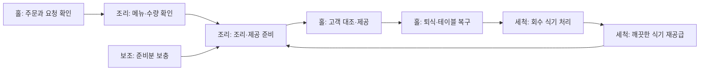

# 하루의 업무 조각으로 구성하는 매뉴얼·체크리스트 조사

조사일: 2026-10-08. 상태: **자료 기반 업무 흐름 재구성 및 질의 초안(proposed)**.

사용자 요청은 여러 크루가 일하는 실제 하루의 업무를 먼저 조사하고, 사장이 새 크루에게 앱의 매뉴얼·체크리스트로 일을 알려주는 상황을 놓고 질의하며 최적화하는 것이다. 이번에는 앱 구현·운영 데이터·공용 콘텐츠를 변경하거나 배포하지 않는다.

아래는 공개 직무자료와 운영 안내를 종합한 예시다. 특정 식당에 방문해 관찰한 기록, 한국 식당의 평균 인원·작업시간·빈도 통계가 아니다. 업무 종류는 출처로 확인하되 시간 순서·파트 구성·TAP 후보·체크 방식은 설계용으로 재구성했다. 식품 안전 수치와 장비 운전법은 해당 제품·공정·매장의 검증된 기준이 필요하다. 해외 자료의 법적 의무나 수치를 국내 기준으로 옮기지 않는다.

## 1. 확인한 자료와 적용 범위

| ID | 자료 | 이번에 확인한 내용 / 한계 |
|---|---|---|
| S1 | [국가유산진흥원 NCS 기반 직무기술서](https://www.alio.go.kr/download/download.json?fileNo=3029793), 조리직 PDF p1–2 및 전통음식 서비스 | 메뉴·재료 구매/관리/손질/조리, 시설 관리, 예약·세팅·서빙·주방과 의사소통. 실제 채용 직무 정의이며 소형 식당의 하루 관찰 자료는 아님 |
| S2 | [O*NET 조리보조](https://www.onetonline.org/link/summary/35-2021.00) | 식재료 준비·계량·운반·저장·보충·설비 이상 보고. 미국 직무 조사에 포함된 작업 목록 |
| S3 | [O*NET 식당 조리사](https://www.onetonline.org/link/summary/35-2014.00) | 레시피 조리·분량/제공·재료 상태·주방 협업. 메뉴별 레시피 검증 자료는 아님 |
| S4 | [O*NET 세척 담당](https://www.onetonline.org/link/summary/35-9021.00) | 식기 세척·정리·재배치·바닥/폐기물 관리. 모든 매장의 겸무 범위를 뜻하지 않음 |
| S5 | [O*NET 홀 서비스](https://www.onetonline.org/link/summary/35-3031.00) | 주문 전달·서빙·요청 대응·퇴식·테이블 복구·비품 보충 |
| S6 | [O*NET 식음료 현장 관리자](https://www.onetonline.org/link/summary/35-1012.00) | 담당 배치·업무 지도·서비스 문제 처리·재고/설비·운영 기록 |
| S7 | [FSA 직원 지도·감독](https://assets.publishing.service.gov.uk/media/69c53bd64a06660f085442a3/sfbb-management-04-training-and-supervison-customers_4.pdf) | 담당 업무의 방법 설명, 시범, 질문, 실제 수행 관찰과 피드백. 앱의 읽음/완료만으로 수행 능력을 판단하지 않는 근거 |
| S8 | [FSA 재고 관리](https://assets.publishing.service.gov.uk/media/69c53c66cdfd19de13d0f6f5/sfbb-management-06-stock-control_4.pdf) | 메뉴·교대에 맞춘 필요량, 입고 상태 확인, 저장·표시·재고 회전. 매장 앱에 재입력을 요구하는 근거는 아님 |
| S9 | [FSA 일지·운영 검토](https://assets.publishing.service.gov.uk/media/69c53f704a06660f085442ab/sfbb-diary-07-diary-and-4-weekly-review-fixed_0.pdf) | 시작/종료 점검과 문제·변경·조치 기록을 구분. 정상 업무 모든 동작의 매번 클릭을 요구하는 양식은 아님 |
| S10 | [O*NET 바리스타](https://www.onetonline.org/link/summary/35-3023.01) | 주문 전달, 음료 제조, 표시·보충·장비/좌석 청소. 카페 확장 비교 |
| S11 | [O*NET 소매 판매](https://www.onetonline.org/link/summary/41-2031.00) | 고객 요구 파악, 진열, 판매, 포장, 교환/반품, 재고·정산. 일반 소매 비교이며 편의점 특수 규정은 미조사 |
| S12 | [O*NET 객실·시설 청소](https://www.onetonline.org/link/summary/37-2012.00) | 청소 물품 준비, 객실 정리, 비품 보충, 분실/파손 보고. 객실 사용 가능 승인 흐름은 아래 설계 추론 |

조회 보조: [FSA SFBB 원본 목록](https://www.gov.uk/government/publications/safer-food-better-business-for-caterers). Opening/closing·Cleaning schedule PDF는 최초 메타데이터를 확인했으나 본문 재조회에 timeout이 있어 상세 인용 근거에서 제외했다. 식약처 대량조리 주의요령 게시물은 확인했으나 이번에는 이미지 본문을 새로 검증하지 않아 새로운 안전값의 근거로 사용하지 않았다. NCS 자체 학습모듈 전문을 열람했다고 주장하지 않는다.

## 2. 조사에서 도출한 업무 구조

다음은 S1–S9를 앱에 연결하기 위한 **설계 추론**이다.

1. 하루에는 영업 시작/종료처럼 **시점이 정해진 일**, 주문·퇴식처럼 **계속 반복되는 일**, 입고·개봉·고장처럼 **발생해야 하는 일**이 겹친다.
2. 같은 결과를 여러 사람이 만드는 경우, 앞 사람의 결과물과 뒤 사람의 시작 조건이 연결된다. 조리 완료, 홀 전달, 고객 제공은 서로 다른 상태다.
3. 초보자가 놓치는 부분에는 물건의 위치, 도구 선택, 수량 판단, 완료의 모습, 중단 기준, 물어볼 사람이 있다. 이것을 현장 인터뷰에서 확인할 가설로 둔다.
4. 방법을 모두 문서화하되 매 동작을 일상 체크 항목으로 바꾸지는 않는다. 필요한 기록의 단위는 매장·파트·작업 건·개인 중 무엇인지 구분한다.
5. 업무 안내는 실제 작업 도중의 설명·시범·질문·확인으로 사용한다. 이번 요청만으로 별도 강좌·시험·점수·교육 진도 기능을 확정하지 않는다.

## 3. 기준 식당과 여러 사람의 하루

설계 예시: 점심·저녁 영업, 중간 영업 브레이크가 있고 국물/밥/주문 조리 메뉴를 취급하는 식당. 운영 파트는 **조리 / 전처리·보조 / 세척 / 홀**, 책임자는 사장 또는 매니저. 이 구분은 역할이며 반드시 5명을 고용하거나 한 사람이 하루 종일 일한다는 뜻이 아니다. 교대·겸무·휴게는 실제 근무표로 정한다. 개인 휴게에는 업무를 배치하지 않는다.

| 하루의 장면 | 조리 | 전처리·보조 | 세척 | 홀 | 사장·매니저의 조정 |
|---|---|---|---|---|---|
| 근무 시작 | 진행 중 제조·설비 확인 | 준비량·재료 위치 확인 | 미세척/깨끗한 식기 상태 확인 | 예약·품절·미응대 고객 확인 | 담당·특이사항·새 크루 지원자 지정 |
| 영업 준비 | 공정·초기 제조량 결정 | 손질·계량·소분·작업대 준비 | 세척 구역·도구·반납 동선 준비 | 테이블·메뉴·비품 준비 | 준비 지연과 부족분 조정 |
| 입고 발생 | 대체 재료/불량 판단 지원 | 검수 후 지정 위치 보관 | 해당 시 운반 지원 | 판매 영향 전달받음 | 차이·반품/보류 판단 |
| 오픈 직전 | 제공 가능한 메뉴 확인 | 사용 가능한 준비분 전달 | 필요한 깨끗한 식기 공급 | 고객 안내 상태 점검 | 서비스 시작 가능 여부 확인 |
| 점심 피크 | 주문 순서·조리·제공대 | 재료/도구 보충·보조 | 회수→세척→재공급 반복 | 주문→전달→제공→퇴식 반복 | 지연·품절·예외·인원 재배치 |
| 피크 이후 | 남은 제조분 처리 판단 | 다음 준비분·표시 정리 | 밀린 세척과 구역 복구 | 빈 테이블·비품·문의 정리 | 남은 일의 담당/시점 정리 |
| 브레이크 운영일 | 보관 공정 지속 시 별도 담당 | 필요한 준비 작업 인계 | 담당 시간 내 정리 | 중단·재개 안내 | 영업중단과 개인 휴게 구분 |
| 교대 | 진행 중 배치 인계 | 개봉품·해동품·부족분 전달 | 파손·기계 상태·우선 식기 전달 | 진행 고객·예약·요청 전달 | 미해결 문제의 다음 책임자 지정 |
| 저녁 영업 | 실제 주문/남은 준비량에 맞춰 조리 | 필요한 것만 추가 준비 | 재공급 반복 | 서비스 반복 | 공석·기준 이탈 대응 |
| 마감 | 미완료 제조/보관·장비 확인 | 남은 재료 상태·표시·다음 준비 | 세척·정위치·폐기물/구역 정리 | 최종 고객·정산 담당 인계·홀 정리 | 미해결 항목·시설·최종 종료 확인 |

시각은 아직 정하지 않았다. 작업 위치, 선후관계, 혼자 가능한 일, 도움을 요청해야 하는 일은 다음 질의에서 매장 기준으로 채운다.

## 4. 세세한 업무 조각 목록: 60개 관찰 후보

아래 표는 그대로 60개 체크박스를 생성하자는 뜻이 아니다. 현장 흐름을 빠뜨리지 않기 위한 조사표다. `정기`는 시점별 결과 확인, `발생`은 건/배치별 기록 후보, `방법`은 수행할 때 보는 설명, `예외`는 이상·막힘이 생겼을 때만 기록할 후보를 뜻한다. 이 분류와 TAP 묶음은 proposed다. 발생/예외의 모든 종류가 현재 앱에 구현된 것은 아니다.

### A. 출근·근무 시작 (기초 S6·S7)

| ID | 담당·계기 | 행동의 흐름 | 끝난 상태 / 다음 사람 | 기록 후보 |
|---|---|---|---|---|
| W01 | 각 크루·근무 시작 | 오늘 배정 파트와 시간, 현장 책임자 확인 | 내 역할과 도움 요청 대상 확인 | 방법 |
| W02 | 각 크루·작업 전 | 복장·개인위생·작업 가능 상태 확인 | 문제는 책임자에게 먼저 전달 | 정기/예외 |
| W03 | 각 파트·교대 진입 | 이전 메모와 미완료 작업 확인 | 이어받을 대상 식별 | 정기 |
| W04 | 책임자·새 크루 합류 | 작업 구역·도구·기준·연락 방식 소개 | 시범을 받을 담당자 연결 | 방법 |
| W05 | 각 파트·실제 준비 전 | 통로·작업대·필요 설비 상태 확인 | 시작 가능 또는 사용 보류 표시 | 정기/예외 |
| W06 | 책임자·영업 계획 확인 | 예약·예상량·입고·품절·인원 공유 | 파트별 우선 작업 합의 | 정기 |

### B. 입고·저장 (기초 S1·S2·S8)

| ID | 담당·계기 | 행동의 흐름 | 끝난 상태 / 다음 사람 | 기록 후보 |
|---|---|---|---|---|
| W07 | 입고 담당·물품 도착 | 납품 품목·수량과 예정 내역 대조 | 차이 식별 | 발생 |
| W08 | 입고 담당·검수 | 제품 표시·포장·필요한 상태값 확인 | 사용 가능/보류 판단 근거 | 발생 |
| W09 | 책임자·검수 이상 | 문제 물품 구분 후 처리 결정 | 정상 물품과 섞이지 않음 | 예외 |
| W10 | 입고 담당·검수 완료 | 제품 조건에 맞는 저장 장소로 이동 | 위치와 대상 연결 | 발생 |
| W11 | 저장 담당·기존 재고 있음 | 기존품/신규품 식별·사용 순서 정리 | 다음 사용자 혼동 없음 | 방법 |
| W12 | 입고 담당·수령 완료 | 실제 수령·차이·위치 전달 | 준비/재고 담당이 확인 가능 | 발생 |

### C. 전처리·초기 제조 (기초 S1·S2·S3)

| ID | 담당·계기 | 행동의 흐름 | 끝난 상태 / 다음 사람 | 기록 후보 |
|---|---|---|---|---|
| W13 | 조리 책임·판매 준비 | 필요한 메뉴별 준비량 결정 | 보조에게 품목·단위·목표 전달 | 정기 |
| W14 | 보조·준비 지시 | 사용 대상과 상태를 확인해 꺼냄 | 해당 준비분 식별 | 방법 |
| W15 | 보조·작업 전 | 작업별 도구·용기·구역 준비 | 교차 사용 방지 조건 충족 | 방법 |
| W16 | 보조·손질 | 재료별 매장 절차로 손질·계량 | 정해진 규격/양의 준비분 | 방법/수량 |
| W17 | 보조·개봉/해동/소분 | 대상·시각·상태·보관기준 연결 | 라벨/위치로 이어서 확인 가능 | 발생 |
| W18 | 조리·제조 시작 | 배치 식별 후 매장 레시피 수행 | 조리 중 상태와 책임자 명확 | 발생 |
| W19 | 조리·제조 완료 | 제공·보관 기준에 맞는지 확인 | 제공 가능 또는 보류 | 발생/예외 |
| W20 | 보조→조리·준비 완료 | 준비량·위치·제한 사항 전달 | 조리 담당이 쓸 수 있음 | 결과 확인 |

### D. 세척·홀의 오픈 준비 (기초 S4·S5)

| ID | 담당·계기 | 행동의 흐름 | 끝난 상태 / 다음 사람 | 기록 후보 |
|---|---|---|---|---|
| W21 | 세척·구역 시작 | 반납/세척/깨끗한 물품 영역 확인 | 서로 섞이지 않는 배치 | 정기 |
| W22 | 세척·설비 사용 전 | 해당 기계/약품 매뉴얼로 준비 | 사용 가능 또는 고장 보고 | 정기/예외 |
| W23 | 세척·오픈 전 | 식기 종류별 필요한 위치로 공급 | 조리/홀 사용 가능 | 결과 확인 |
| W24 | 홀·오픈 전 | 테이블·의자·고객 이동구역 정리 | 고객을 맞을 수 있는 상태 | 정기 |
| W25 | 홀·오픈 전 | 메뉴·수저·물/비품·포장 준비 확인 | 매장 서비스 방식에 맞는 세팅 | 정기 |
| W26 | 홀·서비스 변경 | 예약·품절·주의 메뉴 전달받음 | 고객에게 같은 안내 가능 | 정기/변경 |
| W27 | 책임자·오픈 판단 | 각 파트의 준비 결과와 막힘 확인 | 지연/판매 제외를 결정 | 정기 |

### E. 영업 중 반복되는 세 가지 흐름 (기초 S3·S4·S5)

| ID | 담당·계기 | 행동의 흐름 | 끝난 상태 / 다음 사람 | 기록 후보 |
|---|---|---|---|---|
| W28 | 홀·고객 도착 | 좌석·메뉴·주문 방식 안내 | 주문할 수 있는 상태 | 방법 |
| W29 | 홀·주문 접수 | 메뉴·수량·요청을 확인해 전달 | 주방이 해석할 수 있는 주문 | 방법 |
| W30 | 홀/책임자·특별 요청 | 확인되지 않은 재료/알레르기 질문을 조리 담당에 확인 | 가능한 제공 여부를 명확히 안내 | 예외 |
| W31 | 조리·주문 수신 | 누락·변경·우선순위 확인 | 조리 대상 확정 | 방법 |
| W32 | 조리·제조 | 메뉴별 조리와 구성 확인 | 해당 주문과 음식 연결 | 방법/필수 측정 |
| W33 | 조리→홀·제공 준비 | 메뉴·수량·제공대 위치 전달 | 홀에서 받아갈 음식 식별 | 방법 |
| W34 | 홀·제공 | 대상 테이블/고객과 음식을 대조 | 맞는 고객에게 전달 | 방법 |
| W35 | 홀·식사 중 요청 | 추가 요청·문제 확인 후 해결/전달 | 미응대 요청 남지 않음 | 예외 |
| W36 | 보조·부족 예상 | 실제 남은 준비분 확인 후 보충 요청 | 조리 계획과 보충량 연결 | 예외/수량 |
| W37 | 홀→세척·퇴식 | 식기 회수·반납 규칙 준수 | 세척 담당이 처리할 수 있음 | 방법 |
| W38 | 세척·식기 유입 | 분류·잔여물 처리 후 지정 세척 절차 | 세척 후 검사 가능한 식기 | 방법 |
| W39 | 세척→홀/조리·세척 완료 | 상태 확인·건조/보관·재공급 | 깨끗한 식기가 지정 위치에 있음 | 방법 |
| W40 | 홀·퇴식 후 | 테이블 복구·비품 확인 | 다음 고객 이용 가능 | 방법 |
| W41 | 각 파트·오염/고장/파손 | 작업 중단 필요 판단·위험 구역/대상 분리·보고 | 책임자가 처리 대상을 알 수 있음 | 예외 |

### F. 영업 사이·교대 (기초 S6·S7·S8, 구체 인계 양식은 제안)

| ID | 담당·계기 | 행동의 흐름 | 끝난 상태 / 다음 사람 | 기록 후보 |
|---|---|---|---|---|
| W42 | 홀·영업 브레이크 시작 | 남은 고객/접수 확인·중단 안내 | 신규 방문에 일관된 안내 | 정기·해당일만 |
| W43 | 조리·피크 종료 | 남은 음식/준비분의 다음 사용·보관·처리 결정 | 방치된 대상 없음 | 발생/예외 |
| W44 | 지정 담당·냉각/보관 | 배치별 필요한 시점에 실제값 확인 | 다음 확인 시점/담당이 남음 | 발생 |
| W45 | 각 파트·영업 사이 | 작업대·도구·비품을 다음 영업 상태로 복구 | 다음 담당이 바로 시작 가능 | 정기 |
| W46 | 조리/보조·추가 준비 판단 | 남은 준비량과 다음 예상량으로 추가 결정 | 불필요한 재제조 방지 | 수량/발생 |
| W47 | 나가는 크루·교대 전 | 진행 중 대상·다음 행동·시점·위치 전달 | 누가 이어받을지 명확 | 정기/인계 |
| W48 | 들어오는 크루·교대 | 인계 내용과 실제 현물 대조 | 차이 해결 또는 보고 | 인계 |
| W49 | 홀/책임자·재개 | 제공 가능 상태와 재개 안내 확인 | 영업 재개 가능 | 정기·해당일만 |

### G. 마감·다음 근무 준비 (기초 S1·S4·S5·S6·S9)

| ID | 담당·계기 | 행동의 흐름 | 끝난 상태 / 다음 사람 | 기록 후보 |
|---|---|---|---|---|
| W50 | 홀·마지막 접수/고객 | 미제공·미응대·결제 인계 사항 확인 | 고객 관련 잔여 업무 식별 | 정기/예외 |
| W51 | 조리·최종 제조 종료 | 남은 배치별 처리 상태 확인 | 미확인 식품이 정상 완료로 사라지지 않음 | 발생/예외 |
| W52 | 보조·재료 정리 | 개봉/해동/소분품의 표시·위치 확인 | 다음 사용자 판단 가능 | 정기 |
| W53 | 세척·마지막 반납 | 남은 식기/도구 처리·정위치 보관 | 다음 영업에 사용 가능 | 정기 |
| W54 | 각 파트·구역 청소 | 구역별 매장 방법으로 세척·정리 | 지정된 종료 상태 | 정기 |
| W55 | 세척/지정 담당·폐기물 | 분류·반출·용기/주변 정리 | 폐기물 잔류·동선 방해 없음 | 정기 |
| W56 | 지정 담당·장비 종료 | 장비별 종료/계속 운전 기준 확인 | 필요한 냉장 등 유지·불필요 설비 종료 | 정기 |
| W57 | 권한 있는 담당·정산 | 기존 결제 기록과 차이 확인 | 차이 처리/인계 | 정기/예외 |
| W58 | 재고 담당·부족/다음 준비 | 필요한 부족분·다음 준비 전달 | 기존 재고/발주 기록에 연결 | 예외/수량 |
| W59 | 책임자·최종 점검 | 미완료·사용 보류·고장·다음 확인 검토 | 사라지지 않는 책임자/다음 행동 | 정기 |
| W60 | 최종 담당·퇴장 | 매장별 시설·출입 종료 절차 수행 | 다음 근무자가 이어받을 수 있음 | 정기 |

재고 관련 W07/W12/W36/W58은 같은 수량을 네 번 입력하자는 제안이 아니다. 확인 목적과 원본 기록을 연결한다. 발주 후 N일 재고 확인(D-017)을 입고/보충/개봉으로 연기하지 않는다. 주문·정산은 실제 업무 지도에 포함하지만 POS/배달앱 초기 연결이나 앱 내 주문 재입력을 제안하지 않는다.

## 5. 하나의 주문이 여러 사람을 지나가는 흐름

다음은 설명용 시나리오다. 주방이 완료했다고 고객 제공까지 완료된 것은 아니고, 홀의 퇴식 완료가 세척 완료를 뜻하지도 않는다.

이 전체 흐름을 주문마다 새 체크리스트로 입력시키면 기존 주문 도구와 중복된다. 기본은 **반복 수행 방법 문서**로 제공하고, 신규 크루가 처음 할 때 함께 확인할 지점과 평소 중요한 결과/예외만 별도로 선택한다. 주문 상태 자동 연결은 후속 범위다.

## 6. 신규 크루 하루를 따라가는 예시

가상 인물 민지는 오늘 전처리·보조 파트를 맡는다. 다른 파트 일과는 전체 흐름을 이해하기 위한 보기이며, 민지에게 모두 수행시키지 않는다.

1. **근무 시작**: 사장이 오늘 지원자를 정한다. 민지는 재료 보관 위치·사용할 도구·오늘 준비할 품목을 함께 확인한다.
2. **첫 준비 작업**: 기존 준비분과 새 준비량을 대조한다. 매뉴얼에는 손질 방법, 규격 사진, 계량 단위, 담을 용기와 놓을 위치가 연결된다. 아직 확인되지 않은 규격은 매장에 질문한다.
3. **실행 중**: 선임이 한 번 보여주고 민지가 직접 수행한다. ‘설명 열어봄’과 ‘실제 작업 완료’를 동일하게 처리하지 않는다.
4. **준비분 전달**: ‘손질 완료’ 뒤에도 조리 담당이 찾을 수 있는 위치와 수량을 알려야 일이 끝난다. 실제 전달 결과로 완료 기준을 정한다.
5. **피크**: 민지는 지정 재료의 남은 양과 지원 요청을 보고 움직인다. 앱은 자세한 설명을 다시 찾는 수단이며 모든 집기 동작을 누르게 하지 않는다.
6. **뜻밖의 상황**: 라벨 없는 용기를 발견한다. 정상 완료 대신 책임자에게 대상·위치를 알리고 사용 판단을 요청한다. 승인 없이 날짜를 새로 적거나 정상품에 섞지 않는다.
7. **교대/퇴근**: 진행 중인 준비분과 부족분을 넘긴다. 다음 크루가 위치·상태를 이해했는지 확인한다. 민지가 퇴근해도 남은 공정이 끝난 것으로 바뀌지 않는다.

S7의 시범·질문·직접 수행·관찰 원칙을 적용한 제안이다. ‘혼자 가능’ 같은 앱 권한/숙련 인증이나 별도 교육 이력 시스템은 확정하지 않았다.

## 7. 업무 조각을 TAP과 매뉴얼로 바꾸는 초안

**같은 담당 파트·발생 계기·완료 시점·결과로 묶을 수 있으면 한 TAP**, 그 안의 행동은 Task, 상세 방법·기준·이유는 매뉴얼로 둔다. 담당이나 후속 확인 시점이 달라지면 TAP 분리를 검토한다. 기존 D-073의 TAP 단위 배정을 유지한다.

| 업무 묶음 후보 | 체크리스트에 남길 결과 | 연결 매뉴얼 | 현재 앱과의 관계 |
|---|---|---|---|
| 보조 파트 영업 준비 | 준비분·작업대·전달 상태 | 재료별 손질, 규격, 보관 위치 | 정기 TAP으로 구성 가능 |
| 세척 파트 시작 점검 | 구역·설비·초기 공급 상태 | 해당 장비/약품 방법 | 정기 TAP으로 구성 가능 |
| 홀 오픈 준비 | 고객 공간·비품·변경 안내 상태 | 테이블 사진, 품절 안내 | 정기 TAP으로 구성 가능 |
| 국물 보관 작업 | 배치별 측정/표시·이상 조치 | 해당 국물 공정·매장 기준 | 관리자 수동 사건 시작·증거·이상 처리 가능 |
| 영업 중 서빙/세척 방법 | 평소 모든 반복 동작의 클릭 없음 | 단계·인계·실패 대응 | 참고용으로 구성 가능 |
| 교대 인수인계 | 진행 대상·상태·다음 행동 확인 | 인계 예시와 확인 방법 | 일반 TAP 초안은 가능, 구조화된 양방향 인계는 제안 |
| 관리자 마감 검토 | 미해결 문제와 다음 담당 확인 | 종료/예외 판단 기준 | 일반 TAP 가능, 모든 실행의 의존성 자동 판정은 제안 |

매뉴얼 한 장의 필수 질문은 다음과 같다.

- **언제/왜** 이 일을 시작하는가? 어떤 상태면 해당하지 않는가?
- **어디서/무엇으로** 하는가? 재료·도구·보관 위치는 어디인가?
- **어떤 순서로** 하는가? 중간에 기다려야 하는 조건은 무엇인가?
- **어떤 모습/값이면 끝인가?** 실제 기준 사진·분량·필수 측정은 무엇인가?
- **안 되면 어떻게 하는가?** 중단·보류·보고 대상과 다음 행동은 무엇인가?
- **누구에게 무엇을 넘기는가?** 물건·상태·시점·위치는 무엇인가?

### 상세 카드 예시: 보조가 준비분을 넘기기

- 시작: 조리 담당이 오늘 준비할 품목·목표량을 확인함.
- 전제: 사용할 재료가 식별되고 매장 규격이 있음.
- 방법: 기존 준비량 확인 → 필요한 양만 준비 → 규격에 맞게 손질/계량 → 지정 용기에 담아 표시 → 지정 위치에 놓고 조리 담당에게 전달.
- 체크 후보: `준비 수량 확인`, `표시·보관 위치 확인`, `전달 사항 확인`.
- 매뉴얼 상세: 칼·도마/용기, 규격 사진, 가식부·손실 구분, 남은 원재료 처리, 정상·불량 사례.
- 중단: 상태 불명, 규격 없음, 수량 부족, 도구 이상. 책임자에게 사실만 전달하고 임의 기준을 만들지 않음.
- 현장 질의: 누가 목표량을 정하는가? 어느 용기가 몇 인분인가? 보충 요청을 무엇으로 주고받는가?

### 상세 카드 예시: 국물 배치가 교대를 넘기기

- 시작: 실제 국물 제조/냉각 대상이 생김. 매일 ‘국물 보관 완료’ 하나로 여러 배치를 합치지 않음.
- 체크 후보: 배치 식별 → 해당 공정의 확인 시점에 실제값 기록 → 표시·위치 확인 → 다음 사용/확인 책임 인계.
- 매뉴얼 상세: 기본 육수/완성 국물 구분, 용기와 설비, 검증된 매장 공정, 보류/폐기 판단 경로.
- 인계 예시: `대상: 점심 육수 B / 위치: 지정 냉각 구역 / 상태: 확인 진행 중 / 다음 행동: 매장 기준의 다음 확인 / 인수자: 저녁 담당`.
- 아직 없는 자동화: 경과시간 알림, 수치 임계 판정, 선행 TAP 완료에 따른 후행 자동 생성, 크루 간 명시적 수락과 책임 이전.
- 현장 질의: 실제로 무엇을 측정하는가? 누가 어떤 설비로 확인하는가? 퇴근/브레이크 중에도 확인할 사람이 있는가?

### 상세 카드 예시: 세척 완료가 아닌 재공급 완료

- 시작: 반납 식기가 들어옴.
- 방법: 반납 규칙 → 분류 → 장비/수동 절차 → 깨끗한 상태 확인 → 지정 방식의 건조/보관 → 사용 위치에 재공급.
- 평소에는 이 전체를 필요할 때 보는 방법으로 제공. 구역 시작/마감, 기계 이상, 심한 오염 등 기록이 필요한 지점만 별도 점검.
- 매뉴얼 상세: 담으면 안 되는 물건, 파손 식별, 더러운/깨끗한 영역, 식기 종류별 위치, 공급 우선순위.
- 현장 질의: 피크 때 먼저 필요한 식기는 무엇인가? 세척 담당이 운반까지 맡는가? 세척 후 놓을 곳이 꽉 차면 누구에게 알리는가?

## 8. 체크 피로도를 줄이는 판단표 — 제안

| 실제 작업 | 방법 설명 | 평소 완료 기록 | 처음 함께 할 때 |
|---|---|---|---|
| 손님 인사·식기 한 개 운반 | 필요 | 매번 체크하지 않음 | 시범과 수행 관찰 |
| 홀 오픈 세팅 | 필요 | 파트별 준비 결과 | 위치/사진을 자세히 확인 |
| 국물 배치의 필수 측정 | 필요 | 해당 배치·시점의 실제값 | 측정/기록 방법을 함께 확인 |
| 고장·라벨 불명·미제공 | 필요 | 문제와 조치 기록 | 보고할 대상과 중단 범위를 확인 |
| 교대 | 필요 | 남은 일과 이어받을 대상 | 설명만으로 찾을 수 있는지 확인 |
| 레시피의 유래·품질 팁 | 필요할 때 | 읽었다는 이유로 업무 완료를 만들지 않음 | 실제 작업에 필요한 부분만 설명 |

‘정상은 모두 일괄 완료’로 통일하지 않는다. 증거가 필요한 공정은 실제 기록을 유지한다. 일반 크루 모두에게 같은 매장 점검을 중복 배정하지 않되 개인별 위생 확인은 공용 한 번으로 대체하지 않는다. 별도의 체크 개수 목표는 아직 정하지 않았다.

## 9. 다른 업종에도 적용되는지 비교

아래는 S10–S12 업무 목록을 사용한 **전이 설계 예시**이며 각 업종의 실제 사업장 인터뷰로 확인해야 한다.

| 업종 | 하루의 큰 흐름 | 반복 작업의 단위 | 자주 놓칠 수 있어 검증할 인계 | 필요한 고유 매뉴얼 |
|---|---|---|---|---|
| 카페 | 바/좌석 준비 → 주문·음료 제조 → 소모품 보충 → 교대 → 장비·좌석 마감 | 음료 주문, 원료 개봉, 제조 배치 | 원료 상태·부족품·제조 대기 | 메뉴 레시피·기기 관리·원료 표시 |
| 소매점 | 진열/가격 안내 준비 → 고객 응대·판매 → 입고·진열 보충 → 교대 → 정산/종료 | 입고품, 판매/반품 건 | 재고 차이·미처리 반품·고객 약속 | 상품 설명·진열 기준·반품 절차 |
| 숙박 객실 관리 | 대상 객실/물품 확인 → 객실별 정비 → 점검·비품 보충 → 상태 전달 → 카트/물품 정리 | 객실 한 개 | 고장/분실물·정비 미완료 객실 | 객실 기준 사진·물품 수량·보고 절차 |

공통으로 재사용할 수 있는 것은 **담당 확인 → 준비 → 대상별 수행 → 결과 확인 → 이상 대응 → 인계 → 종료**라는 구조다. 식재료 안전·객실 출입·반품 권한 같은 업무 기준은 서로 복사하지 않는다. 브레이크 유무, 교대 유무, 고객당/제품당/공간당 업무 여부는 업종명과 별도로 확인한다.

## 10. 현재 앱에서 확인한 범위와 다음 검증

로컬 코드 `developer/knowledge_work.mjs`, `docs/ARCHITECTURE.md`의 2026-10-08 구현 항목을 확인했다.

- 구현됨: 참고/정기/작업별 구분, TAP 배정, 관련 매뉴얼 참조, 관리자 수동 batch/opened/thawed/received 시작, 실행 당시 내용 보존, 사건의 증거/이상 처리, 미완료 사건의 다음날 표시.
- 추가 설계 필요: 앞 사람의 결과를 인수자가 수락하는 구조, 선후행 의존관계, 공정 중 기다림/후속 확인 시간, 크루의 사건 시작 권한, 실제 준비 수량/입고 기록과의 중복 없는 연결, 신규자 설명 강도 조절.
- 상태 구분 유의: 체크 완료·매뉴얼 읽음·시범 관찰·혼자 수행 가능은 서로 다르다. 지금 앱이 이 네 가지를 모두 추적한다고 설명하지 않는다.
- 현재 공용 stable86 유지/새91 검토안 미발행 상태는 그대로다. 이번 자료를 자동 가져오기/발행하지 않는다.

현장 확인용 기록 틀: `시점/발생 계기 → 실제 수행자·파트 → 대상/위치 → 행동 → 종료 판단 → 다음 사람 → 막힌 이유 → 앱을 볼 수 있었던 순간`. 가능한 경우 사장 설명뿐 아니라 신입·숙련자·다음 인수자의 관점을 각각 대조한다. 작업시간과 발생 횟수는 직접 관찰 전 수치화하지 않는다.

## 11. 질의 순서

첫 대화에서는 다음 세 가지만 정한다. 나머지는 선택한 하루를 실제처럼 따라가며 한 장면씩 묻는다.

1. **대표 사업장**: 어떤 업종·주요 메뉴의 매장을 먼저 구체화할 것인가? 한 매장을 깊게 만든 뒤 다른 업종에 대입하는 안을 제안한다.
2. **실제 인원과 역할**: 피크에 누가 몇 명이며, 신입은 어느 파트로 들어오는가? 예: 사장 조리1·보조1·홀1, 세척은 보조 겸무.
3. **신입의 첫날 범위**: 자기 파트 중심으로 실제 수행하되 전체 흐름은 보는가, 여러 파트를 순환 체험하는가?

이어 물을 장면별 질문:

- 출근: 처음 누구에게 가는가? 오늘 일을 무엇으로 알려주는가? 책임자가 자리를 비우면 누구에게 묻는가?
- 준비: ‘적당히’라고 말하는 양·규격은 무엇인가? 목표를 누가 정하는가? 전날 준비분을 어떻게 구분하는가?
- 피크: 일이 세 개 겹치면 무엇부터 하는가? 지원 요청과 품절 정보는 어떻게 전달되는가?
- 완료: 끝났다고 누구에게 알리는가? 다음 사람이 다시 확인하는 이유는 무엇인가?
- 사건: 실제로 자주 겪는 품절·고장·오주문·파손·보관 불명 사례는 무엇인가?
- 교대: 말로만 전해 놓치는 내용은 무엇인가? 인수자가 없을 때 누구에게 남기는가?
- 마감: 다음날 가장 자주 발견하는 누락은 무엇인가? 최종 확인자는 누구인가?
- 앱 사용: 손이 젖었거나 바쁠 때 어디에서 확인할 수 있는가? 개인폰/공용 기기/인쇄 중 무엇을 쓰는가?
- 부담: 현재 기록 중 실제 의사결정에 쓰지 않는 것은 무엇인가? 반드시 남겨야 하는 것은 무엇인가?

답변에 따라 수정할 산출물: 파트별 하루 지도 → 대표 TAP/Task/매뉴얼 1세트 → 반복·사건·인계의 실제 예시 → 다른 업종 반례. 제품 세부 결정은 사용자 답변 전까지 proposed로 둔다.
