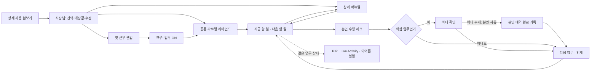

# 신입 크루 업무 내비게이션 · 매뉴얼 고도화 작업 계획

작성: 2026-10-10 (Asia/Seoul). **후속: 행동 슬라이드·사진 등록 첫 구현 진행. 전체 고도화·운영 배포 완료 아님.**

현재 [모델별 에이전트 실행·검증](MANUAL_NAVIGATION_AGENT_DELIVERY_2026-10-10.md)을 따른다. 아래 원래 계획의 미구현 표시는 해당 계획 작성 시점이며 후속 구현 상태는 실행 문서와 canonical history가 우선한다.

> 후속 검토: [한 항목씩 미리 보고 결정하기](MANUAL_NAVIGATION_REVIEW_SEQUENCE_2026-10-10.md). 사용자 요청으로 작은 시안→체험→질문 하나→반영 순서를 사용한다. 01 웰컴 위치는 A안(별도 웰컴 화면)으로 확정했으며 실제 Flutter 구현은 아직이다.

이 문서는 [10월 10일 TODO](MANUAL_ROUTINE_TODO_2026-10-10.md)를 이어받는 상세 실행 계획이다. 기존 미완성 작업을 폐기하지 않는다. 사용자 답변으로 확정한 제품 선택과 아래 `proposed` 구현 방식을 구별한다. 기준 조사 시점의 canonical revision은 270이다. 후속 답변은 [project-state.json](project-state.json)에 별도 기록한다.

## 1. 목표와 이번에 확정한 선택

TAP Work는 신입 크루가 **어떤 일을 언제, 어디에서, 어떻게 하고 무엇으로 완료를 확인하는지** 안내하는 업무 내비게이션을 지향한다. 매뉴얼은 업무 시점·실제 체크와 연결하고, 사장님에게는 좋은 운영 본보기와 매장에 맞춰 수정할 수 있는 상세 절차를 제공한다. 업무·매뉴얼·근무표·우리매장과 재고·발주·공간의 통합 운영 범위는 유지한다.

| 번호 | 사용자 확정 답변 | 계획 반영 |
|---|---|---|
| C01 | 외식 공통 + 설거지·주방 보조를 첫 본보기로 사용 | 대표 하루를 먼저 끝까지 완성한 뒤 홀·업종별로 확장 |
| C02 | 크루가 직접 업무 ON, 출퇴근은 별도 | 안내 시작/일시정지/종료가 근태·급여를 쓰지 않음 |
| C03 | 매뉴얼·시간별 체크 우선, PIP·음성은 병렬 실험 | 네이티브 실험의 지연이 매뉴얼 구현을 막지 않음 |
| C04 | 일반 업무 본인 체크, 지정 핵심 업무만 버디 확인 | 본인 수행과 타인의 확인을 별도 사건으로 저장 |
| C05 | 사장님이 공통·파트별 리마인드 묶음 선택, 크루는 한 번에 확인 | 모듈 선택·순서·대상 설정과 묶음 버전별 확인을 분리 |
| C06 | 사장님·권한 있는 매니저가 매장 공통본 수정 | 크루별로 서로 다른 작업 표준을 만들지 않음 |
| C07 | 웰컴은 첫 근무·중요 변경 시 표시, 평소 다시보기 | 매 근무 전체 웰컴 강제 재생 없음; 중요 변경 판정은 §11 질의 |
| C08 | 공용 개선안을 먼저 보고 사장님이 선택 적용 | 기존 미수정 연결본 자동 갱신을 대체하는 새 정책. 이관 필요 |
| C09 | Android PIP / iPhone 잠금화면·Dynamic Island 안내, 이어폰 듣기부터 검증 | 음성은 명시적으로 켠 뒤 듣기·반복·일시정지. 음성 완료는 첫 실험 범위 밖 |
| C10 | 사장님이 웰컴 중요 변경 표시, 재확인 요청, 업무 진입 허용 | 재확인 대기가 업무 진입을 막지 않음 |
| C11 | 버디 부재 시 본인이 사유를 적으면 최종 완료 허용 | 버디 확인과 사유 있는 본인 예외 완료를 구별해 기록 |
| C12 | 매뉴얼 묶음(TAP)별 개선 선택, 매장 수정 충돌은 확인 후 교체 | 절차별 자동 병합 없이 TAP별 영향 비교·명시 적용 |
| C13 | 핵심 행동·자세한 설명·사진 링크/첨부·수행 체크를 같은 화면에 담고 슬라이드로 다음 행동 보기 | 완료 체크 시 다음 행동으로 자동 이동, 체크 없이 탐색 가능. 매뉴얼과 체크리스트 통합. 접시 종류·반납/건조 위치·잔반 배출처·배수구 예방 내용을 구체화 |

| C14 | 바로 촬영·적정 화질 변환 후 업로드 | 고화질 원본 미보관,1280px/150~250KB는 조정 가능한 초기 기술값 |
| C15 | 설거지 시작 준비·교대·마감 체크, 영업 중 필요 시 안내 | 식기마다 반복 체크 없음. 실제 기존 일정을 임의 일괄 변경하지 않음 |
| C16 | 다른 매장 복원 시 내용 유지·사진 재등록 | private 사진 제외 수를 미리 안내, 같은 매장 참조·외부 링크 유지 |

이번 요청의 직원교육은 현장 매뉴얼·시범·실습·버디 확인이다. 별도 강좌·시험·점수·LMS·교육 진도 시스템은 추가하지 않는다. 기존 기기 로컬 연습과 버디 데모는 공유 매장 업무 완료의 증거로 전환하지 않는다.

## 2. 10월 10일 계획과 실제 기준선

| 구분 | 확인한 상태 | 다음 조치 |
|---|---|---|
| 공용 카탈로그 | 최신 기록상 stable 109개 / channel revision 2 발행 완료 | 계획 기준값이며 이번 턴 운영 DB 재조회 아님 |
| 마켓·서버 초안 | 아래 5개 파일 수정 중, 해당 변경 분석·테스트 미실시 | P0에서 기준 검사와 실제 실패 재현 |
| 상세 콘텐츠 | 18개 매뉴얼·84개 절차 초안, SOURCE/current 미적용 | ID 대조·근거·완료 기준 검토 후 적용 |
| 탐색 분류 | `knowledge.useCase` 처리 코드 초안은 있으나 원본에 값 없음 | 109개 전수 분류 후 UI와 함께 검증 |
| 딥다운 | Task 본문 700자 / tip 400자, 이미지·영상·출처 URL 각각 하나 | 요약을 보존하고 구조화 상세 연결 계약 확장 |
| 업무 연결 | TAP 단위 배정, reference/routine/event, 사건별 실행·증거·이상 대응 존재 | 별도 완료 엔진 대신 기존 실행 재사용 |
| 매장별 구성 | 셀프바/화구 조건·공통 장소·수정 배지·개인화 존재 | 기존 ID·설정·실행 snapshot 유지 |
| 웰컴·버디 | 기기 로컬 데모 존재 | 인증된 매장 웰컴·핵심 업무 확인 기능은 별도 구현 |
| PIP·음성 | 표적 소스 감사에서 관련 네이티브 기능 미발견 | 신규 네이티브 실험으로 분리 |
| 네이티브 배포 | 마지막 기록은 Android9 내부 사용 가능/Alpha 심사 중, iOS10 심사 대기 | 과거 확인값. 이 계획 때문에 심사 중 빌드를 변경하지 않음 |

초안 파일: `app/lib/domain/manual_market_catalog.dart`, `app/lib/ui/manual_market_screen.dart`, `developer/knowledge_work.mjs`, `developer/manual_market.mjs`, `developer/store_setup.mjs`.

감사에서 발견한 구체 공백:

- 상세 초안의 단계 ID 84개가 모두 `{sid}` 임시 표기다. 자동 가져오기 전에 `sourceId → 기존 stepId → 변경 절차 → 신규 ID 여부` 대조표를 작성한다. 셀프바·화구 조건 ID를 특히 보존한다.
- 현재 미분류 legal 항목을 periodic으로 보는 Flutter 대체 분류는 최초 인허가까지 정기관리로 표시할 수 있다. 최초 개설·운영 중 점검을 실제 내용으로 구별한다.
- 교육·정기관리 탐색 분류와 실행 방식은 다른 축이다. `useCase=training/periodic`만으로 매일 업무를 만들지 않는다.
- 본문 700자 제한은 카탈로그 스키마·편집기·콘텐츠 export에도 존재한다. 한 군데 제한만 늘리는 구현은 불충분하다.
- 기존 D-081 자동 갱신은 아직 현재 코드의 동작이다. C08 선택 적용 정책은 **확정했지만 미구현**이며 P2 이관 전까지 자동으로 바뀌지 않는다.
- `docs/BACKEND_WATCH_HANDOFF.md`는 현재 작업 트리에서 찾지 못했다. AI_HANDOFF의 오래된 B-01 참조를 재현된 현재 오류로 보고하지 않는다.

## 3. 크루·사장님 사용 흐름

네 주요 목적지는 유지한다. `업무`가 오늘의 안내와 실제 체크를, `매뉴얼`이 전체 방법·본보기·작성·업데이트 검토를 소유한다. `근무표`는 담당/시간 원본, `우리매장`은 분위기·공통 장소·안내 설정의 진입점이다. 다른 진입점에서도 같은 편집기와 저장값을 사용한다.

### 3.1 웰컴

첫 화면에 환영 문구와 매장의 일하는 원칙을 담는다. 예: “모르면 바로 물어봐요. 급해도 확인하고 움직여요.” 이는 편집 가능한 가상 예시이며 실제 매장 신조로 단정하지 않는다.

내용은 매장 분위기·응대 원칙, 내 담당 범위, 도움받을 버디/책임자, 주요 장소, 혼자 판단하지 않을 상황 순으로 구성한다. 장소는 기존 zone ID를 연결하고 별도 위치 목록을 중복 입력하지 않는다. 본문은 짧게, 이유·구체 사례·자세한 방법은 펼쳐 본다. 매장 정보가 없으면 준비되지 않은 항목을 표시하고 사람·연락처를 생성하지 않는다.

최초 근무 대상 판정 및 확인 기록은 매장+크루+웰컴 버전에 연결하는 방안을 제안한다. 사장님이 중요 변경으로 표시하면 변경점 중심으로 다시 보여주고 재확인을 요청하되 업무 진입은 허용한다(C10). 이미 읽은 웰컴을 재생했다고 실제 업무를 수행한 것으로 기록하지 않는다.

### 3.2 사장님 구성

`완성된 하루 본보기 보기 → 사용할 업무 묶음 선택 → 기존 영업시간·파트·장소 불러오기 → 부족한 매장값 입력 → 매뉴얼 수정 → 크루 화면 미리보기 → 저장` 순서다.

마켓의 직원교육/매장 루틴/정기관리 구분은 10월 10일 초안을 검수하여 적용한다. 외식 공통/업종/용도를 동시에 여러 줄로 노출하지 않고 검색과 한 번의 좁혀보기를 우선 검증한다. 가져올 매뉴얼 수, 실제 시간별 체크 수, 참고 전용 수를 구분한다. 최초 개설 항목은 신규 탐색·추천에서 제외하고 기존 설치본·실행은 유지한다.

기존 공통값은 연결 표시, 절차 수정은 코랄 연필+문자, 직접 추가는 코랄 문서+문자로 구별한다. 매니저는 기존 서버 capability 범위에서 매장 공통 내용을 수정하며 공용 개선 적용은 사용자가 선택한 사장님 동작으로 설계한다. 더 넓은 적용 권한은 별도 결정한다.

### 3.3 시간별 업무와 상세 읽기

후속 C13을 우선한다. 실제 업무의 각 핵심 행동은 설명·사진·완료 기준·체크를 같은 화면에 담고 다음 행동으로 좌우 넘긴다. 초기의 별도 상세 화면 왕복은 핵심 방법을 읽는 기본 동선에서 대체한다. 같은 행동 안의 추가 설명/사진 확대와 세로 스크롤은 허용하고 전체 지식 검색·매뉴얼 편집 구조는 유지한다. [시안과 콘텐츠 구성](MANUAL_NAVIGATION_REVIEW_SEQUENCE_2026-10-10.md).

상단에는 지금 수행할 업무 1개, 다음 업무, 주요 주의를 우선 보여주는 안을 제안한다. 전체 흐름은 필요할 때 펼친다. 예정 시각과 실제 수행 시각을 나누고, 시간이 되었다고 완료하거나 다른 사람의 업무를 자동 인수하지 않는다.

고정 시각, 영업 시작/종료 기준 상대 시각, 사건 발생 시, 정기관리 시점을 구별한다. 기존 시간대 배정은 재사용하며 세부 상대 시각·업무 간 선후관계 지원 여부는 P2에서 명시한다. 상세 설명 단계마다 체크를 늘리지 않고 실제 확인 가치가 있는 행동을 Task로 유지한다. 배정·권한은 TAP에서 결정한다.

일반 업무는 본인 체크로 완료한다. 핵심 업무는 본인 수행 후 `버디 확인 대기`를 보여주고 별도 확인 사건을 기록한다. 버디가 없으면 본인이 사유를 적어 최종 완료할 수 있다(C11). 이때 `버디 부재 · 본인 완료`와 사유·작성자·시각을 남기고 버디가 확인한 기록을 생성하지 않는다. 이 예외는 버디 확인 단계에 적용하며 실제 수행·필수 관찰값과 기존 미해결 이상 처리 계약은 유지한다. 반려·재작업과 버디 지정 방법은 Q02의 남은 질문이다. 공동 업무를 다른 크루가 완료하면 안내 후보에서 제거한다. 연습 완료와 실제 근무의 수행 체크는 구분한다.

### 3.4 영업 전 선택형 리마인드와 모션

사장님은 공통과 파트별 모듈을 조합하고 순서를 정한다. 최초 모듈 후보는 도움 요청, 뜨거운 용기와 이동, 깨끗한/오염 동선 구별, 파손 발견, 손님 질문을 담당자에게 연결하기, 오늘의 품절·설비 변경이다. 위생·장비의 정확한 절차는 검증된 상세 매뉴얼과 매장 기준을 따른다.

각 모듈은 `상황 → 해야 할 행동 → 주의/도움 요청` 3장면과 한 줄 자막, 같은 버전의 상세 매뉴얼 연결을 가진다. 10~15초씩 3개, 전체 30~60초는 **초기 검증용 제안값**이며 확정 길이가 아니다. 고객 응대 예시는 주방 보조의 권한 범위에 맞춰 “확인 후 담당자를 연결하겠습니다”처럼 확인되지 않은 약속을 피하는 상황으로 만든다.

모션은 내용을 전달하고 자동 반복 장식은 줄인다. 무음·자막·정지 그림·동작 줄이기를 동등하게 제공한다. 크루는 묶음을 한 번에 확인하며, 재생 완료와 명시적 확인은 별도 상태다. 확인해도 실제 작업 완료는 생성하지 않는다. 중간에 내용이 바뀌면 과거 확인을 새 버전의 확인으로 옮기지 않는다. 늦게 업무 ON한 경우의 노출·반복 기준은 Q03에서 결정한다.

### 3.5 사장님이 운영 노하우를 얻는 구조

각 본보기는 단순 절차 외에 ‘왜 이렇게 하는지’, 정상/실수 예시, 이상 시 판단·보고, 매장에서 바꿀 값, 적용 조건을 제공한다. 사장님은 전체 하루와 실제 크루 화면을 보고 필요한 묶음을 가져온다. 장소·장비·제품·담당·시간을 수정한 결과가 실행 화면에 어떻게 나타나는지도 미리 확인한다.

현장 사용에서 모호한 단계·도움 요청·반복 보류가 생기면 해당 콘텐츠 버전에 연결한 개선 메모로 검토한다. 개선 요청은 기존 요청형 콘텐츠 팀에 전달할 수 있게 설계하며 실제 수집·전송 범위는 후속 결정한다. AI의 작성·동의 횟수를 정확도나 현장 검증으로 표시하지 않는다.

## 4. 첫 사용 본보기: 설거지·주방 보조의 하루

아래는 **가상 시나리오**다. 특정 매장의 실측 일과·인원·안전 기준이 아니다. T는 해당 매장의 영업 시작이며 리드타임은 설정·현장 검토 대상이다.

| 시점 | 보여줄 내용 | 크루 행동과 기록 |
|---|---|---|
| 첫 근무 | 웰컴: 분위기·신조·주의·도움받을 사람·장소 | 웰컴 열람/확인. 근태나 업무 완료를 만들지 않음 |
| 직접 업무 ON | 오늘 파트·지금 할 일·다음 일 | 안내 세션 시작. 예정 근무가 없으면 범위를 확인하고 배정을 생성하지 않음 |
| T-30분 예시 | 세척 구역 준비 TAP | 반납/깨끗한 식기 위치, 도구·제품 표기, 장비 사용 가능 여부 확인 |
| T-10분 예시 | 선택 리마인드 3장면 | 이동·뜨거운 용기·도움 요청 확인. 묶음 1회 확인 |
| 영업 중 | 반납 식기 처리·지정 보조 업무 | 발생한 업무의 처리. 식기 한 개마다 체크하는 과도한 입력은 피함 |
| 확인 필요 상황 | 파손·정체·사용 불가 등 | 처리 보류/책임자 연결, 실제 대응 기록. 자동 해결 처리 없음 |
| 교대 시 | 남은 일·보류 이유·위치·다음 담당 | 인계하고 실행 기록 유지 |
| 마감 시 | 세척 구역 마감 한 TAP | 실제 수행 체크, 지정 핵심 항목 버디 확인 |
| 업무 OFF | 남은 업무와 인계 요약 | 안내 종료·소리/표시 해제. 퇴근 기록 변경 없음 |

**한 업무를 깊게 보는 완성본 예시 — ‘세척 구역 준비’**

| 깊이 | 예시 내용 | 매장별 수정값 |
|---|---|---|
| 바로 할 일 | 반납 식기와 깨끗한 식기의 자리를 확인해요 | 반납대/건조대 zone 참조 |
| 준비물·순서 | 담당 버디와 지정 도구·세척 제품 표기·장비 사용 가능 상태를 확인해요 | 장비·도구·제품·책임자 |
| 정상 기준 | 두 식기의 이동 구역을 구별할 수 있고, 필요한 도구와 사용 가능 장비를 찾을 수 있어요 | 실제 위치 사진/안내 |
| 모르면 할 일 | 구역이나 제품 표기가 불명확하면 사용 전에 담당자에게 확인해요 | 도움 요청 방식 |
| 실제 본보기 | 가상 매장 위치도와 ‘반납은 여기, 건조 후 보관은 여기’ 자막. 사진은 승인된 샘플로 제작 | 매장 사진으로 교체 가능 |
| 이유·노하우 | 구역이 섞이거나 준비물이 부족할 때 생기는 운영 문제와 예방 방법 | 현장 검토한 사례 |
| 상세 절차 | 장비별 작동·세척·점검은 제조사 지침과 연결된 상세 문서에서 확인 | 모델/지침 버전 |
| 완료/버디 | 본인 준비 확인과 지정 핵심 작업의 버디 확인을 따로 표시 | 핵심 항목·확인 담당 |

위 표는 작성 구조의 본보기다. 제품 농도·온도·접촉 시간·보관 기한 등은 만들어 넣지 않는다. P1에서 적용 제품/공정별 공식 근거와 매장 확인값을 채운다. 상세 초안 18개 중 나머지도 같은 구조로 검토하고, 빠진 `food/service-reset`, 공통 공정·보관, 정기관리, 고객 응대 연결을 별도 작성한다.

## 5. 데이터와 모듈 경계 — proposed 구현안

명칭은 설계용이다. API·테이블 이름의 확정을 의미하지 않는다. 기존 저장 방식과 크기·읽기 비용을 점검한 뒤 최소 범위로 확정한다.

| 단위 | 소유 정보 | 연결·보존 계약 |
|---|---|---|
| 상세 문서/버전 | 요약, 이유, 준비물, 절차, 정상/실수 예시, 완료 기준, 예외, 미디어/자막, 출처, 적용 조건 | 기존 sourceId/stepId와 안정적 연결. 짧은 Task 본문 유지. 과거 버전 조회 가능 |
| 매장 매뉴얼 개정 | 적용한 원본 버전·매장값·본문 수정·작성자·revision | 공용 개선은 대기 후보, 사장님 선택 시 적용. 매장 수정과 기존 실행 보존 |
| 웰컴 버전 | 분위기·신조·주의·도움 역할·장소 참조·중요 변경 | 매장별 분리, 크루별 확인은 해당 버전에 고정 |
| 리마인드 모듈/묶음 | 모듈 ID·순서·대상 파트·시점·상세 버전·모션/자막/음성 요약 | 같은 상세 내용에서 각 표현을 검토. 묶음 확인과 수행 완료 분리 |
| 업무 실행 | 기존 TAP/Task ID, 배정, 시간창, 실제 완료·관찰·이상 | 기존 실행 원본 재사용. 상세 본문 변경이 완료 이력 재작성하지 않음 |
| 버디 확인/부재 예외 | 대상 실행·단계·본인 수행 사건·확인자·시각·결과 또는 본인 예외 사유 | 인증된 버디 확인과 부재 사유를 적은 본인 최종 완료를 구별. 기기 로컬 연습 확인을 복제하지 않음 |
| 안내 세션 | 매장·본인·안내 ON/일시정지/OFF·유효 업무·콘텐츠 버전 | 근태와 분리. 로그아웃/매장 전환/권한 회수 시 표시·음성 종료 |
| 안내 이벤트 | 실행 ID·안내 종류·예정 시각·유효 기간·중복 방지 키 | 실행/배정 변경 시 취소. 표시·재생·확인 상태 구별 |

서버가 배정·완료 권한을 결정하고 Flutter는 같은 업무 투영을 앱 카드·네이티브 표시로 전달한다. PIP/음성마다 별도 작업 목록을 만들지 않는다. 공통 `WorkNavigationController`와 플랫폼 어댑터는 후보 구조다.

새 필드에는 schemaVersion과 구버전 대체 표시를 검토한다. 카탈로그 validate/hash, DB release 읽기, 팀 export, 가져오기/개인화/동기화, JSON 백업, PDF, 검색, 번역 sourceHash, 실행 snapshot을 함께 설계한다. 상세 문서가 없던 구 발행본은 필드 정규화로 해시가 달라지지 않아야 한다. 상세 미디어는 전체 앱 상태에 무제한으로 삽입하지 않고 접근 제어와 로딩·캐시를 검토한다.

### 5.1 공용 개선 선택 적용 이관

이 선택은 D-081의 미수정 연결본 자동 갱신을 바꾼다. 다음을 한 작업 묶음으로 다룬다.

1. 현재 적용 버전과 새 원본 후보를 분리해 저장한다. 카탈로그를 읽는 것만으로 매장 양식을 바꾸지 않게 한다.
2. 개선 요약·추가/삭제/변경 절차·적용 조건·매장 수정 충돌·다음 업무 영향을 보여준다.
3. 사장님이 선택한 TAP만 opening revision·request ID로 적용한다(C12). Task별 자동 병합은 첫 버전에 넣지 않는다.
4. 매장 수정이 겹치는 경우 자동 덮어쓰지 않고 유지/교체를 명시한다. 새 충돌 비교 UI는 별도 구현하며 AI로 병합 승인하지 않는다.
5. 적용 전 원본 버전·매장 편집본·과거 확인과 **이미 생성된 모든 실행(미시작 포함)**을 보존한다. 새 내용은 선택 적용 후 새로 생성하는 실행부터 사용한다. 기존 manualSetup 조건 변경의 미시작 실행 재구성과 공용 본문 업데이트를 혼동하지 않는다. 실행 중 중요한 변경의 재안내 정책은 Q03과 함께 결정하며 재안내가 기존 실행 내용을 바꾸지는 않는다.
6. 기존 연결본의 기준 버전을 현재 적용본으로 고정하는 이관과 구 클라이언트 경로를 검증한다. API가 선택 적용을 지원하기 전에 새 UI가 적용 완료로 표시하지 않게 한다.

### 5.2 예외와 재개

시간이 겹치거나 업무가 밀리면 예정/현재/지연을 표시한다. 다음 업무의 자동 선택 규칙은 Q05에서 결정하며 그 전에는 기존 수동 우선순위를 보존한다. 휴무·날짜 예외·야간 영업일·파트 시간 예외·대타·공동 완료가 같은 업무 원본을 사용해야 한다.

오프라인 초기는 마지막 동기화 시각과 저장 실패를 분명히 보여주는 안이다. 저장 성공 전 완료로 확정하지 않는다. 오프라인 완료 큐는 별도 범위 선택이며 이 계획으로 자동 확정하지 않는다. 앱 재개 시 밀린 리마인드를 모두 재생하지 않고 유효한 현재 안내만 다시 계산한다.

## 6. PIP·이어폰 안내 병렬 실험

2026-10-10 공식 문서 조사에 근거한 기술 후보다. 식당 업무 안내의 적합성·배터리·지속성·스토어 심사 통과는 아직 검증하지 않았다.

| 환경 | 검증할 표현 | 경계 |
|---|---|---|
| Flutter 앱 내부 | 지금/다음/핵심 주의 축소 카드, 상세 복귀 | 첫 매뉴얼 흐름과 동일 실행 데이터 |
| Android | native PiP에 업무 요약, 제한된 custom action | 일반 Flutter 버튼을 그대로 누르는 화면으로 설계하지 않음 |
| iPhone | Live Activities/잠금화면·지원 기기의 Dynamic Island, 앱 복귀 | 임의 Flutter 카드가 모든 앱 위에 뜨는 PIP와 다름 |
| 이어폰 | 사용자가 켠 짧은 안내, 반복, 일시정지 | 초기에는 듣기 중심. 상시 마이크·음성 완료 없음 |
| 웹/공개 샘플 | 앱 내부 안내와 명시적 재생 미리보기 | 네이티브 백그라운드 기능 검증을 대신하지 않음 |

Android PiP는 navigation 용도를 명시하며 system alert window로 PiP를 대체하지 않도록 안내한다. 터치는 시스템 동작/custom action을 사용한다. [Android 공식 PiP 문서](https://developer.android.com/develop/ui/views/picture-in-picture).

iOS PiP 공개 API는 영상·영상통화 중심이다. 따라서 업무 상태에는 Live Activities를 시험한다. Live Activity는 최대 8시간 활성 상태, 자체 네트워크 접근 제한이 있어 앱/APNs 갱신과 긴 근무의 종료·재시작 처리가 필요하다. [Apple PiP](https://developer.apple.com/documentation/avkit/adopting-picture-in-picture-for-video-calls), [Live Activities](https://developer.apple.com/documentation/activitykit/displaying-live-data-with-live-activities).

음성 합성과 OS 오디오 경로를 쓰되 장시간 화면 잠금 상태의 간헐 안내는 별도 실험이다. 로컬 알림이 전달된다고 임의의 백그라운드 TTS가 가능한 것은 아니다. 통화·오디오 포커스·절전·앱 종료를 검증한다. [Apple 음성 합성](https://developer.apple.com/documentation/avfaudio/speech-synthesis), [로컬 알림](https://developer.apple.com/documentation/usernotifications/scheduling-a-notification-locally-from-your-app), [Android 오디오 포커스](https://developer.android.com/media/optimize/audio-focus).

실험 결과는 기기·OS·권한·앱 상태·전원 조건별로 기록한다. 무음 오디오로 앱 생존을 유지하거나 업무 내비게이션 명칭만으로 위치 백그라운드 권한을 사용하지 않는다. 이어폰 연결 해제 시 멈추고 자동 스피커 전환을 막는 안을 우선 검증한다. 다른 크루의 완료를 네트워크 단절 중 즉시 알 수 있다고 보장하지 않는다.

## 7. 실행 순서·산출물·완료 조건

P0–P6은 구현 백로그다. 이번 턴에 완료한 것은 계획·소스 감사·공식 플랫폼 문서 조사뿐이다. 예상 일수는 실제 착수 후 P0 결과로 다시 산정하며 아래 회차를 확정 납기로 해석하지 않는다.

| 순서 | 작업 | 산출물 | 선행 조건 | 통과 기준 |
|---|---|---|---|---|
| P0 | 10/10 초안 회수·기준 검사·설정 관계·실제 크루 계정 연결 점검 | 변경 파일 목록, 재현된 실패 목록, 결정 표, 84단계 ID 대조표, 인증 계정→매장 소속→크루 ID→버디 권한 연결표 | 없음 | 기존 수정 보존, 테스트 미실시와 실패 구별, 실제 크루/버디 인증 경로의 공백 확인 |
| P1 | 109개 분류·18개 상세 검토·대표 하루 | 분류표, 설거지/주방 보조 전체 하루, 웰컴/리마인드 스토리보드, 근거표 | C01·P0 | 최초 개설 제외/매일 오픈 유지, 행동·완료·예외·매장값 충실성, 미검증 수치 없음 |
| P2 | 딥다운·선택 업데이트·확인 계약 | 호환 스키마/API, 개정 이관안, 설정 연결 표, 계약 테스트 | P0; C10/C11/C12 및 버디 지정 계약 | 과거 해시/ID/모든 생성 실행 보존, 구 앱 호환, 매장 수정 보호, 인증 크루 연결 검증 |
| P3 | 매뉴얼·마켓·웰컴·사장님 미리보기 | Flutter 흐름, 실제 저장/취소/충돌 처리, 대표 콘텐츠 | P1+P2 | 본보기 선택→수정→크루 화면의 동일 버전, 320/390/1200px·1.5배 글자 |
| P4 | 시간별 체크·업무 ON·버디 확인·모션 리마인드 | 앱 내부 안내, 묶음 확인, 상세 복귀, 업무/버디 기록 | P2+P3; Q02/Q03/Q05 | 읽음/재생/수행/버디 구별, 실제 완료가 다음 안내에 반영, 근태 불변 |
| N1 병렬 | Android PiP·iPhone Live Activity·이어폰 기술 실험 | 최소 네이티브 시험 앱/브랜치, 기기별 가능/불가 기록 | C09; 통합은 P2 필요 | ON/OFF·통화·잠금·절전·해제·8시간 경계 검증, 불가 시 대체 경로 |
| P5 | 교차 검토·신입 시나리오·현장 파일럿 | 결함 목록, 개선된 본보기, 사용성 관찰 보고 | P3+P4 | 첫 근무→영업→이상→인계→마감 통과. 실제 현장 관찰은 별도 참가자/매장 필요 |
| P6 | 릴리스 준비·단계 반영 | 코드/콘텐츠/네이티브 각각의 검증·배포 기록 | 각 영역의 통과 기준 | 서버 호환→앱→콘텐츠 선택 적용 순서 확인, 이전 버전/롤백 준비 |

작업 회차 제안: 1회차 P0·핵심 계약, 2회차 P1/P2 병렬, 3회차 P3와 N1, 4회차 P4, 5회차 P5/P6. 한 회차는 검토 가능한 산출물 묶음이며 하루 단위를 뜻하지 않는다. 첫 시연의 완료 기준은 ‘가상 매장의 신입이 웰컴부터 마감까지 같은 매뉴얼·실행 ID로 따라갈 수 있음’이다.

실제 크루 초대·가입은 과거 문서에서 미완료 범위다. P0에서 계정 연결을 확인하고 P2에서 최소 연결 범위와 테스트 계정 경로를 정한다. 연결이 없으면 시연은 샘플로 구별하고 인증된 버디 확인·실매장 파일럿은 통과 처리하지 않는다. 이 공백을 이유로 데모 actor를 운영 신원으로 사용하지 않는다.

## 8. 에이전트 협업 운영

최대 동시 실행은 **총괄 1 + 작업자 3**이다. 이번 계획 검토에는 매뉴얼/콘텐츠 감사, 전달 구조/검증 감사, 플랫폼 공식 문서 조사를 병렬 수행했다. 새 개발은 아래 파일 소유권을 잡은 뒤 시작한다.

| 슬롯 | 담당 | 주 산출물/소유 범위 | 교차 검토 |
|---|---|---|---|
| 총괄 | 요구·계약·질의·통합 | 이 계획, canonical JSON, 문서 통합, 생성 파일, 통합 검증 | 계약 불일치·실제 검증 증거 판단 |
| A 콘텐츠 | 조사·상세 작성·본보기 | SOURCE 편집 후보, 분류표, ID 대조표, 웰컴·리마인드 원고/스토리보드 | Flutter 시안이 초보자에게 이해되는지 검토 |
| B 도메인 | 데이터·서버·호환·업무 안내 | 스키마, catalog/update, 실행·세션·버디 계약과 서버 테스트 | Flutter 저장·권한·revision 검토 |
| C Flutter | 구성/읽기/실행 UI | 앱 도메인 표현·화면·해당 위젯 테스트 | 서버 계약 사례와 실패 복구 검토 |

P0에서는 총괄+A 콘텐츠+B 도메인+N 네이티브 조사로 시작할 수 있다. P2 계약이 정리되면 N 자리를 C Flutter로 바꾼다. 콘텐츠 검수가 끝나 A 슬롯이 비면 N의 실기기 실험을 P3/P4와 병행한다. 최종 단계는 한 슬롯을 별도 QA에 배정한다. 역할 수와 동시 에이전트 수를 혼동하지 않는다.

기존 콘텐츠 파이프라인의 researcher → editor → reviewer → qa → coordinator는 [CONTENT_AGENT_TEAM.md](CONTENT_AGENT_TEAM.md)의 요청형 순서를 재사용한다. 이 문서는 해당 자동 파이프라인을 실행하거나 정기 예약을 켠 기록이 아니다. AI reviewer를 인증된 공용 발행 reviewer나 현장 전문가로 표시하지 않는다.

공동 작업 규칙:

1. 매 작업 카드에 입력 기준 revision, 목표, 담당 파일, 의존 질문, 검증, 미실시 항목을 적는다.
2. 계약 확정 전에는 각자 초안/시안만 만들고 같은 서버·controller 파일을 동시 수정하지 않는다. `operations.mjs`, repository/controller, pubspec, 생성 catalog, project-state는 한 시점에 한 작성자만 맡는다.
3. 현재 작업 트리의 광범위한 기존 수정은 그대로 보존한다. 깨끗한 별도 체크아웃을 사용해도 필요한 미커밋 기준 파일을 목록·해시로 옮겨야 한다. HEAD만으로 이번 기준선을 재현했다고 보지 않는다.
4. A의 콘텐츠를 B가 ID/호환 검토, C 화면을 A가 초보자 관점 검토, B API를 C/QA가 실제 액션으로 검토한다. 작성자 혼자 완료 판정하지 않는다.
5. 공유 checkout의 Flutter analyze/test/build는 한 번에 하나씩 실행한다. 생성 파일과 통합 문서는 총괄이 마지막에 최신 상태를 읽고 갱신한다.
6. 실패는 재현·원인·수정·재검증으로 기록한다. 서로 다른 에이전트의 동의만으로 통과 처리하지 않는다.
7. 보고 형식: `바뀐 행동 / 근거·파일 / 실제 통과 검사 / 남은 실패·질문 / 다음 담당자`.

## 9. 10월 10일 TODO 인수 체크리스트

| 기존 할 일 | 새 계획 위치 | 보존할 조건 |
|---|---|---|
| 109개 전수 분류·startup 제외 | P0/P1 | 설치본·ID·기록 삭제 없음; 오래된 직접 import API 계약도 결정 |
| 직원교육·정기관리 상세 작성 | P1 | 시범/실습/버디 분리, 제조사·매장 주기 구별 |
| 18개·84절차 적용 | P0 ID 매핑 → P1 → P2 호환 | `{sid}` 해소, selfbar/burner 조건 유지 |
| service-reset/공정/업종 레시피 누락 보강 | P1 확장 묶음 | 뼈찜 고정 시각/특정 매장 문구 정리, 수치 추정 금지 |
| 매장값 안내·출처 확인·taxonomy | P1/P2 | 확인일을 실제 조회일로 기록, 한국 법적 근거와 해외 운영 참고 구별 |
| 5개 마켓/서버 초안 검수 | P0/P3 | 선택 유지, 임시 필터 취소/적용, 빈 결과·읽기 전용 |
| 교육·정기 업무 매일 활성화 차단 | P2/P4 | 기존 daily 설정과 발생한 기록 소급변경 없음 |
| 구 hash·백업·공용 동기화 검증 | P2 | 추가 상세 필드 및 선택 적용 정책까지 확장 |
| 오래된 count109/칩/hash 테스트 정리 | P0/P2/P3 | 고정 기대를 무조건 지우지 않고 ID·과거 발행본 불변성 보존 |
| 문서·검증·새 release | P5/P6 | 이전 immutable release 수정 금지, DB 발행과 코드 배포 구별 |

## 10. 검증과 릴리스 통과 기준

**콘텐츠:** 109개 분류 근거, 모든 대상 단계 ID 대조, 매장값과 공통 절차 구별, 출처/확인일/적용 조건, 실제 수행 가능한 완료 기준, 이상 대응, 정상/실수 예시, 모션 자막과 상세 버전 일치. 18개·84개는 시작 초안의 수량이며 최종 수량 목표가 아니다.

**서버/계약:** 구 발행본 읽기·해시, 신규 스키마, source/step ID, 개인화, 매장 조건, 이미 생성된 모든 실행 snapshot, 선택 업데이트의 동시 수정·재시도·롤백, 본인 완료와 버디 권한, 버디 부재 예외의 필수 사유·본인 신원·중복 처리·확인 기록 구별, 묶음 확인과 수행 분리, 다중 매장/권한 회수, 자정·휴무·대타·공동 완료, 미확인 상태 보존.

**Flutter:** `flutter analyze`와 관련 마켓/매뉴얼/설정/배정/새 안내 위젯 테스트. 목록 수·문구뿐 아니라 실제 누르기→정확한 ID/revision→실패 초안 보존→서버 결과 표시를 검증한다. 320/390/1200px, 글자 1.5배, 긴 이름, 키보드, 접근성 라벨, 동작 줄이기·정지 자막, 시트 마지막 항목을 확인한다.

**실행 명령:** 서버 변경은 `npm run test:console`, JavaScript는 `npm run check`, 콘텐츠는 `npm run market:check`, 설정/링크는 `npm run check:ui-links`. 발행 전 `npm run test:catalog-sql`, Edge 변경은 `npm run test:edge`. S45/S47/S55/S64와 S59–S67을 실제 영향에 따라 갱신하고 신규 웰컴/리마인드/선택 업데이트/안내의 source → control → action → consumer 행을 추가한다. 이번 계획의 행은 현재 구현 계약으로 등록하지 않는다.

**네이티브:** 실제 Android/iPhone에서 잠금/다른 앱/통화/이어폰 분리/재연결/절전/프로세스 종료/오프라인/긴 교대를 검사한다. OFF·로그아웃·매장 전환 후 이전 안내가 사라지고, 잘못된 스피커 출력·밀린 음성 폭주가 없어야 한다. 실제 기능·기기별 제한과 배터리 측정치를 남긴다. 웹 빌드 성공은 이 검증을 대체하지 않는다.

**사용성:** 첫 업무 찾는 시간, 상세를 열고 돌아오는 조작 수, 의미를 몰라 묻는 단계, 오체크·중복 알림, 설정에 필요한 중복 입력을 관찰한다. 합격 수치는 시안/파일럿 전 정하고 실측값 없이 개선률을 쓰지 않는다. 실매장 파일럿의 크루 로그인·매장 소속 연결·버디 계정이 실제로 동작하는지도 먼저 검증한다. 기존 데모 actor로 인증된 현장 검증을 대체하지 않는다.

**릴리스:** 로컬/리뷰 시연 → 호환 API·필요 migration → 앱 → 정확한 후보 hash의 콘텐츠 검토·발행 → 사장님의 매장 선택 적용 순으로 영향과 복구 경로를 확인한다. 공용 DB 발행과 매장 적용은 다른 동작이다. 기존109개 D-108 발행 예외를 새 발행에 확대하지 않는다. native는 N1 통과 후 별도 빌드·실기기·제출 대상으로 둔다. 이번 요청은 계획 작성이며 외부 배포/발행을 수행하지 않는다.

## 11. 남은 제품 질문 — proposed, 구현 직전에 순차 질의

아래 권장값은 사용자 답변으로 확정하기 전에는 저장 정책이나 자동 행동으로 구현하지 않는다. 이미 확정한 C01–C12를 다시 묻지 않는다. Q01과 Q04 및 Q02의 부재 처리는 후속 답변으로 확정했다.

| ID / 필요한 시점 | 질문과 선택지 | 권장안과 이유 |
|---|---|---|
| Q01 / 확정 C10 | 사장님 중요 표시·재확인 요청·업무 진입 허용 | 추가 질문 없음 |
| Q02 / 일부 확정 C11, P2 | 부재 시 본인 사유로 최종 완료는 확정. 남은 질문: 버디 지정자·핵심 업무 목록·반려 후 재확인 방식은? | 사장님/권한 있는 매니저가 지정하는 안. 구체 목록은 첫 본보기로 질의 |
| Q03 / P4 리마인드 | 영업 전 몇 분·첫 ON·교대 중 어느 때 보여주고, 늦은 ON·내용 변경에는 다시 확인할까요? | 매장 지정 오픈 전 시점 + 놓쳤으면 첫 ON, 같은 묶음 중복 억제. 중요한 변경만 재안내 |
| Q04 / 확정 C12 | TAP별 선택·매장 수정 충돌은 확인 후 교체 | 추가 질문 없음. 비교 UI·이관은 구현 설계 |
| Q05 / P4 다음 업무 | 시간이 겹치거나 밀리면 자동으로 순서를 바꿀까요? | 기존 수동 우선순위 보존 + 마감/지연 표시. 긴급 업무의 선점 규칙은 현장 예시로 결정 |
| Q06 / N1 실기기 | 파일럿은 개인폰/공용폰 중 무엇이고, iPhone/Android 구성과 이어폰 사용 가능한 상황은 무엇인가요? | 실제 사용할 기기부터 검증. 플랫폼 지원 범위를 시험 결과로 결정 |
| Q07 / P4 이후 | 오프라인에서는 조회만 허용할까요, 수행 기록을 보관했다가 동기화할까요? | 초기에는 캐시 조회·저장 상태 명시, 오프라인 완료 큐는 필요 확인 후 추가 |

다음 질의는 첫 본보기와 함께 Q02 남은 항목/Q03/Q05를 1~3개씩 진행한다. Q06은 실기기 실험, Q07은 오프라인 구현 전에 묻는다. 사용자가 실제 매장 운영 예시를 제공하면 P1의 가상 시나리오를 보완하되 개인정보·직원 기록은 계획/공용 콘텐츠에 넣지 않는다.

## 12. 이번 계획 작업에서 실제 수행한 검증

- canonical revision270의 최근 결정·이력, 제품/아키텍처/설정 관계/디자인 지침, 10월10일 TODO·콘텐츠 초안 및 관련 소스 읽기.
- 3개 하위 에이전트의 읽기 전용 감사·공식 문서 조사와 총괄 교차 검토. 내용/ID 제한·분류 누락·플랫폼 구현 공백 확인.
- 사용자 C01–C12 답변 반영. 앱 기능 완료나 현재 운영 상태의 실시간 검증으로 표시하지 않음.
- 계획 문서·canonical JSON·연결 문서의 로컬 링크/형식 확인 결과는 project-state history에 실제 실행 후 기록.
- Flutter/Node 기능 테스트, 실기기, 콘텐츠 적용, 공용 발행, 커밋·배포는 이번 계획 작성에서 미실시.
