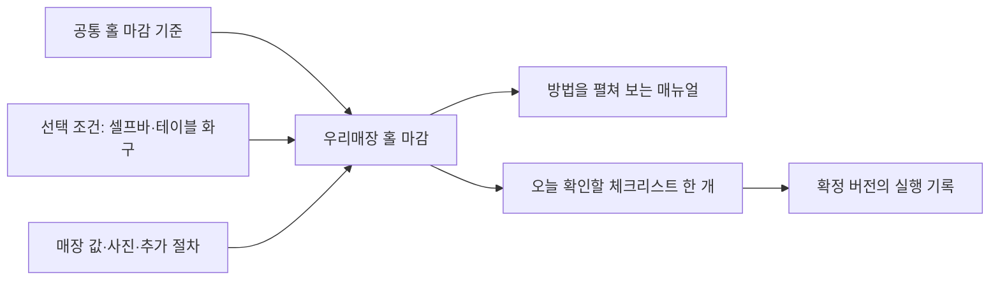

# 외식업 매뉴얼·체크리스트 구조 재설계 조사

2026-10-09 · Ego Lite 조사 및 설계 초안. **앱·DB·공용 콘텐츠에 적용하지 않은 proposed 설계**다. 사용자에게 확인받은 범위와 화면 원칙, 자료로 확인한 사실, 설계 추론을 구분한다.

## 확인된 범위와 아직 결정하지 않은 것

사용자는 실사용 유저가 없는 단계임을 설명하고, 기존 업종별 구조에 얽매이지 않는 재설계를 요청했다. 초기 범위는 **외식업 전반**이다. 공통 업무와 맞춤이 필요한 업무를 구분하며, 크루 화면에는 **‘홀 마감’ 하나에 해당 매장에 필요한 절차를 묶어 표시**한다.

원본을 독립 사본으로 가져올지, 원본 연결을 유지하고 매장 변경분을 따로 관리할지는 아직 미정이다. 사용자는 상세 비교표를 읽은 뒤 결정하기로 했다. 자동 업데이트·매장 확인·안전 기준 변경·삭제 허용·데이터 초기화도 확정하지 않았다. 여기서 추천하는 내부 모듈 조합은 구현 승인이 아니다.

## 현재 구조에서 실제 확인한 문제

점검 대상은 로컬 `docs/market/current.json` 91개 원본이다. 운영 DB의 활성 콘텐츠를 새로 조회하거나 수정한 결과는 아니다. 외식업을 명시한 원본은43개이고, 전 업종 공통 항목은 이 숫자에 별도로 고려해야 한다.

전체 scope는 universal23 / food4 / process2 / menu62다. menu62개 전체가 잘못됐다고 단정하지 않는다. 다만 뼈찜 컬렉션12개가 모두 menu로 표시되며, 아래 공통 목적까지 메뉴 전용 분류에 섞여 있다.

| 현재 원본 | 확인한 내용 | 설계상 분리 후보 |
| --- | --- | --- |
| `bonejjim/hall-close` 마감·홀과 셀프바 | 셀프바, 좌석·바닥, 폐기물, 비품, 소등·잠금 | 홀 마감 공통 목적 + 조건부 시설/서비스 절차 + 매장 값 |
| `bonejjim/hall-open` 오픈·홀과 셀프바 | 공통 좌석 준비와 뼈 통·국물 양념·특정 영업시각 혼재 | 공통 홀 오픈 + 제공 방식/메뉴/매장 조건 |
| `bonejjim/staff-open` 출근·개인 위생과 인수인계 | 위생·인계와 등뼈/육수 잔량·솥 업무 혼재 | 공통 근무 시작 + 실제 담당 공정의 인계 |
| `bonejjim/kitchen-close` 마감·주방 | 주방 정리와 등뼈·육수 보관/폐기가 혼재 | 주방 마감 + 제품·배치별 보관 절차 |
| `business/closing` 하루 마감·정산 인계 | 남은 일·정산·시설 종료 | 기존 홀/주방 마감과 같은 확인을 중복 생성하는지 검토 필요 |

`ManualMarketCatalog.scopeOf`는 metadata가 없으면 common을food, legal/business를universal, 나머지를menu로 취급한다. 현재 JSON에는 scope가 있지만 그 내용 자체가 과도하게 넓은 menu로 분류돼 있다. **폴더 이동이나 필터 추가만으로 적용 조건·본문·실행 단위를 바로잡을 수 없다.**

## 실제 서비스에서 확인한 구조

공개 공식 설명·도움말을 Ego Lite로 열어 확인했다. 유료 계정의 실제 편집기, 내부 DB, 성과 수치를 검증한 것은 아니다. 업체가 제시한 절감시간·효율·고객 수는 이번 설계 근거로 사용하지 않는다.

| 서비스 | 공식 자료에서 확인한 것 | 가져올 설계 힌트 / 한계 |
| --- | --- | --- |
| Mitti by SafetyCulture | 조건에 따라 질문/증빙을 표시. 참고 파일은 독립 첨부 또는 원본 연결. 양식 초안 발행과 신규 점검 반영을 구분 | 방법 문서·점검·업데이트를 분리. 파일 연결 기능을 매장별 부분 상속 기능으로 확대 해석하지 않음. [조건](https://help.mitti.com/002285), [첨부/연결](https://help.mitti.com/000490), [발행](https://help.mitti.com/002006) |
| Jolt / SmartSense 도움말 | 매장 전용 Location Mode와 공동 Content Group Mode, 공유 구독, 별도 실행 일정 | 배포 묶음·매장 소유 콘텐츠·일정을 독립 축으로 관리. 임의 수정의 자동 충돌 해결은 확인하지 않음. [콘텐츠 범위](https://help.smartsense.co/en/articles/9654803-location-mode-vs-content-group-mode), [일정](https://help.smartsense.co/en/articles/9654068-creating-and-managing-list-schedules-in-the-jolt-web-app) |
| FoodDocs | 기본 양식 활성/비활성·수정, 장비/공간과 점검 연결, 단순 체크와 상세 입력 구분 | 업종명 외에 장비·공간·관찰 목적이 필요. 설정 일부는 데스크톱 전용이라고 도움말에 명시. [장비](https://www.fooddocs.com/knowledge/how-to-create/add-equipment), [입력 종류](https://www.fooddocs.com/knowledge/how-to-add-a-new-monitoring-task-from-scratch) |
| Process Street | 조건별 내용/업무 표시. 업데이트된 원본과 실행 중인 run을 구분하며 최신판으로 갱신하는 명시적 기능 제공 | 조건과 버전은 따로 설계해야 함. 진행 중 실행을 갱신할 수 있다는 기능을 우리 앱의 기본값으로 채택하지 않음. [조건](https://www.process.st/help/docs/conditional-logic/), [실행 갱신](https://www.process.st/help/update-runs-to-latest/) |
| Trainual | Subject → Document → Page. 전사 공통과 부서/집단별 절차를 구분 | 업무 분야 → 특정 절차 → 상세 설명의 같은 레벨을 유지할 근거. 별도 교육·시험 기능은 이번 범위에 도입하지 않음. [내용 구조](https://help.trainual.com/en/subject-structure) |
| RestaurantOwner | 운영·관리자·직원·청소 등 용도별 체크리스트와 매장별 수정 가능한 자료 제공 | 분류의 중심이 특정 메뉴가 아닌 업무 영역/역할/시점. 공개 소개만 확인했으며 회원용 파일 전문은 열람하지 않음. [공개 목록](https://www.restaurantowner.com/public/DOWNLOAD-Restaurant-Checklists.cfm) |

이 자료에서 공통으로 읽히는 것은 **기준 콘텐츠, 적용 대상, 실행 일정, 실행 기록이 서로 다른 정보**라는 점이다. 특정 업체가 우리가 제안하는 전체 구조를 그대로 구현했다고 주장하지 않는다.

## 운영 자료·연구에서 확인한 것

| 자료 | 직접 확인한 내용 | 이번 설계에 사용하는 범위 |
| --- | --- | --- |
| [NCS 기반 식음서비스 직무 설명자료](https://www.ncs.go.kr/common/file/downloadFile.do?sysDstinCd=06&fileMstky=20230926083659525&filedetlSeq=20230926083700113), PDF p1 | 식음료접객의 영업장 마감·위생 안전과 소믈리에/커피관리의 특화 역량을 구분 | 국내에서도 마감 목적은 음식서비스 업무 축으로 다룰 수 있다는 근거. 강원랜드 직무 설명이며 모든 소형 식당의 절차·인원 기준은 아님 |
| [FSA SFBB 전체 구성](https://www.gov.uk/government/publications/safer-food-better-business-for-caterers/safer-food-better-business-for-caterers) | 방법 주제·관리·일지를 구분 | 매뉴얼의 설명과 실제 점검 기록을 구분하는 참고 |
| [FSA 개점·마감 점검](https://assets.publishing.service.gov.uk/media/69c53ae523fcbcd838a6f774/sfbb-management-01-opening-closing-checks__1__1.pdf), PDF p1–2 | 공통 일일 점검, 매장 추가 항목, 덜 빈번한 별도 점검 | 마감 목적의 공통 골격과 추가/주기별 항목을 구분 |
| [FSA 청소 계획](https://assets.publishing.service.gov.uk/media/69c52c48cdfd19de13d0f6de/sfbb-cleaning-04-your-cleaning-schedule-fix_1.pdf), PDF p1–2 | 실제 대상·방법·도구/제품·빈도를 매장에 맞춰 작성 | 청소라는 목표는 공통이어도 작업 대상과 방법은 달라진다는 근거 |
| [FSA 중식용](https://www.gov.uk/government/publications/safer-food-better-business-for-chinese-cuisine), [인도계 요리용](https://www.gov.uk/government/publications/safer-food-better-business-for-indian-cuisine) 자료 목록 | 공통 청소·개점/마감·일지와 음식/공정 항목을 함께 제공 | 공통 체계 + 적용 조건에 따른 전문 내용을 구성하는 참고. 전체 PDF끼리 내용이 모두 동일하다고 검증하지 않음 |
| [NASA CR177549](https://ntrs.nasa.gov/citations/19910017830), PDF 인쇄p66–67 / 파일p69–70 | 부록의 제안 지침: 무리한 동일화 주의, 결과 상태를 명확히, 긴 목록은 묶음으로 나눔, 논리적 순서 | 체크리스트 설계 일반 원칙. 항공 분야 연구이므로 외식업의 성과·최적 체크 개수를 입증하는 자료가 아님 |

FSA 자료는 영국 적용 범위다. 온도·법적 의무·폐기 기준을 한국 매장의 기본값으로 옮기지 않는다. 장비 운전·제품 취급 기준은 해당 제조사와 국내 적용 근거를 별도로 검토한다.

## 설계 축: 업종 하나로 모든 레벨을 나누지 않는다

다음 내부 구조는 제안이다. 사용자가 보는 화면은 단순하게 유지한다.

| 축 | 예 | 담당하는 정보 |
| --- | --- | --- |
| 업무 목적/분야 | 홀 마감, 주방 마감, 입고 확인, 고객 응대 | 무엇을 이루려는가. 기본 탐색 축 |
| 적용 조건 | 홀 있음, 셀프바, 테이블 화구, 음료 장비, 포장 판매 | 우리 매장에 어떤 절차가 필요한가 |
| 대상 | 특정 설비·공간·메뉴·제품 | 어느 물건/장소의 어떤 기준을 사용하는가 |
| 매장 값 | 배출 장소, 비품 기준, 장비 지침, 마감 구역 | 매장마다 다른 정보 |
| 실행 계획 | 영업 종료 시점, 담당 파트, 반복/작업 발생 | 누가 언제 확인하는가 |
| 실행 기록 | 그날/그 배치의 확인값·이상·조치 | 실제로 무엇이 확인됐는가 |

업종은 초기 추천의 힌트로 사용하고 소유 폴더가 되지 않게 한다. 예를 들어 뼈찜 선택으로 홀/셀프바 조건을 추천할 수는 있지만 실제 사용을 확정하거나 홀 마감 원본을 뼈찜 소유로 만들지는 않는다. 포장 전문점에는 홀 마감을 자동 배정하지 않는다. 조건 미입력은 조건 없음/조건 충족과 구분한다.

내용은 **공통 목적 + 조건부 공통 절차 + 매장별 값/추가 절차**로 검토한다. 이 세 가지는 사용자가 세 개의 폴더를 관리해야 한다는 뜻이 아니다. ‘공통’도 모든 매장이 반드시 같은 동작을 한다는 뜻은 아니다.

## ‘홀 마감’의 원본을 실제로 나누어 보는 초안

현재 원문은 다음처럼 분해할 수 있다. 분류 초안이며 청소·설비·식품 처리 기준을 검증한 완성 매뉴얼이 아니다.

| 현재 포함 내용 | 재사용 단위 후보 | 매장이 정할 내용 |
| --- | --- | --- |
| 테이블·의자·바닥 청소, 뼈 조각/국물 자국 | 공통 좌석 구역 정리. 뼈/국물은 취급 내용에 따른 설명 예시 | 대상 구역, 승인된 방법·도구, 완료 상태 사진 |
| 셀프바 반찬·집게·반찬통 | 셀프바가 있는 매장에만 필요한 절차 | 취급 식품/용기, 승인된 보관·폐기·세척 기준 |
| 쓰레기·음식물 분리 | 폐기물 정리의 공통 목적 | 지역/매장별 품목 구분·장소·요일/시각 |
| 휴지·물티슈·정수기·포장 봉투 | 다음 영업에 필요한 비품 준비 | 사용하는 비품과 준비 기준. 없는 물품은 제외 |
| 소등·문단속·가스/콘센트 | 시설 종료·최종 확인의 공통 목적 + 설비별 지침 | 종료할 설비/계속 가동할 설비 구분, 잠금 대상 |

뼈찜 전용 내용은 별도 메뉴/제품 절차로 참조한다. 예: 등뼈·육수의 다음 영업 준비와 보관은 좌석 구역 마감 원본에 넣지 않는다. 셀프바는 여러 업종이 공유하는 조건부 절차이고 ‘뼈찜 전용’이 아니다.

크루에게는 확정한 매장 구성을 한 카드로 보여준다. 예시 문구는 `좌석 구역 정리 / 셀프바 정리 / 폐기물 정리 / 비품 준비 / 종료 대상 확인`이다. 항목 옆에는 필요할 때 방법을 펼치고, 상세 방법의 모든 문장을 체크박스로 만들지는 않는다. 항목 수와 묶는 방법은 사용성 검토 대상이며 ‘최적5개’ 같은 수치를 주장하지 않는다.

일일 마감과 주간 정밀 청소는 같은 절차 문서를 참조할 수 있지만 같은 날 같은 완료 확인으로 합쳐서는 안 된다. 날짜·대상·빈도·관찰 목적이 달라지면 별도 실행 여부를 판단한다.

## 상세 비교: 독립 사본과 원본 연결

**내용을 조건별로 조합하는 것과 원본 업데이트를 연결하는 것은 따로 선택할 수 있다.** 아래 두 방식 모두 크루에게는 ‘홀 마감’ 한 개로 보인다. 비교는 이 프로젝트의 설계 추론이며 업체별 실제 가격/개발시간 측정이 아니다.

| 판단 항목 | A. 독립 사본 | B. 원본 연결 + 매장 변경분 분리 |
| --- | --- | --- |
| 처음 사용 | 공통/조건별 내용을 조합한 뒤 매장 사본으로 저장 | 필요한 원본·조건별 절차를 선택하고 매장 값을 저장 |
| 사장 수정 | 제목·문장·항목·순서를 모두 편하게 수정 | 매장 값/추가 항목은 직접 수정. 공통 문장의 수정은 별도 변경분 또는 사본 전환 규칙이 필요 |
| 공통 개선 | 기존 사본에 자동 전달되지 않음. 다시 가져오기/수동 반영 필요 | 연결된 원본의 새 버전을 찾아 비교·반영할 수 있음 |
| 수정 충돌 | 당장 원본 충돌이 적지만 최신 개선을 다시 넣을 때 사람이 비교해야 함 | 원본과 매장이 같은 항목을 수정했을 때 비교/선택 규칙을 구현해야 함 |
| 장비/셀프바 변경 | 다른 절차를 추가하거나 재구성하면서 기존 수정이 누락되지 않게 관리 | 적용 조건을 바꾸고 해당 절차·매장 설정을 다시 구성. 제거될 항목/수정의 처리 규칙 필요 |
| 공통 콘텐츠 품질 관리 | 사본마다 달라져 운영자가 어느 표준을 쓰는지 추적하기 어려움 | 원본ID·버전·매장 변경을 구분하면 적용 범위와 최신성 추적이 쉬움 |
| 출처/버전 | 복사 시점의 원본ID·버전을 남길 수 있음. 독립 사본이라고 출처를 없앨 이유는 없음 | 연결 원본과 적용 버전, 매장 수정 버전을 각각 추적 |
| 자유도 | 높음. 복잡한 매장 특수 절차를 빠르게 담기 좋음 | 높게 만들 수 있으나 허용 수정·전체 사본 전환 범위를 명확히 해야 함 |
| 구현 부담 | 초기 상대적으로 작음. 수정·재가져오기/출처 관리 필요 | 초기 상대적으로 큼. 안정적 항목ID, 변경분, 비교, 삭제/순서 변경 처리 필요 |
| 장기 관리 부담 | 공통 원본이 커질수록 매장별 수동 갱신 부담 증가 가능 | 구현·운영 규칙이 갖춰지면 공통 개선 전달에 유리. 자동 병합을 과신하면 더 복잡해짐 |
| 작은 매장의 화면 | 생성된 문서를 직접 편집하므로 이해하기 쉬움 | 기본값/매장 값만 먼저 보여주면 단순하게 만들 수 있음. 원본·변경분 개념을 크루에게 노출할 필요 없음 |
| 맞는 상황 | 원본 업데이트가 드물고 각 매장의 자유 편집이 최우선 | 공통 기준을 지속 개선·배포하고 매장별 차이를 보존하려는 경우 |

Mitti의 복제/독립 첨부와 연결 문서, Jolt의 공통/매장 범위, FoodDocs의 수정 가능한 기본 양식이 각 선택의 존재를 뒷받침한다. 어떤 서비스가 B의 모든 부분 병합 규칙을 제공한다고 확인한 것은 아니다.

## 연결을 선택하더라도 별도로 정할 업데이트 정책

| 정책 | 장점 | 부담/확인할 것 |
| --- | --- | --- |
| 새 업무부터 자동 반영 | 사장에게 추가 확인 부담이 적고 개선 전달이 빠름 | 공통 문장/항목 변경이 현장 방법·순서에 영향을 줄 수 있음. 매장 수정 보존과 변경 안내 필요 |
| 변경 내용 확인 후 매장 확정 | 어떤 기준으로 일하는지 사장이 통제. 중요한 수정 비교에 적합 | 확인하지 않은 매장은 이전 버전에 남음. 매번 작은 오탈자까지 확인시키면 부담 |
| 변경 종류별 혼합 | 표현/분류 보정과 작업 방법·검증 기준 변경을 구분 가능 | 분류 기준이 복잡해질 수 있음. 무엇을 자동 적용할지 별도 합의 필요 |

Mitti의 양식 발행은 신규 점검 반영이라고 설명하며, 연결 참고 파일은 원본 갱신이 연결된 곳에 반영된다고 설명한다. Process Street는 진행 중 run의 최신판 갱신 기능을 별도로 제공한다. **콘텐츠 종류·실행 상태에 따라 버전 정책이 달라질 수 있다는 사실**을 확인한 것이며, 현재 진행 기록을 자동 변경하자는 근거가 아니다.

현 단계의 추천은 원본 연결과 매장 변경을 분리하는 방향을 우선 검토하되, 자동 반영/매장 확정은 아직 결정하지 않는 것이다. 중앙 기준을 지속 개선한다는 기존 목표와 맞지만, 첫 구현에서 모든 자유 문장의 자동3-way 병합까지 만들 필요가 있는지는 별도로 판단한다.

## 두 가지 수정 사례로 비교

1. 공통 ‘홀 정리’의 설명에 개선 문장이 추가되고, 사장은 이미 ‘배출 장소: 뒤편 보관 구역’을 입력했다. A는 사본을 수동 갱신한다. B는 서로 다른 필드이면 공통 설명과 매장 장소를 함께 유지할 수 있다. 그 필드 분리는 구현 설계가 필요하다.
2. 공통 원본이 두 청소 항목을 합쳤고, 사장은 한 항목에 사진과 별도 순서를 넣었다. A도 새 원본 재도입 시 사람이 비교해야 한다. B도 항목 삭제/병합 대응과 매장 수정 선택이 필요하다. ‘연결이면 자동으로 해결’되지 않는다.

이 차이 때문에 안정적 항목ID·적용 원본 버전·매장 변경 이력은 B의 핵심이고 A에서도 출처 추적에 유용하다.

## 매뉴얼과 체크리스트의 관계

매뉴얼은 방법·완료 모습·주의·이상 대응을 설명한다. 체크리스트는 특정 시점/대상의 결과를 확인한다. 예를 들어 테이블 청소 방법 여러 단계는 매뉴얼로 두고, 일일 홀 마감에서는 준비된 상태 확인을 한 항목으로 사용할 수 있다. 측정·관찰이 필요한 작업은 단순 완료와 구분한다.

FoodDocs의 단순 checklist/상세 입력 구분, FSA 방법/일지, NASA 결과 중심 응답이 이 구분의 참고다. 안전 확인이나 실제 관찰을 숨기거나 일괄 완료하는 근거로 사용하지 않는다.

## 제로 설계에서 남겨야 할 최소 데이터 경계

아래는 테이블/JSON 확정안이 아니라 책임 경계다.

| 객체 후보 | 책임 |
| --- | --- |
| 기준 매뉴얼/절차 | 목적, 적용 조건, 방법, 완료 상태, 출처, 버전 |
| 조건별 구성 | 필요한 절차 참조와 해당 여부, 중복 방지 |
| 매장 매뉴얼 | 선택 구성, 매장 값/사진/추가 항목, 적용 버전 또는 독립 사본 |
| 업무 계획 | 매장 일정·파트와 연결한 실행 조건/확인 방법 |
| 실행 기록 | 실제 사용한 구성/기준 버전과 확인값·이상·조치 |

업종 이름·폴더 이름으로 권한을 판단하지 않는다. 파트는 분류, 직책은 권한이라는 경계를 유지한다. 매장 정보·영업시간·배치도·메뉴/장비의 기존 입력은 재사용하는 방향을 검토한다. 같은 값을 매뉴얼마다 다시 묻지 않는다. 한국 영업일과 발주 후N일 재고 확인 정책을 이 구조 논의로 변경하지 않는다.

실사용 고객의 이전 구조를 유지해야 하는 비용을 전제하지 않고 새 구조를 평가한다. 그러나 설계 요청만으로 운영 DB·개인 계정·데모 데이터를 삭제하거나 공용 원본을 발행하지 않는다. 새 기준이 합의되면 별도의 재구성/초기화 범위를 정한다.

## 다음 결정 순서

1. A 독립 사본 / B 원본 연결 중 운영 방향 선택.
2. B라면 자동 반영·확인 후 확정·변경 종류별 혼합 중 정책 선택.
3. 매장 수정의 범위: 값/사진/추가 항목, 공통 문장·삭제·순서까지 어디까지 허용할지.
4. 비교 사례 확정: 일반 좌석 식당, 셀프바 있는 뼈찜집, 테이블 화구 있는 고깃집, 음료 장비 있는 카페, 포장 전문점.
5. 그 사례로 공통 목적/조건별 절차/매장 값의 필수 필드를 검증한 뒤 원본 재분류·앱/DB 설계.

1–3은 아직 미정이다. 질문에 대한 사용자 답변을 이 문서와 project-state에 누적하며, 사용자 선택 전 추천을 confirmed로 바꾸지 않는다.

## 조사 방법·한계·검증

- Ego Lite task space5의 같은 페이지에서 Google로 공식 원문을 찾고 각 원문을 열어 확인했다. 검색 결과나 AI 검색 요약만으로 기능을 확정하지 않았다.
- 공개 도움말20여 페이지와 FSA/NASA/NCS PDF의 관련 구간을 확인했다. NASA는 요약과 설계 지침 부록, NCS는 식음서비스p1을 사용했다. 모든 PDF 전문/인용 논문을 전수 검토한 것이 아니다.
- PDF는 Ego Page.fetch로 내려받았다. FSA 최초 다른 origin에서의 fetch는 CORS로 실패했으며 같은 공식 PDF origin에서 다시 열고 정상 내려받았다. FSA 청소 예시 표p2는 Ego PDF 뷰어에서도 확인했다.
- 원문·조회일·URL은 `.local/manual-structure-research/*.json`, PDF/추출문/표 캡처에 보관한다. Google 계정/개인 브라우저 내용은 연구 원문에 저장하지 않았다.
- 유료 편집기·업체 내부 구조·실제 작은 매장 사용성·정량 성과는 미검증이다. RestaurantOwner 회원용 파일은 조사하지 않았다.
- 이번 새 구조 작업은 조사·문서·질의다. 앱/운영DB/공용 발행본 변경, 외부 콘텐츠 발행, 자료 재배포 권리 확인, 현장 관찰·사용자 실험은 수행하지 않았다.
