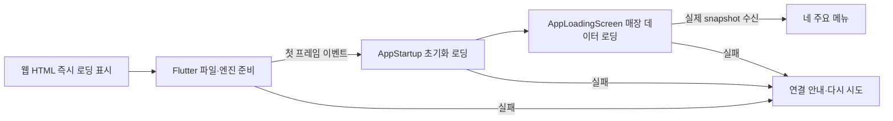

# 공통 가독성·시트·시작 로딩 개선

사용자 요청: 매뉴얼 편집·시급 정산 등 읽기 어려운 UI를 개선하고, 더 나은 규칙을 앱 전체에 적용한다. ‘기존 모습 유지’보다 읽기 쉬운 공통 구조를 우선한다. 현재 다크 팔레트와 초록/코랄, 네 주요 메뉴는 유지한다.

## 새 공통 기준

| 영역 | 이전 | 현재 기준과 코드 |
| --- | --- | --- |
| 시트 제목 | 고정 높이 AppBar에 긴 제목·저장 동작이 함께 표시 | `AppEditorScaffold`: 줄바꿈 가능한 24sp 제목, 보조 설명, 48px 닫기 버튼. 일반 시트도 공통 theme 적용 |
| 폼 본문 | 연속 입력칸, 화면별 다른 폭 | 읽기 폭 640–760px, 24px 바깥 여백. `AppFormSection`은 20px 안쪽 여백/섹션 제목 18sp/20px 입력 간격 |
| 저장 | 작은 상단 텍스트 또는 긴 스크롤 끝 | `AppSheetFooter`: 전체 폭 주요 버튼, 오류/저장 상태. Scaffold의 하단 영역을 사용해 snackbar가 버튼을 가리지 않음 |
| 입력 | 축소되는 라벨과 값 구분이 약함 | 전역 InputDecorationTheme: 항상 보이는 라벨, 56px 최소 높이, 16px 입력, 보조·오류 문구 줄바꿈 |
| 선택 | 반올림 값을 슬라이더 위치로 파악 | 값이 직접 보이는 공통 pill 선택. 날짜처럼 연속 선택이 필요한 경우 현재 값을 크게 별도 표시 |
| 긴 폼 | 내용이 한 카드에 이어짐 | 매뉴얼: 업무 안내/추가 안내/자료. 정산: 주기/시작일/반올림/규모/주휴. 계산 조건: 시급·시간/주휴·계약/휴일 |
| 키보드 | 시트/Scaffold의 inset 처리가 중첩될 수 있음 | `showAppSheet`가 viewInsets를 한 번만 적용하고 하위에서 제거. 동작 줄이기를 따르는 AnimatedPadding |
| 안내 | 초록 안내 카드가 반복되어 본문과 경쟁 | 중립 배경/보조 아이콘으로 정리. 오류는 해당 저장 동작 가까이 표시 |

## 적용 범위

전역 ThemeData와 `showAppSheet`를 쓰는 모든 화면에 입력·간격·모션·키보드 규칙이 적용된다. `AppSheetPanel`을 사용하는 크루/시급/근무 배정/카탈로그/수량·발주 입력도 공통 헤더·footer를 사용한다. 매뉴얼·정산·계산 조건·보드 편집·매장 프로필·TAP 설정·채용 초안은 공통 편집 구조로 옮겼다. 매뉴얼 상세·매장 설정·파트/시간대/권한·추천 업무도 같은 제목 구조다.

근무표·배치도처럼 공간을 읽는 화면의 표/캔버스는 폼 카드로 바꾸지 않는다. 공통 typography와 시트 테마를 적용하되 필요한 가로 스크롤과 지도 동작을 유지한다. 전체 운영 화면은 초기 데이터가 준비된 뒤 공통 content 전환으로 나타난다.

## 시작 로딩의 실제 수명

- `app/web/index.html`의 로고/상태/진행 막대는 Flutter 다운로드 전부터 보인다. `flutter_bootstrap.js`는 엔진 실패를 재시도로 연결한다.
- 웹 덮개는 `flutter-first-frame` 이벤트 이후 제거한다. 임의의 시간으로 앱이 준비됐다고 판단하지 않는다.
- Flutter는 `runApp`을 먼저 호출한 다음 기기 데이터와 인증을 초기화한다. 매장 snapshot이 없으면 빈 메뉴 대신 전체 로딩/오류 화면을 보여준다.
- 12초 이상 기다리는 초기화에는 지연 안내를 표시한다. HTTP 요청은 기존 10초 제한과 재시도 경로를 유지한다. 진짜 진척률이 없으므로 퍼센트나 인위적 최소 대기시간을 넣지 않는다.
- 모션은 `AppMotion` 공통 160/240/360ms 정책과 동작 줄이기를 따른다. 웹 로딩도 `prefers-reduced-motion`을 존중한다. 타이머는 종료 시 해제한다.

## 검증과 유지 관리

- `startup_and_sheet_test.dart`: 초기화 오류/재시도, 데이터 준비 전 메뉴 숨김, 320/390/1200px + 1.5배 글자 + 키보드에서 저장 버튼 접근 및 초안 취소 보호.
- `manual_workspace_test.dart`, `payroll_settings_test.dart`, `labor_panel_test.dart`, `settings_screens_test.dart`: ID·revision·저장 payload·권한과 충돌 시 입력 보존.
- `developer/test/startup.test.mjs`: 웹 초기화 지연, 첫 프레임 전환, 다운로드/엔진 실패, 다시 불러오기.
- `tool/readability_review.dart`: 번들 폰트로 매뉴얼·정산·로딩을 390/1200px에서 캡처. `.local/readability-review/`는 로컬 검토 산출물이다.
- 변경 시 [UI_SETTINGS_RELATIONSHIP_MAP.md](UI_SETTINGS_RELATIONSHIP_MAP.md)의 E06/U01/U02와 연결된 테스트를 갱신한다. 새 시트에 별도의 색·제목·저장 방식·애니메이션을 만들지 않는다.

공개 샘플/로컬 데모/인증 저장의 경계, 파트·급여 계산과 revision 정책은 기존과 같다. 본 검증은 웹과 widget 기준이며 네이티브 기기에서의 키보드/프레임 성능 확인을 대신하지 않는다.
