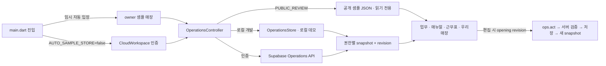

# 설정·화면·저장 연결 관계도

최종 검토: 2026-09-28. 제품 결정은 [project-state.json](project-state.json), 계층과 데이터 경계는 [ARCHITECTURE.md](ARCHITECTURE.md)를 따른다. 이 문서는 **현재 구현**의 화면 진입점, 입력값, 저장 액션, 응답 투영과 소비 화면을 연결한다. 기능을 옮기거나 UI를 바꾸면 같은 변경에서 해당 행과 회귀 테스트를 갱신하고 `npm run check:ui-links`를 실행한다. 시각적 확인만으로 저장을 검증했다고 간주하지 않는다.

## 진입·데이터 모드

| ID | 현재 값과 소유 코드 | 사용자에게 보이는 효과 | 저장/보안 계약 | 검증 |
| --- | --- | --- | --- | --- |
| E01 | `app/lib/main.dart` `AUTO_SAMPLE_STORE=true` 기본값 | 로그인 화면 없이 owner 샘플 매장 진입. `false`는 기존 인증 진입 복원 | 임시 UX 결정. 이 플래그는 인증 권한을 부여하지 않음 | Flutter 시작 구성 확인, `operations_test.dart` |
| E02 | `PUBLIC_REVIEW=true`, `scripts/build-site.mjs` `review-data/owner.json` | tap2.work는 매번 시드한 공개 샘플을 표시 | `HttpOperationsRepository`가 쓰기 차단. UI 미리보기 변경은 메모리에만 유지 | `manual_workspace_test.dart`, Pages 빌드 |
| E03 | 로컬 `/api/operations`, `.local/operations-demo.json` | 개발 서버 샘플에서 편집 연습 | 서버 revision 검사; 데모 actor는 실제 인증 아님 | `developer/test/*.test.mjs` |
| E04 | `CloudWorkspace`, `developer/supabase_backend.mjs` | 임시 플래그 해제 시 로그인·매장 생성 | JWT 및 매장 멤버십 검증 후 저장. 샘플 진입에서 Supabase 쓰기 없음 | `cloud_workspace_test.dart`, `developer/test/cloud.test.mjs` |
| E05 | `app/lib/ui/components.dart`, `operations_screen.dart` | 업무, 매뉴얼, 근무표, 우리매장 네 목적지 | 탭 변경은 설정 저장 아님. 공통 `AppMotionScope`와 시트 사용 | `operations_test.dart`, `app_motion_test.dart` |
| E06 | `app/web/index.html`, `flutter_bootstrap.js`, `AppStartup`, `AppLoadingScreen` | 웹 엔진 → 기기/인증 초기화 → 매장 읽기 → 실제 메뉴 | 첫 프레임에서 웹 덮개 제거, snapshot 수신 후 메뉴 표시, 실패 시 재시도 | `startup_and_sheet_test.dart`, `startup.test.mjs` |
| U01 | `AppEditorScaffold`, `AppSheetFooter`, `AppSheetPanel` | 매뉴얼/급여/설정/크루 폼의 제목·본문·저장 영역 | 저장 callback·ID·revision은 그대로 전달, snackbar와 키보드가 버튼을 가리지 않음 | 키보드/초안 보호/기존 저장 테스트 |
| U02 | `AppFormSection`, 전역 `InputDecorationTheme`, `AppMotion` | 전체 폼 라벨·간격·모션, 동작 줄이기 | UI 표현만 변경, 저장 또는 권한을 animation에 연결하지 않음 | 가독성 캡처/확대 글자/모션 테스트 |

## 설정 → 화면 → 저장 관계

| ID | 설정/원본 경로 | 입력 UI와 액션 | 저장 후 소비 화면·파생 값 | 검증 기준 |
| --- | --- | --- | --- | --- |
| S01 | `workplace.parts[]` | `workplace_screens.dart` 파트 관리 → `save_workplace_parts` | 업무 전체 파트/개별 파트 필터, 매뉴얼 폴더와 별개, 근무표 요일×파트 열, 크루 파트 선택 | `developer/test/workplace.test.mjs`, 근무표 테스트 |
| S02 | `tappers[].workProfile.partIds[]`, `bands[]` | `workplace_screens.dart` 크루 프로필 → `save_staff_profile`; `team_screen.dart` 크루 편집 → `save_tapper` | 파트별 업무 수행 가능 여부, 근무표 배정 선택지, 크루 카드. 직책/권한과 분리 | `workplace.test.mjs`, `operations.test.mjs` |
| S03 | `workplace.days[weekday].bands[]` | 우리매장 영업시간대 → `save_workplace_day` | `rosterTemplates[]` 생성, 근무표 요일·파트별 기본 슬롯. 전체 영업시간 `store.profile.hours`는 호환 기본값 | `workplace.test.mjs`, `calendar_test.dart` |
| S04 | `rosterOverrides[]` | 근무표 슬롯 클릭 → `save_roster_slot`, `reset_roster_slot` | 선택 날짜의 시작/끝 시간만 덮어쓰기; 고정 왼쪽 시간축에 반영 | `workplace.test.mjs`, `calendar_test.dart` |
| S05 | `staffShifts[]`, `shiftPatterns[]` | 근무표 배정·반복 → `save_staff_shift`, `save_shift_pattern` | 주간/월간 근무표, 필요 슬롯 충족률, 인건비 계획. 출퇴근 기록과 구별 | `workplace.test.mjs`, `calendar_test.dart` |
| S06 | `store.profile.orderSystem.enabled` | 우리매장 주문처리 시스템 토글 → `save_order_system` | 서버 `orderBoardEnabled`; ON일 때만 업무 주문처리 보드/주문 카드 표시. 주문 기록 유지 | `workplace.test.mjs`, 업무 화면 테스트 |
| S07 | `workplace.permissions` | 우리매장 직책 권한 → `save_workplace_permissions` | 업무/재고/직원 UI 허용 상태와 서버 액션 권한 검사 | `workplace.test.mjs` |
| S08 | `store.profile` 기본/영업/POS/배달/인력 섹션 | 매장 프로필 → `save_store_profile` | 우리매장 카드, 근무표 기본 시간, 주문·배달 정보. POS 연결 상태는 별도 실제 연동 아님 | `workspace_settings.test.mjs` |
| S09 | `payrollSettings` 및 이력 | 급여·정산 설정 → `save_payroll_settings` | 사장님 전용 인건비 계산·지급 주기/시작일/반올림/규모/주휴. 기존 근무/지급 기록을 역수정하지 않음 | `cloud.test.mjs`, `payroll_settings_test.dart` |
| S10 | `tappers[]`, `attendance[]`, `payAdjustments[]`, `payments[]` | 크루 정보/출퇴근/급여 기록 → `save_tapper`, `clock_in`, `break_start`, `break_end`, `clock_out`, `adjust_attendance`, `add_pay_adjustment`, `record_payment` | 근무표·크루·사장님 인건비 화면. 개인 급여는 역할별 투영으로 보호 | `labor.test.mjs`, `labor_panel_test.dart` |
| S11 | `checklistFolders[]`, `taskTemplates[]` | 업무 보드 전체 편집 → `ChecklistEditor` → `save_checklists` | 새로 시작하는 업무 양식, 매뉴얼 디렉토리, 업무 카드. 진행 중 스냅샷 보존 | `checklist_test.dart`, `checklists.test.mjs` |
| S12 | `taskTemplates[id].steps[id]` | 매뉴얼 > Task > **매뉴얼 편집** → `ManualTaskEditor(templateId, sourceStepId)` → `save_checklists` | 해당 Task의 제목·본문·팁·링크·태그만 갱신, `manualSearch` 재투영. 다른 Task와 기존 진행 기록 불변 | `manual_workspace_test.dart` 단일 Task/형제 불변/POST 검사 |
| S13 | `taskTemplates[id].steps[id].settings.estimatedMinutes` 및 TAP 설정 | 매뉴얼 > Task > 소요시간 설정 → `TapSettingsScreen(initialTemplateId)` → `save_tap_settings` | 매뉴얼 Task 시간·TAP 합계·새 업무의 시간 설정 | `workspace_settings.test.mjs`, 매뉴얼 테스트 |
| S14 | 매뉴얼 폴더/TAP/Task 순서 | 매뉴얼 구조 편집 → `move_manual_node` | 디렉토리·검색의 위치. 선택한 매뉴얼 본문은 바뀌지 않음 | `manual_workspace_test.dart` 드래그/충돌 |
| S15 | `tasks[].steps[]` 실행 스냅샷 | 업무 카드/단계 상세 → `complete_step`, `reopen_step`, `complete_task`, `save_step_manual` | 오늘 업무 완료 상태·기록; 정의 매뉴얼 수정과 별개. 서버가 완료 규칙 검사 | `operations_test.dart`, `checklists.test.mjs` |
| S16 | `items[]`, `orders[]`, `preparedItems[]` | 재고/발주/입고/준비품 → `save_inventory_item`, `check_stock`, `place_order`, `receive_order`, `save_prepared_item`, `count_prepared_item` | 우리매장 재고, 부족 알림, 준비품·업무 카드. 주문만으로 재고 증가 없음 | `operations.test.mjs`, `prepared_items.test.mjs` |
| S17 | `menus[]`, 주문 양식 | 메뉴 편집 → `save_menu` | 우리매장 메뉴, 메뉴 연계 매뉴얼·주문 업무 | `catalog.test.mjs`, `menu_layout_test.dart` |
| S18 | `layout`, `zones[]` | 매장 배치 편집 → `save_layout` | 우리매장 공간/동선, 재고·업무 위치 참조. 삭제·겹침은 서버 검사 | `layout.test.mjs`, `floor_plan_test.dart` |
| S19 | `hiringDrafts[]` | 근무표 > 채용 초안 → `save_hiring_draft`, `archive_hiring_draft` | 사장/매니저 초안 목록. 외부 공고 발행 없음 | `workspace_settings.test.mjs` |
| S20 | `laborReviews[]` | 인건비 검토 → `save_labor_review` | 사장님 인건비 화면의 검토 상태; 급여 지급 실행과 구별 | `labor.test.mjs` |
| S21 | 기기 내 `WorkController` 학습 진도 | 근무표 > 교육/첫 근무 | 사람별 연습·버디 확인 분리. 매장 공용 설정이나 급여 기록 아님 | `work_controller_test.dart` |

## 매뉴얼 링크 계약

`developer/operations.mjs`의 `manualSearchIndex()`는 편집 가능한 양식 Task마다 `templateId`와 `sourceStepId`를 준다. `ManualWorkspace`는 두 ID가 모두 있을 때만 **매뉴얼 편집**을 표시한다. 이 버튼은 `ManualTaskEditor`로만 연결한다. 폴더 ID로 `ChecklistEditor`를 여는 경로를 이 버튼에 다시 연결하면 회귀다. 편집기는 열 때의 actor/revision과 두 ID를 고정하고, 저장할 때 지정한 step만 변경한 양식 목록을 `save_checklists`에 보낸다. 다른 사람이 먼저 저장했다면 409를 표시하고 입력 초안을 유지한다. 공개 샘플에서는 동일 step과 검색 결과를 메모리에서 갱신하고 POST를 보내지 않는다. 시작한 업무의 복제된 단계는 수정하지 않는다.

## 변경 시 검증 순서

1. 설정 키나 버튼의 목적지가 바뀌면 이 표의 **원본 → 입력 → 액션 → 소비**를 같은 커밋에서 갱신한다. 사용자 승인 없는 제안을 현재값으로 올리지 않는다.
2. `npm run check:ui-links`로 주요 파일·액션·잘못된 매뉴얼 경로 재등장을 검사한다. 이 검사는 관계표의 구조 검사이며 실행 결과 검증을 대체하지 않는다.
3. 영향을 받은 화면 위젯 테스트에서 버튼을 실제로 누르고, 저장 요청의 액션·ID·revision 및 형제 데이터 불변을 확인한다. 공개 샘플은 POST가 0건인지 확인한다.
4. 저장 규칙 변경 시 `npm run test:console`로 서버 권한/투영/충돌을, Flutter 변경 시 `flutter analyze`와 관련 테스트를 실행한다. 배포 후 샘플 진입과 대표 연결을 확인한다.

현재 한계: 공개 샘플의 인메모리 편집은 새로고침 후 사라진다. 실제 저장은 임시 자동 진입을 해제하고 인증한 매장에서만 가능하다. 외부 POS·공급사 연동, 채용 공고 게시, 실제 급여 지급은 구현된 저장 액션으로 해석하지 않는다.
