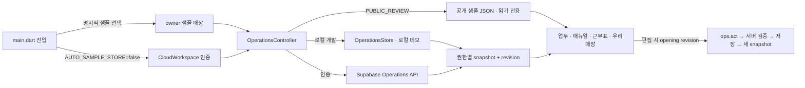

# 설정·화면·저장 연결 관계도

최종 검토: 2026-09-29. 제품 결정은 [project-state.json](project-state.json), 계층과 데이터 경계는 [ARCHITECTURE.md](ARCHITECTURE.md)를 따른다. 이 문서는 **현재 구현**의 화면 진입점, 입력값, 저장 액션, 응답 투영과 소비 화면을 연결한다. 기능을 옮기거나 UI를 바꾸면 같은 변경에서 해당 행과 회귀 테스트를 갱신하고 `npm run check:ui-links`를 실행한다. 시각적 확인만으로 저장을 검증했다고 간주하지 않는다.

## 진입·데이터 모드

| ID | 현재 값과 소유 코드 | 사용자에게 보이는 효과 | 저장/보안 계약 | 검증 |
| --- | --- | --- | --- | --- |
| E01 | `app/lib/main.dart` `AUTO_SAMPLE_STORE=false` 기본값 | Apple·Google 개인 로그인 버튼. 재방문은 검증된 개인 세션으로 진입 | 임시 UX 결정. 이 플래그는 인증 권한을 부여하지 않음 | Flutter 시작 구성 확인, `operations_test.dart` |
| E02 | `PUBLIC_REVIEW=true`, `scripts/build-site.mjs` `review-data/owner.json` | 명시적 샘플 둘러보기만 시드한 공개 샘플 표시 | `HttpOperationsRepository`가 쓰기 차단. UI 미리보기 변경은 메모리에만 유지 | `manual_workspace_test.dart`, Pages 빌드 |
| E03 | 로컬 `/api/operations`, `.local/operations-demo.json` | 개발 서버 샘플에서 편집 연습 | 서버 revision 검사; 데모 actor는 실제 인증 아님 | `developer/test/*.test.mjs` |
| E04 | `CloudWorkspace`, `developer/supabase_backend.mjs` | 개인 로그인 후 본인 소속 매장 읽기·수정·저장 | JWT 및 매장 멤버십 검증 후 저장. 샘플 진입에서 Supabase 쓰기 없음 | `cloud_workspace_test.dart`, `developer/test/cloud.test.mjs` |
| E05 | `app/lib/ui/components.dart`, `operations_screen.dart` | 업무, 매뉴얼, 근무표, 우리매장 네 목적지 | 탭 변경은 설정 저장 아님. 공통 `AppMotionScope`와 시트 사용 | `operations_test.dart`, `app_motion_test.dart` |
| E06 | `app/web/index.html`, `flutter_bootstrap.js`, `AppStartup`, `AppLoadingScreen` | 웹 엔진 → 기기/인증 초기화 → 매장 읽기 → 실제 메뉴 | 첫 프레임에서 웹 덮개 제거, snapshot 수신 후 메뉴 표시, 실패 시 재시도 | `startup_and_sheet_test.dart`, `startup.test.mjs` |
| U01 | `AppEditorScaffold`, `AppSheetFooter`, `AppSheetPanel` | 매뉴얼/급여/설정/크루 폼의 제목·본문·저장 영역 | 저장 callback·ID·revision은 그대로 전달, snackbar와 키보드가 버튼을 가리지 않음 | 키보드/초안 보호/기존 저장 테스트 |
| U02 | `AppFormSection`, 전역 `InputDecorationTheme`, `AppMotion` | 전체 폼 라벨·간격·모션, 동작 줄이기 | UI 표현만 변경, 저장 또는 권한을 animation에 연결하지 않음 | 가독성 캡처/확대 글자/모션 테스트 |

## 설정 → 화면 → 저장 관계

| ID | 설정/원본 경로 | 입력 UI와 액션 | 저장 후 소비 화면·파생 값 | 검증 기준 |
| --- | --- | --- | --- | --- |
| S01 | `workplace.parts[]` | `workplace_screens.dart` 파트 관리 → `save_workplace_parts` | 업무 전체 파트/개별 파트 필터, 매뉴얼 폴더와 별개, 근무표 요일×파트 열, 크루 파트 선택 | `developer/test/workplace.test.mjs`, 근무표 테스트 |
| S02 | `tappers[].workProfile.partIds[]`, `bands[]` | `workplace_screens.dart` 크루 프로필 → `save_staff_profile`; `team_screen.dart` 크루 편집 → `save_tapper` | 파트별 업무 수행 가능 여부, 근무표 배정 선택지, 크루 카드. 직책/권한과 분리 | `workplace.test.mjs`, `operations.test.mjs` |
| S03 | `workplace.days[weekday][]`, `workplace.breaks[weekday]` | 우리매장 > 영업시간 설정 / 준비 목록 / 신규 등록 / 근무표 영업시간·인원 → `openWorkplaceHours` → 영업시간 설정(휴무일→2교대 이상→브레이크 타임 토글)/인원 배치 탭·전체/개별 복수 요일·시간 표기가 붙은 영업/브레이크 드래그 막대·교대×파트 카운터 표 → `save_workplace_hours` (7일·브레이크 원자 저장) | `rosterTemplates[]` 생성, 브레이크를 차감하지 않는 근무표 요일·파트별 기본 슬롯·필요 시간 충족률. 전체 영업시간 `store.profile.hours`는 호환 기본값 | `workplace.test.mjs`, `calendar_test.dart` |
| S04 | `rosterOverrides[]` | 근무표 슬롯 클릭 → `save_roster_slot`, `reset_roster_slot` | 선택 날짜의 이름·시작/끝·숨김만 덮어쓰기; 고정 왼쪽 시간축에 반영 | `workplace.test.mjs`, `calendar_test.dart` |
| S05 | `staffShifts[]`, `shiftPatterns[]` | 근무표 개별 배정 → `save_staff_shift`; 반복은 S28 | 주간/월간 근무표, 필요 슬롯 충족률, 인건비 계획. 출퇴근 기록과 구별 | `workplace.test.mjs`, `calendar_test.dart` |
| S06 | `store.profile.orderSystem.enabled` | 우리매장 주문처리 시스템 토글 → `save_order_system` | 서버 `orderBoardEnabled`; ON일 때만 업무 주문처리 보드/주문 카드 표시. 주문 기록 유지 | `workplace.test.mjs`, 업무 화면 테스트 |
| S07 | `workplace.restrictions[role]` | 우리매장 직책 권한 → `save_workplace_permissions` | 업무 편집은 서버 `canEditTasks`와 UI를 연결; 재고/직원 등의 서버 액션 권한 검사 | `workplace.test.mjs` |
| S08 | `store.profile` 기본/POS/배달; `businessTypeId` 세부 업종 | 우리매장 매장 정보/POS/배달 플랫폼 → 영역별 StoreProfileScreen → `save_store_profile`; 인원/영업시간은 S03 | 매장 카드·주문 도구 정보·기본 매뉴얼 제안. legacy hours/staffing 입력 UI 제거·데이터 호환 보존 | `workspace_settings.test.mjs`, `settings_screens_test.dart`, `settings_sheet_audit_test.dart` |
| S09 | `payrollSettings` 및 이력 | 급여·정산 설정 → `save_payroll_settings` | 사장님 전용 인건비 계산·지급 주기/시작일/반올림/규모/주휴. 기존 근무/지급 기록을 역수정하지 않음 | `cloud.test.mjs`, `payroll_settings_test.dart` |
| S10 | `tappers[]`, `attendance[]`, `payAdjustments[]`, `payments[]` | 크루 정보/출퇴근/급여 기록 → `save_tapper`, `clock_in`, `break_start`, `break_end`, `clock_out`, `adjust_attendance`, `add_pay_adjustment`, `record_payment` | 근무표·크루·사장님 인건비 화면. 개인 급여는 역할별 투영으로 보호 | `labor.test.mjs`, `labor_panel_test.dart` |
| S11 | `checklistFolders[]`, `taskTemplates[]` | 매뉴얼 항목 길게 누르기 → 폴더 추가 / 항목 ⋯ → 추가·이름·상세·이동·삭제 | 정의 편집은 매뉴얼에 집중. 업무의 내용 편집 진입 제거 | `manual_authoring_test.dart`, `task_inline_edit_test.dart` |
| S12 | `taskTemplates[id].steps[id]` | 매뉴얼 > Task > **매뉴얼 편집** → `ManualTaskEditor(templateId, sourceStepId)` → `save_checklists` | 해당 Task의 제목·본문·팁·링크·태그만 갱신, `manualSearch` 재투영. 다른 Task와 기존 진행 기록 불변 | `manual_workspace_test.dart` 단일 Task/형제 불변/POST 검사 |
| S13 | `taskTemplates[id].settings` | 매뉴얼 > Task > TAP 설정 → `TapSettingsScreen(initialTemplateId)` → `save_tap_settings` v2 | 부모 TAP의 시간대·파트·장소·완료 조건·소요 시간을 전체 Task에 적용; Task별 운영 컨트롤 없음 | `settings_screens_test.dart`, `tap_policy.test.mjs` |
| S14 | 매뉴얼 폴더/TAP/Task 순서 | 왼쪽 트리 길게 누르기 → 같은 계층 행의 손잡이/⋯ 이동 → `move_manual_node` | TAP→폴더, Task→TAP. Task를 폴더에 놓으면 해당 폴더의 TAP 선택. 같은 단계는 앞 순서. 오른쪽 편집은 독립이며 본문·오늘 실행 보존 | `manual_workspace_test.dart` 양쪽 격리/계층/폴더 드롭/320px/충돌, `manual_directory.test.mjs` |
| S15 | `tasks[].steps[]` 실행 스냅샷 | 업무 카드/단계 상세 → `complete_step`, `reopen_step`, `complete_task`, `save_step_manual` | 오늘 업무 완료 상태·기록; 정의 매뉴얼 수정과 별개. 서버가 완료 규칙 검사 | `operations_test.dart`, `checklists.test.mjs` |
| S16 | `items[]`, `orders[]`, `preparedItems[]` | 재고/발주/입고/준비품 → `save_inventory_item`, `check_stock`, `place_order`, `receive_order`, `save_prepared_item`, `count_prepared_item` | 우리매장 재고, 부족 알림, 준비품·업무 카드. 주문만으로 재고 증가 없음 | `operations.test.mjs`, `prepared_items.test.mjs` |
| S17 | `menus[]`, 주문 양식 | 메뉴 편집 → `save_menu` | 우리매장 메뉴, 메뉴 연계 매뉴얼·주문 업무 | `catalog.test.mjs`, `menu_layout_test.dart` |
| S18 | `layout`, `zones[]` | 공간·장비 → 간단 배치도(선택) → 층별 편집 → `save_layout(floorScope)` | 우리매장 공간/동선, 재고·업무 위치 참조. 미배치 장소·다른 층·사진 보존; 삭제·겹침은 서버 검사 | `layout.test.mjs`, `floor_plan_test.dart` |
| S19 | `hiringDrafts[]` | 근무표 > 채용 초안 → `save_hiring_draft`, `archive_hiring_draft` | 사장/매니저 초안 목록. 외부 공고 발행 없음 | `workspace_settings.test.mjs` |
| S20 | `laborReviews[]` | 인건비 검토 → `save_labor_review` | 사장님 인건비 화면의 검토 상태; 급여 지급 실행과 구별 | `labor.test.mjs` |
| S21 | 기기 내 `WorkController` 학습 진도 | 근무표 > 교육/첫 근무 | 사람별 연습·버디 확인 분리. 매장 공용 설정이나 급여 기록 아님 | `work_controller_test.dart` |

## 화면별 상단과 편집 범위

| 화면 | 상단 동작 | 본문 동작과 다음 화면 |
| --- | --- | --- |
| 업무 / TAP 보드 | TAP 추가와 길게 누르기 안내. 편집 중 이름·이동·휴지통·상세 설정 | 파트 필터 → TAP 카드 → 해당 TAP의 Task 목록 |
| 선택 TAP / Task 목록 | TAP 목록으로, 선택 TAP 이름, TAP 편집 | 제목 클릭은 권한이 있는 미완료 Task 직접 입력·커서. 별도 매뉴얼 버튼은 해당 Task의 방법 열기. 마지막 Task 바로 아래 Task 추가 |
| TAP 편집 | TAP 설정 제목과 선택한 TAP 이름 고정 | 해당 TAP의 반복·일괄완료·순서와 하위 Task 규칙. 다른 TAP 선택기 없음 |
| Task 매뉴얼 상세 | 소속 TAP/Task 경로, 매뉴얼 편집, Task 설정 | 매뉴얼 편집은 정확한 원본 Task. Task 설정은 그 Task의 규칙만 표시; TAP 전체 규칙은 표시하지 않음 |
| 근무표 | 크루별 근무 배정·영업시간/인원, 날짜/보기 | 길게 누르기 → 시간 드래그 미리보기·하단 높이 조절. 직원 본인 슬롯 클릭은 변경 신청 |
| 우리매장 상세 | 상세 제목 1회와 닫기 | 재고 상세의 본문 반복 제목 제거. 파트·영업시간·권한·주문·정산은 해당 설정 시트 |

완료·매뉴얼 열기·드래그는 별도 터치 영역이다. Task 목록의 자동 오른쪽 드래그 손잡이는 끄고 왼쪽에 명시적으로 배치한다. 제목은 최대 3줄, 상단 완료/체험 표시는 줄바꿈한다. 메뉴 공통 제목·검색 위치는 유지한다.

| ID | 설정/원본 경로 | 입력 UI와 액션 | 저장 후 소비 화면·파생 값 | 검증 기준 |
| --- | --- | --- | --- | --- |
| S22 | `taskTemplates[].steps[]` | 매뉴얼 Task ⋯ 상세 수정 → `ManualTaskEditor` → `save_manual_tap` | 선택 Task 콘텐츠와 양식 저장. 기존 실행·완료 기록 보존. `save_task_step`은 기존 API 호환용이며 업무 화면 진입 없음 | `manual_workspace_test.dart`, `tap_policy.test.mjs` |
| S23 | 선택한 TAP의 `steps[]` | 매뉴얼 TAP ⋯ Task 추가 → 내용 초안 → 매뉴얼 저장 | `ManualTapEditor(addTask: true)`에서 제목·방법 함께 추가, opening revision으로 양식만 저장 | `manual_authoring_test.dart` |
| S24 | 서버 `canEditTasks` | 보드/TAP/Task/매뉴얼 편집과 순서 UI 표시 | 사장 또는 업무 권한이 활성화된 매니저만 편집. 서버도 `tasks` 제한으로 저장·순서변경 검증 | 매니저 제한·크루 거절·완료 보호 서버/위젯 테스트 |

## 설정 항목별 상속·적용 시점

| 설정 화면 | 각 입력 항목 | 관계·우선순위·적용 범위 |
| --- | --- | --- |
| 파트 관리 | 이름, 순서, 숨김 | 업무 필터·크루 담당·근무표 슬롯의 같은 part ID. 숨김은 기록 삭제 아님. 매뉴얼 폴더와 독립 |
| 크루 파트·시간대 | 담당 파트 복수 선택, 선호 시간대 | **미선택 시 전체 파트 가능**을 화면에 명시. 시간대는 선호이며 근무 배정/권한을 자동 생성하지 않음 |
| 영업시간대 | 요일, 시작·종료, 필요 인원 | 요일별 값 → 매장 기본 영업시간 순으로 슬롯 생성. 날짜 슬롯 덮어쓰기는 해당 날짜에 우선하며 배정과 별도 |
| 직책 권한 | 업무 편집, 완료, 근무표, 재고, 발주 | `workplace.restrictions`로 기존 권한을 제한. 파트 선택으로 권한 상승 불가. 업무 편집/정렬 UI는 `canEditTasks` 소비 |
| 주문처리 | 보드 사용 ON/OFF | 업무 주문 보드 가시성만 변경, 주문 기록 보존. POS 제품/배달 사용 설정은 외부 인증과 별개 |
| TAP 설정 | 유형, 다음 업무 사용, 반복 방식/요일, 일괄완료 허용, 순서대로 수행 | 다음 생성 업무의 기본 규칙. 오늘 스냅샷의 규칙을 바꾸지 않음 |
| Task 설정 | 완료 방식, 수량 단위/목표/소수 자리, 담당 파트, 장소, 예상 시간 | 파트·장소 미지정은 TAP 상속. 시간 미설정은 0분이 아닌 미확인. 시간은 매뉴얼 합계에 반영, 실행 규칙은 다음 업무부터 |
| Task 내용 직접 편집 | 제목, 방법과 완료 기준 | 사용자 확정: 오늘 선택한 미완료 Task와 기본 양식 함께 반영. 완료 증빙 보존. 취소는 저장하지 않음 |
| 매뉴얼 편집 | 제목, 본문, 팁, 연관어, 사진·영상·출처 HTTPS 링크 | 원본 Task 매뉴얼·검색에 반영. 이미 착수한 실행은 유지. 실행 중 매뉴얼 바로 수정은 별도 `save_step_manual` 경로 |
| 매장 프로필 | 기본정보, 기본 영업시간, POS, 배달, 인력 정보 | 기본시간은 요일 설정이 없을 때 호환값. POS/배달 입력은 사용 정보·추천을 위한 값이며 연결 상태를 만들지 않음 |
| 정산 설정 | 지급 주기, 월/주 시작일, 반올림, 사업장 규모, 주휴 포함 | 매장 공통 예상 계산. 크루 시급·출퇴근·실제 지급 기록과 분리. 이전 정책 이력 유지 |
| 재고 품목 | 단위, 공급사, 가격, 최소/기본발주량, 발주 후 확인일, 위치 | 발주 후 N일 1회 점검. 입고에서만 재고 증가. 위치는 배치의 안정적 ID |
| 매장 배치 | 격자 크기, 위치/크기/종류, 테이블 좌석 | 재고·업무 장소와 연결. 좌석은 정원이며 점유 현황 아님. 참조된 장소 삭제와 겹침은 서버 검증 |

### 이번 질의 결과와 남은 제안

2026-09-29 사용자 답변으로 S22/S23의 오늘 미완료 업무+원본 양식 동시 반영, S02의 미선택=전체 파트 가능을 확정했다. `save_task_step`은 편집 시작 시 actor/revision을 고정하며 충돌·저장 실패 시 초안을 유지한다. 공개 체험은 메모리에만 반영한다.

`proposed`: 재고·근무표 등 나머지 기능도 직책별 실제 capability를 응답에 통일하고, 각 입력 바로 옆에 적용 시점/상속 표시를 확대한다. 이번 업무 편집 capability와 달리 전체 capability 전환은 아직 완료된 것으로 표시하지 않는다. 사진 제출·관리자 승인·실제 타이머·외부 POS는 기존 후속 과제다.

## 매뉴얼 링크 계약

`developer/operations.mjs`의 `manualSearchIndex()`는 편집 가능한 양식 Task마다 `templateId`와 `sourceStepId`를 준다. `ManualWorkspace`는 두 ID가 모두 있을 때만 **매뉴얼 편집**을 표시한다. 이 버튼은 `ManualTaskEditor`로만 연결한다. 폴더 ID로 `ChecklistEditor`를 여는 경로를 이 버튼에 다시 연결하면 회귀다. 편집기는 열 때의 actor/revision과 두 ID를 고정하고, 저장할 때 지정한 step만 변경한 양식 목록을 `save_checklists`에 보낸다. 다른 사람이 먼저 저장했다면 409를 표시하고 입력 초안을 유지한다. 공개 샘플에서는 동일 step과 검색 결과를 메모리에서 갱신하고 POST를 보내지 않는다. 시작한 업무의 복제된 단계는 수정하지 않는다.

## 변경 시 검증 순서

1. 설정 키나 버튼의 목적지가 바뀌면 이 표의 **원본 → 입력 → 액션 → 소비**를 같은 커밋에서 갱신한다. 사용자 승인 없는 제안을 현재값으로 올리지 않는다.
2. `npm run check:ui-links`로 주요 파일·액션·잘못된 매뉴얼 경로 재등장을 검사한다. 이 검사는 관계표의 구조 검사이며 실행 결과 검증을 대체하지 않는다.
3. 영향을 받은 화면 위젯 테스트에서 버튼을 실제로 누르고, 저장 요청의 액션·ID·revision 및 형제 데이터 불변을 확인한다. 공개 샘플은 POST가 0건인지 확인한다.
4. 저장 규칙 변경 시 `npm run test:console`로 서버 권한/투영/충돌을, Flutter 변경 시 `flutter analyze`와 관련 테스트를 실행한다. 배포 후 샘플 진입과 대표 연결을 확인한다.

현재 한계: 공개 샘플의 인메모리 편집은 새로고침 후 사라진다. 실제 저장은 임시 자동 진입을 해제하고 인증한 매장에서만 가능하다. 외부 POS·공급사 연동, 채용 공고 게시, 실제 급여 지급은 구현된 저장 액션으로 해석하지 않는다.

## 이전 공용 로그인·저장 변경 (2026-10-05 개인 로그인으로 대체)

`PublicLoginFields` → `public-login` → Auth 세션 → `CloudWorkspace` → 기존 매장의 설정 읽기/저장. 고정 아이디와 마스킹 필드를 제공하되 실제 비밀번호는 배포하지 않는다. 서버 지정 이메일과 활성화 플래그만 허용한다. `public_login.test.mjs`와 `cloud_workspace_test.dart`로 확인한다. 이 설명은 과거 이력이며 현재 UI는 E07/S50–52 개인 로그인·삭제 경로를 따른다.

저장소·변경 감지 계약: [DB와 성능](DATABASE_AND_PERFORMANCE.md). 급여 검토·추천 TAP·채용 초안도 열 때의 revision과 actor를 고정한다.

## 길게 누르는 공통 편집 · 2026-09-29

| ID | 원본 → 컨트롤 → 액션 | 저장 후 소비 | 검증 |
| --- | --- | --- | --- |
| U03 | 업무·매뉴얼·근무표 → `DirectEditFrame` 길게 누르기/우클릭/접근성 동작 → 흔들림·초록 테두리·편집 완료 | 수정 권한이 있을 때만 진입. 동작 줄이기와 TickerMode에서는 흔들림 중지 | `direct_edit_test.dart` |
| S25 | 오늘 TAP/Task 우선순위 | 업무 손잡이 드래그 → `move_tap(status: keep)` / `reorder_small_taps` | 현재 실행 순서만 변경. 폴더·내용·완료 상태 유지, 순서 강제 TAP 재정렬 금지 | `task_inline_edit_test.dart`, `direct_edit.test.mjs` |
| S26 | 매뉴얼 폴더/TAP/Task | 폴더 추가 및 항목 ⋯의 이름·삭제 → `edit_manual_node`, 상세·추가 → `save_manual_tap`, 이동 → `move_manual_node` | 기본 양식 편집. 휴대폰 동일 기능, 편집 중 빈 폴더도 표시. 사용중/기본 폴더 삭제 보호 | `manual_authoring_test.dart`, `manual_workspace_test.dart`, `direct_edit.test.mjs` |
| S27 | 근무표 카드 → 날짜·시간 드래그/이름/휴지통 → `save_staff_shift`, `save_roster_slot`, `delete_roster_slot` | 배정 근무의 label 또는 날짜별 슬롯 name/hidden; 사람 이름·출퇴근 원본 불변. 날짜별 삭제는 영업 기본시간을 변경하지 않음 | `direct_edit.test.mjs`, `direct_edit_test.dart`, `calendar_test.dart` |

업무의 보드 편집 버튼과 매뉴얼 구조 편집 버튼을 제거했다. TAP 규칙·시간/크루 배정·매뉴얼 본문 편집은 카드에서 필요한 세부 입력으로 유지한다. 카드의 위치 이동 메뉴는 드래그 대안이다. 편집 중 휴지통은 확인 후 실행하며 서버 revision/직책 검증을 거친다. 공개 읽기 전용 샘플의 구조 추가·삭제·이름 변경은 저장하지 않고 로그인 안내를 표시한다. 기존 샘플의 Task 직접 입력/드래그 체험은 메모리에만 유지한다.

## 반복 배정·직원 승인·공휴일 · 2026-09-29

| ID | 원본 → 컨트롤 → 액션 | 저장 후 소비 | 검증 |
| --- | --- | --- | --- |
| S28 | `crewPatterns[]` → 근무표 상단 `CrewPatternScreen` → `save_crew_pattern`, `apply_crew_pattern` | 매주/월요일 기준 A·B주, 크루/파트 ID/`timeBandId`/시간. 선택한 오늘 이후 1–90일에만 배정. `staffShifts.patternId/base`가 원본, 화면은 유효 시간 소비. 재적용은 해당 반복 배정만 교체하며 별도 근무·출퇴근 보존. 승인 OFF·대체·출퇴근·대기 신청·범위 밖 이동이 있는 날짜는 건너뛰고 보존. 그 밖의 겹침은 전체 거절 | `schedule_patterns.test.mjs`, `schedule_workflow_test.dart` |
| S29 | `shiftChangeRequests[]` → 직원 본인 슬롯 → `request_shift_change`, `cancel_shift_change`; 사장님 → `review_shift_change` | 대기=기존 시간, 승인=유효 시간 변경/leave. `partial_off`는 앞뒤 실제 근무 구간으로 분할하며 `timeBandId` 유지. 승인 빈 구간 → 대체 크루 시트 → `review_shift_change(assign_replacement)`로 같은 파트 가능 크루를 연결. 반려·취소=원본 유지. before/after/status와 신청·처리 시각 보존. 신청 후 근무 변경 시 승인 거절 | 서버 본인/직책/중복/기록 보호, 위젯 신청과 상태 구분 |
| E07 | Apple·Google provider → 소셜 로그인 버튼 → 네이티브 SDK / 웹 OAuth | Supabase 개인 세션, production operations social identity 확인. 과거 공용 계정/직원 전환 UI 폐기 | cloud_workspace_test.dart, account.test.mjs |
| S30 | 공개 대한민국 공휴일 JSON → `KoreanHolidays` → 주·월 달력 | 연도별 최초 조회·메모리 캐시, 실패 시 번들 달력/미확인 안내. 정보 버튼에서 출처·갱신 상태 확인. 크루 정보 미전송, DB 쓰기 없음. 공휴일 표시와 매장 휴무 독립 | JSON 파싱·대체공휴일 테스트, 출처/캐시 표시 |

S03은 휴무일을 먼저 선택하고 영업일별 한 타임/2교대/3교대와 시간·파트별 인원(0–12)을 편집한다. 전체 적용은 휴무일을 제외한다. 별도 복사·상세 편집 버튼은 제거했다. 저장은 opening revision으로 7일 모두 원자 반영하며 실제 근무를 재생성하지 않는다. `headcounts[partId]` 수만큼 필요 슬롯을 생성해 충족률에도 반영한다. 첫 인원의 기존 template ID는 유지하고 추가 인원은 seat suffix를 쓴다. 자정을 넘긴 **뒤의** 별도 시간대는 다음 요일에 설정한다. 파트 편집은 별도 파트 관리가 유일한 원본이며 숨김/이름 변경에도 ID·기록을 보존한다.

S27 드래그는 컬럼 전체에서 30분 경계에 맞춘 시작·끝과 반투명 배정 영역을 표시한다. 아래 손잡이의 높이 조절은 종료 시간만 수정하며 실제 gesture 종료 시 한 번 저장한다. 원본 pattern/base는 변경하지 않는다. 키보드·접근성 대안은 기존 시간·크루 시트다.

다국어 준비 계약은 [LOCALIZATION_PLAN.md](LOCALIZATION_PLAN.md). 한국어만 제공하는 현재 화면에 동작하지 않는 언어 선택기는 추가하지 않는다.

휴대폰 상단을 간소화해 배정·영업시간 버튼을 우선 배치했다. 파트 관리는 우리매장에서 접근한다. 영업시간 시트의 파트 관리·상세 설정 진입은 제거했다.

2026-10-06: 매뉴얼 편집은 디렉토리/Task 목록에 공통 적용한다. 길게 누르면 양쪽의 편집 가능한 항목에 동작이 나타난다. 왼쪽은 들여쓰기·펼치기를 유지하며 이동 아이콘 클릭/드래그와 ⋯ 메뉴를 제공한다. 오른쪽 카드는 위치·이름·상세·삭제 동작과 본문 편집을 제공한다. 휴대폰 디렉토리↔매뉴얼 전환은 편집을 유지하며 완료·계정/매장/권한 변경으로 종료한다. manual_edit_mode_test.dart와 기존 manual_workspace/manual_phone_fix 테스트가 S11/S14/S33을 검증한다.

근무표 상단 배정/영업시간 버튼은 같은 최소 높이 56px·동일 폭·12px 여백을 사용한다. 최대 480px 영역 안에서 가용 폭과 글자 배율에 따라 2열 또는 동일 폭 세로 배치한다. `schedule_workflow_test.dart`는 320/390/1200px 및 확대 글자에서 실제 버튼 크기·간격과 공통 영업시간 시트 진입을 검사한다. 우리매장 메뉴는 `operations_test.dart`에서 같은 휴무/교대 폼 진입을 검증한다.

Empty manual containers (2026-09-29): folder and TAP definitions remain visible independently of manualSearch. edit_manual_node creates TAPs with steps: []; move/delete may leave a TAP empty. Task addition and destination choices include empty TAPs. save_checklists and Flutter draft validation allow 0-30 Tasks. Empty definitions generate no new daily execution. Existing execution snapshots and work-action protections remain.

| ID | 설정/원본 경로 | 입력 UI와 액션 | 저장 후 소비 화면·파생 값 | 검증 기준 |
| --- | --- | --- | --- | --- |
| S32 | preparedItems 및 메뉴 연결 | 준비품 추가/기준 수정/수량 보정 → PreparedItemEditor → save_prepared_item / count_prepared_item | 성공 후 닫기, 실패 시 초안 유지. 준비 수량·재고 기록의 기존 API와 opening actor/revision 유지. 부분 메뉴 응답에서 기존 연결 보존 | settings_sheet_audit_test.dart, prepared_items.test.mjs |

설정 시트 전수 소스 점검과 22개 화면군/66개 캡처 결과는 [설정 시트 점검](SETTINGS_SHEET_AUDIT_2026-09-29.md)에 기록한다. 파트/직책 권한/크루 파트의 저장도 고정 footer로 옮겼다. 매뉴얼 왼쪽 편집 모드에서 이름 클릭 → directEditNode(rename) → edit_manual_node이며 폴더/TAP/Task ID를 고정한다. 메뉴 연결 이름은 매뉴얼 표시 이름만 별도로 저장하며 판매 메뉴명은 유지한다. 연결 항목 삭제 제한은 유지한다.

| ID | Source | Control → action | Consumer | Verification |
|---|---|---|---|---|
| S33 | taskTemplates[].manualTitle / steps[].manualTitle | 왼쪽 이름 클릭·오른쪽 이름 변경 → edit_manual_node(rename); 본문 → save_checklists | 매뉴얼 트리·검색·상세·편집 표시명; 판매 메뉴명은 독립 유지 | direct_edit.test.mjs, manual_workspace_test.dart |

| ID | Source | Control → action | Consumer | Verification |
|---|---|---|---|---|
| S35 | `taskTemplates[].settings.assignment`, `assignmentScopeVersion` | TAP 담당 설정 → `save_tap_settings` v2 | 오늘 미착수 배정만 재생성; 진행·완료 v1 snapshot 보존. v2 모든 Task의 담당 동일; 실제 크루·내 배정·권한 projection | `work_assignment_ui_test.dart`, `tap_policy.test.mjs` |

S35의 신규 모드는 TAP scheduled/crew/anyone이며 현재 legacy는 유지 선택으로만 노출한다. Task inherit/개별 배정 UI는 제거했다. scheduled는 stable timeBandIds와 필수 partId, crew는 tapper ID 배열 crewIds를 저장한다. 배정 변경은 오늘 미착수 업무부터, 나머지 규칙은 다음 업무부터 적용하고 진행·완료 기록은 보존한다.

## 시간대와 업무 담당 · 2026-09-30

| ID | Source | Control → action | Consumer | Verification |
|---|---|---|---|---|
| S34 | workplace.days[].id/name/start/end/headcounts | 영업시간 설정 → 1–3교대·조정선 시간 드래그/휠·전체/개별 → save_workplace_hours (상세 추가/수정/삭제 진입 제거, 기존 추가 시간대 보존) | 필요 슬롯·반복 배정의 시간대 선택·업무 담당 | time_band_editor_test.dart, 시간대 서버 테스트 |
| S36 | crewPatterns / staffShifts / shiftChangeRequests | 크루별 반복 배정·부분 OFF 신청/승인·빈 구간 대타 | 날짜별 근무표·미완료 업무 자동 인계·완료 담당 스냅샷 | schedule_exceptions.test.mjs, 관련 근무표 위젯 테스트 |

담당 표시는 실제 배정, 지원 완료는 권한으로 분리한다. `누구나`는 그날 유효 근무 크루다. 기존 파트 미선택=전체 파트 가능 설정과 혼동하지 않는다. [상세 계약](SCHEDULE_WORK_ASSIGNMENTS.md).

## 영업일·교대 숫자 휠 · D-064

| 원본 | 화면 → 컨트롤 → 저장 | 영향 소비자 | 검증 |
|---|---|---|---|
| workplace.businessDayStart | 공통 영업시간 → 영업일 중 가장 이른 시작으로 경계 자동 산출(입력 필드 없음) → save_workplace_hours | state.day, 새 업무의 영업일 스냅샷, 누구나 담당, 근무표 businessDate, 반복 배정의 실제 날짜 변환 | business_day.test.mjs, business_hours_test.dart |
| workplace.days[].start/end/partTimes/headcounts | 영업시간 설정 → 조정선 드래그/시간 탭 휠·교대 분할 → 일괄 저장 (기존 partTimes 보존, 이 시트의 별도 파트 시간 편집 제거) | rosterTemplates, 업무 assignmentWindow, crew pattern 시간 선택 | business_hours_test.dart, time_band_editor_test.dart, workplace_test.dart |
| 날짜별 근무·반복 배정·변경 신청의 시작/종료 | AppTimeField → showTimeWheel → 기존 저장·신청 API | 실제 근무 구간, 미완료 업무 담당 및 승인 흐름 | calendar_test.dart, schedule_exceptions_test.dart |

S03의 이전 “자정 이후 별도 시간대는 다음 요일에 입력” 기준은 D-064로 대체된다. 설정한 영업일 경계 이전 시간은 선택한 영업일의 다음 실제 날짜로 해석한다. 경계 미설정 매장은 이전 00:00 기준을 유지한다. 영업시간 저장만으로 이미 배정된 근무·완료 업무·출퇴근을 덮어쓰지 않는다.

## Weekly assignment controls (2026-10-01)

| Source | Control / action | Consumer | Verification |
|---|---|---|---|
| rosterTemplates / rosterOverrides + staffShifts | Coral uncovered interval -> crew picker -> save_staff_shift | Actual assignments and remaining vacancies; truncated gaps never overwrite requirements | roster_vacancy_test.dart, schedule_workflow_test.dart |
| crewPatterns.entries | CrewWeekGrid weekday/time cell -> part, band and time draft -> save_crew_pattern -> apply_crew_pattern | Weekly/A-B patterns and explicit date range; opening revision and protected dates retained | schedule_workflow_test.dart, schedule_exceptions_test.dart, schedule_patterns.test.mjs |

S27 retains source time editing for fully empty requirements; partial gaps are assignment-only. S28 replaces the vertical weekday list with a grid. Only this grid opts into the 1440px sheet/editor width; default forms retain their existing widths.

## 날짜별 파트 보기 · 2026-10-01

| 원본 | 컨트롤 → 액션 | 소비 | 검증 |
|---|---|---|---|
| ScheduleController.selected / slots / rosterCoverage | 날짜 탭 → selectDay; 파트별/시간표 → 로컬 보기 전환 | 선택 날짜 파트 카드 또는 기존 주간 시간축; 조회 전환은 저장 없음 | calendar_test.dart 320/390/1200px·확대 글자 |
| 날짜별 슬롯 / staffShifts | 파트 카드 클릭 → 기존 edit / 본인 requestShiftChange; 길게 누르기 → 기존 직접 편집 | save_roster_slot / save_staff_shift / request_shift_change; 기존 opening revision·권한 유지 | calendar_test.dart 새 기본 보기에서 시간 수정·크루 배정 |

## 영업시간 슬라이더 · 2026-10-03

S03은 새 영업일 06:00–22:00/1교대, 브레이크 OFF에서 시작한다. 기존 저장값은 유지한다. 전체/개별은 편집 범위이며 저장 필드가 아니다. 전체 변경은 영업일에만 적용하고 각 요일의 ID·파트 예외·필요 인원을 유지한다. 시간 변경으로 브레이크가 범위를 벗어나면 새 영업시간 안으로 조정한다. 브레이크 ON 기본은 15:00–17:00이며 해당 시간이 불가능한 요일은 영업 구간 안으로 조정한다. 2교대는 15시, 3교대는 12/18시를 우선 경계로 사용하고 짧은/야간 영업은 30분 이상 구간으로 나눈다. 줄어든 교대 중 업무·반복 배정이 참조한 ID는 추가 시간대로 보존한다.

`breaks`는 매장 영업 중단 구간이며 크루의 실제 휴게/급여 공제가 아니다. `business_breaks.mjs`가 범위·30분 단위·휴무를 검증하고 `parts.mjs`가 파트별 필요 슬롯에서 교집합을 제외한다. 분할 전반부는 기존 슬롯 ID, 후반부는 `-after-break` suffix를 사용한다. 기존 날짜별 예외·배정·출퇴근·업무 완료 기록은 수정하지 않는다. 검증: `business_hours_slider_test.dart`, `workplace_test.dart`, `business_breaks.test.mjs`, `workplace.test.mjs`.

2026-10-03 최신 수정: S03은 `영업시간 설정 / 인원 배치` 두 탭이다. 영업시간 설정에 휴무일을 포함하며 고정 다음/저장 footer를 유지한다. 막대 안 교대명과 조정선 시간을 표시하고, 브레이크 선/시간은 주황색·동일 드래그 방식이다. 별도 시간 필드와 양쪽 상세 설정은 제거했다. 전체/개별 인원 적용과 영업 시작 경계, 추가 시간대·파트 예외·연결 ID 보존은 유지한다. 검증: `business_hours_slider_test.dart`(브레이크 드래그/야간 범위/중복 필드 제거/저장값 보존), `workplace_test.dart`, `time_band_editor_test.dart`(독립 편집기와 기존 ID 보존), 관련 서버 테스트.

2026-10-03 토글 후속: S03의 휴무일은 ON일 때 요일 선택을 표시하고 OFF는 매일 영업으로 복원한다. 2교대 이상은 ON일 때 2/3교대 선택을 표시하며 기본 2교대, OFF는 1교대다. 브레이크는 기존 ON 조정선/OFF 해제 동작이다. 세 토글은 휴무일→2교대 이상→브레이크 타임 순서이며 서버에는 별도 토글 필드를 저장하지 않는다. 휴무일 재개 시 편집 중 보관한 ID·인원·브레이크 초안을 복원한다. `business_hours_slider_test.dart`에서 순서·조건부 표시·저장값 초기화·OFF 결과와 데이터 복원을 검증한다.

2026-10-03 토글 배치 후속: S03의 `days` → 휴무 요일 선택 줄 아래 휴무일 토글 / 영업시간 바 아래 2교대 이상 토글 → 기존 `toggleClosedDays`·`preset` → `save_workplace_hours`·근무표·업무 담당 소비 경로를 유지한다. `breaks` → 주황색 바·시간 아래 브레이크 토글 → 기존 `onBreak` → 같은 저장 및 슬롯 차감 경로다. OFF에서는 해당 조건부 UI만 숨기며 토글은 남는다. 관련 위젯·서버 테스트와 320/390/1200px 캡처로 확인한다.

휴무일 요일 칩 크기 후속: 7개 칩의 외부 너비는 48, 라벨은 최소 24×24의 동일 영역에서 중앙 정렬한다. 글자 모양·선택 상태에 따라 버튼 크기가 달라지지 않으며 기존 줄바꿈·휴무 토글·저장 동작을 유지한다.

Latest weekday-selector correction (2026-10-03): supersedes the preceding closed-day placement and sizing notes. The closed-day switch comes BEFORE its weekday selector. Closed-day FilterChip and individual-day ChoiceChip share the existing ChipTheme, plain text labels, 8px spacing and no checkmark. Remove closed-day-only 48px width / 24px label constraints. Both rows now have matching button geometry; multiple closed-day selection and single editing-day selection retain their existing actions and save consumers. Shift and break switches remain below their tracks. Capture both rows together at 320/390/1200px.

2026-10-04 사용자 수정: 탭 이름은 `영업시간 설정 / 인원 배치`다. 영업시간 바 아래에 휴무일 토글과 ON일 때 나타나는 월~일 선택 버튼을 함께 배치하고, 그 아래에 2교대 이상 토글·선택을 둔다. 영업일이 없을 때도 휴무일 컨트롤을 유지해 영업일을 다시 열 수 있다. S03의 `workplace.days` → 휴무일 토글·요일 선택 → `toggleClosedDays`/`setClosedDay` → `save_workplace_hours` → 근무표·업무 담당 연결과 저장 계약을 유지한다.

## 근무 배정 흐름 최신 변경 · 2026-10-04

아래 행은 S03/S27/S28/S36과 이전 브레이크 차감·시간표 전환 설명을 대체한다.

| ID | 원본 → 컨트롤 → 액션 | 저장 후 소비 | 검증 |
|---|---|---|---|
| S03 | workplace.days/breaks/headcounts → WeekdayScopeSelector 전체·개별 복수 요일, 브레이크 토글 아래 조정 바 → hoursTargets 일괄 편집 → save_workplace_hours | 선택만으로 저장하지 않음; 선택 요일만 시간·인원 변경, 전체는 휴무 제외 초록 선택. 브레이크는 교대와 독립인 amber 참고 띠 | business_hours_slider_test.dart, workplace.test.mjs |
| S37 | workplace.days/headcounts + crewPatterns/previous → 복수 요일·세로 교대/파트 카드·터치 바텀 시트·이전 배정 고스트 확정 → save_crew_allocations / apply_crew_allocations | 정원·파트·중복을 선택 요일 전체에서 검사; 기본/예상 주간 시간 표시, 실패 시 초안 유지, 날짜별 근무표는 별도 적용 | crew_allocation_domain_test.dart, crew_allocation_test.dart, crew_allocations.test.mjs |
| S38 | workplace.hoursVersion + crewPatterns source/applied versions → 단계 안내·재적용 필요 → 기존 명시적 apply 액션 | 기존 근무표 보존, 재적용의 세부 시간 초기화와 보호 기록 안내 | crew_allocations.test.mjs, schedule_workflow_test.dart |
| S39 | workplace.dateOverrides + 정기 요일 → 날짜 현재 상태의 반대 동작 자동 선택 → save_calendar_day(closed/open/reset) | 같은 영업/휴무 상태는 안내만 하고 무변경(서버도 거절). 기본 상태로 되돌리면 중복 예외 제거. 휴무 전환은 미시작 배정 해제·원본 보관, 보호 기록 있으면 거절 | crew_allocation_test.dart, crew_allocations.test.mjs |
| S27 | staffShifts → 날짜 탭·파트 가로/시간 세로 블록 → save_staff_shift | 배정 크루만 표시·직원 본인만, 시간 휠/drag/resize. 별도 시간표·파트 필터 제거 | calendar_test.dart, direct_edit_test.dart, schedule_workflow_test.dart |

## TAP-only 첫 구현 · 2026-10-04

S13/S35는 v2 실제 구현을 반영한다. `assignmentScopeVersion:2` 신규 양식은 Task별 운영 설정 쓰기를 서버에서 거절하고 시간대별 전체 Task 목록을 생성한다. 구 v1 실행은 호환 resolver로 읽는다. 달력 추가 휴무/영업 예외도 업무 시간대 판정에 반영한다.

| ID | source → control → action | consumer | 검증 |
| --- | --- | --- | --- |
| S40 | 기존 Task override + policyReport → 기존 설정 확인·통합 체크/별도 TAP 분리 → save_tap_settings v2 또는 split_tap_policy | 통합 원본 보관, 분리 다음 영업일부터 생성·operationId 재시도, 진행/완료 snapshot 보존 | tap_policy.test.mjs |
| S41 | TAP settings.completionPolicy → Task 체크 후 TAP 완성 수량 입력 → complete_task(quantity) | 실제 수량 한 번 저장·정밀도/권한 검증, 재고 자동 증가 없음 | tap_policy.test.mjs, workspace_settings.test.mjs |
| S22 | `taskTemplates[].steps[]` | 매뉴얼 Task ⋯ 상세 수정 → `ManualTaskEditor` → `save_manual_tap` | 선택 Task 콘텐츠와 양식 저장. 기존 실행·완료 기록 보존. `save_task_step`은 기존 API 호환용이며 업무 화면 진입 없음 | `manual_workspace_test.dart`, `tap_policy.test.mjs` |

중앙 주간 발행/선택 업데이트, 로컬 초안·백업/복원은 아직 구현 전이다. [상세 구현안](CHECKLIST_PLATFORM_IMPLEMENTATION_PLAN_2026-10-04.md) 참조.

2026-10-04 복수 요일 후속: S03의 `workplace.days/breaks/headcounts` → 공유 `WeekdayScopeSelector` 전체/개별 → 개별 복수 선택 `hoursTargets`에 시간·인원 변경 → `save_workplace_hours` → 필요 슬롯/크루 배정. 선택만으로 쓰지 않으며 1개 선택은 1요일만 변경한다. S37의 `crewPatterns.previous` → 이전 스케줄 불러오기/고스트 확정 → `save_crew_allocations` → 기본 배정 및 명시적 기간 적용. `crew_allocation_domain_test.dart`, `crew_allocation_test.dart`, `business_hours_slider_test.dart`, `crew_allocations.test.mjs`로 범위·중복·이력·무변경을 검증한다.

## 인원 배치에서 기본 크루 저장 · 2026-10-04 최신 (S03/S37/S38 대체)

| ID | 원본 → 컨트롤 → 액션 | 소비 | 검증 |
|---|---|---|---|
| S03 | workplace.days.headcounts/crewIds → 인원수·자리별 등록 크루 dropdown, 전체/개별 요일 → save_workplace_hours + defaultAssignmentsEnabled | 영업시간과 기본 크루를 원자 저장, 미래 staffShifts 자동 생성·연장 | default_staffing_test.dart, default_assignments.test.mjs |
| S37 | workplace.days.crewIds + dateOverrides → 서버 ensureDefaultAssignments | 오늘부터 90일의 기본 근무, 다음 조회 시 범위 연장. 수동 수정/삭제·시작·출퇴근·승인/대타·대기 신청 보존. 기존 별도 근무와 겹치면 추가하지 않음 | default_assignments.test.mjs, schedule_workflow_test.dart |
| S38 | 근무표 달력 아래 영업시간·인원 → openWorkplaceHours → 공통 인원 배치 폼 | 별도 크루별 근무 배정/기간 적용 진입 제거; legacy pattern 원본/API 보존 | menu_layout_test.dart, check:ui-links |

S27 주간은 `ScheduleController.selected` → 전체 폭 7일 선택 → 선택 날짜의 전체 폭 파트 열·시간축이며 기존 근무 편집 API를 유지한다. 근무표의 공통 제목/매뉴얼 검색과 내부 하위 탭은 숨긴다. 월간 다른 달 날짜/설명은 흐린 색으로 표시한다. 기본 배정 자동 반영이 활성화된 매장의 추가 영업/복원은 별도 기간 적용 없이 기본 크루를 생성한다.

## 테이블 셀 편집·공통 검색 후속 · 2026-10-04

| ID | 원본 → 컨트롤 → 액션 | 소비 | 검증 |
|---|---|---|---|
| S03 | workplace.days.headcounts/crewIds → 교대×파트 테이블의 배정/필요 인원·크루 셀 클릭 → 인원/크루 다이얼로그 적용 → save_workplace_hours | 선택 요일 초안 후 최종 원자 저장, 미래 기본 배정 유지; 취소는 셀 값 보존 | default_staffing_test.dart, business_hours_slider_test.dart |
| E05 | manualSearch/manualQuery → 상단 녹색 매뉴얼 검색창 한 개 → onChanged/검색 지우기 | 4개 메뉴 공통 검색; 기존 녹색 상태 띠 및 본문 중복 검색 제거; 서버 쓰기 없음 | menu_layout_test.dart, ui_ux_audit_test.dart, operations_test.dart |
| S27 | ScheduleController.selected/slots → 투명 날짜/파트 머리글·왼쪽 30분 시각/눈금 | 시간축만 짧은 선, 본문 격자선 없음. 기존 편집/배정 API 유지 | schedule_workflow_test.dart, calendar_test.dart |

## 출퇴근 이력·크루 등록 후 배정 · 2026-10-04 최신

| ID | 원본 → 컨트롤 → 액션 | 소비 | 검증 |
|---|---|---|---|
| S02 | 크루 신원·직급·고용정보 → 등록/수정 → save_tapper (partIds/bands 생략) → 크루 정보의 크루 배정 링크 | 새 크루 제한 없음, 기존 profile 보존; openWorkplaceHours(staffing:true) 공통 테이블. legacy save_staff_profile API는 호환 보존 | attendance_history_test.dart, workplace.test.mjs |
| S03 | workplace.days.crewIds → 공통 인원 배치 → save_workplace_hours | 배정된 파트가 crewPartIds에 포함되며 기존 profile을 다시 수정할 필요 없음 | default_assignments.test.mjs |
| S42 | attendance + 서버 한국 날짜 day → 과거 주간 이력/월간 건수 → 조회만 | voided 원본 제외, 야간 출근일 귀속, 누락 표시. 오늘/미래 계획 유지 | attendance_history_test.dart |
| S43 | workplace.attendancePreferences.method → 출퇴근 인증 설정의 위치/Wi-Fi 선택 → save_attendance_preferences | 선택 복원, not_connected 고정. 기기 연동/자동 출퇴근은 활성화하지 않음 | attendance_history_test.dart, workplace.test.mjs |

## 인원 배정 재반영·휴무일 표시 · 2026-10-04 최신

| ID | source → control → action | consumer | 검증 |
|---|---|---|---|
| S03 | workplace.days + hoursTargets → 초기화 안내와 일주일 설정 저장 → save_workplace_hours(resetScheduleWeekdays) | refreshDefaultAssignments: 변경/선택 요일의 오늘부터 90일 미세 조정·개별 계획·삭제 초기화, 실제/승인/대기 보존, 같은 기본 배정 ID 재사용 | default_staffing_test.dart, default_assignments.test.mjs |
| S27 | workplace.days/dateOverrides → 주간 날짜 선택 → isClosedDay | 휴무일은 표시만, 시간축/파트 표/편집바/변경 신청 패널 숨김, 추가 영업은 표 복원 | calendar_test.dart |

## 매뉴얼 마켓·상세 편집·백업 · 2026-10-04

| ID | 설정/원본 경로 | 입력 UI와 액션 | 저장 후 소비 화면·파생 값 | 검증 기준 |
| --- | --- | --- | --- | --- |
| S44 | `taskTemplates[]`, `catalogLinks` | 디렉토리 TAP/Task 상세 → `ManualTapEditor`/`ManualTaskEditor` → `save_manual_tap`; TAP 운영 설정은 기존 S13 | 단일 양식·매뉴얼 검색·다음 실행, 기존 생성 업무 보존; 내용 편집은 개인화 분리 | `manual_market.test.mjs`, `manual_workspace_test.dart`, `manual_market_test.dart` |
| S45 | `docs/market/current.json`, `manualCatalog` | 매뉴얼 마켓 / 우리매장 할일 준비 → `import_market_taps`; 공용 연결을 유지한 사본은 `personalize_market_tap` | OFF 양식과 source 연결; 다음 서버 조회 자동 내용/매뉴얼 동기화, 기존 실행·운영 정책 보존 | 서버 자동 업데이트/권한/CAS/재시도, 마켓 위젯 테스트 |
| S46 | 개인화/비연결 `taskTemplates` → `checklistBackup` | 백업·복원 → `ChecklistBackupRepository` 기기/파일 → 미리보기 → `restore_checklist_backup` | 기존 목록 유지, 새 ID·OFF 개인화 양식 추가, 크루/파트/시간·장소 재연결 | 기기 scope/파일 payload/오류 위젯, 서버 복원·불법 입력·원자성 테스트 |

S12 매뉴얼 편집의 저장 액션은 이제 `save_manual_tap`으로 선택 TAP 정의만 갱신한다. S26 이름/삭제와 S14 구조 이동은 유지하며 공용 내용이 달라지면 같은 개인화 분리 검사를 적용한다. 영업/배정 등 운영 정책만 바꾸면 공용 연결을 유지한다.

## 자유 미세조정 · 2026-10-05 (S02/S03/S05/S27 최신 규칙)

| ID | source → control → action | consumer | 검증 |
| --- | --- | --- | --- |
| S02 | `tappers.workProfile.partIds` → 기본 인원 배치·크루 프로필 | 기본 담당 분류만 제공, 날짜별 미세조정의 후보를 제한하지 않음 | workplace.test.mjs, schedule_fine_edit_test.dart |
| S03 | `workplace.days/breaks/dateOverrides` → 영업 시작·종료 선/투명 주황 브레이크 → 읽기 전용 표시 | 근무표 참고선; 배정 시간 제한·근무 시간 차감 없음 | schedule_fine_edit_test.dart, schedule_overlap_review.dart |
| S27 | `staffShifts`/전체 활성 크루 → 파트·시작 날짜·시간 편집/파트별 추가/빈 시간/drag·resize → `save_staff_shift(scheduleDate,dayOffset,revision)` | 프로필과 독립한 날짜별 계획; 실제 KST 날짜·표시 날짜 분리; 기본 설정 재저장 시 D-080 초기화 유지 | calendar_test.dart, schedule_fine_edit_test.dart, workplace.test.mjs, schedule_exceptions.test.mjs |
| S05 | `staffShifts` → `scheduleLayout` 최대 3열 및 4명 이후 순환 겹침, 파트 제목 전체 목록 → 기존 개별 편집 | 목록에서 가려진 크루 접근, 미리보기와 저장 후 같은 폭 계산, 추가 인원도 저장 | 1–7명 순환/홀 2열 ghost/320·390·1200 확대/추가 POST 검증 |

2026-10-05 S27 제스처 수정: `staffShifts` → 안정적인 `Positioned` key의 drag/resize → `save_staff_shift` → 성공 응답까지 resize 종료/임시 이동 위치 유지 → 응답 후 서버 상태로 전환한다. 영업 종료 후 연속 3시간 resize와 다른 크루 순차 조정·새로고침 보존, 시간 칸 추가 중 Draggable identity, 지연 저장 성공/실패는 `schedule_gesture_test.dart`에서 검증한다. 실패는 원본으로 돌아가고 오류를 표시한다.

2026-10-05 S27 저장 시점 변경: `staffShifts[]` → 길게 누른 배정 하나의 drag/resize 로컬 초안 → 선택 카드/도구 외부 클릭 또는 편집 완료 → opening revision으로 `save_staff_shift` 1회 → 서버 근무표. 변경 없는 종료는 요청 없음. 저장 대기/실패 시 초안을 유지하고 재시도·취소 제공. 다른 크루 블록은 편집 비활성. `schedule_gesture_test.dart`는 반복 조정 후 단일 요청, 바깥 카드 클릭 시 새 폼 미진입, 선택 범위, 영업 종료 후 확대 및 실패 보존을 검증한다.

## 매뉴얼 마켓 탐색·일괄 담기 · 2026-10-05

| 원본 | 컨트롤 → 액션 | 소비·보존 | 검증 |
| --- | --- | --- | --- |
| manualCatalog schemaVersion 2 + taxonomy | 매뉴얼 마켓 검색·업종 시트·법적 기준/운영 필터 → 로컬 basket | 업종/필터 전환 선택 유지, 설치된 공용 연결 중복 방지 | manual_market_discovery_test.dart |
| basket sourceIds + purposeId | 담은 항목 확인 → 업무별 자동 분류 / 기존 그룹 → import_market_taps | checklistsFolders와 새 TAP 원자 저장; OFF, 공용 연결 및 과거 실행 보존 | manual_market.test.mjs, manual_market_test.dart |
| applicability/jurisdiction/references | 상세 펼침 → 공식 출처 열기 | 법적 기준 적용 대상·자료 확인일·범위 표시; 준법 판정 없음 | manual_market_discovery_test.dart, market_discovery_review.dart |

## 모바일 근무표·사업장 매뉴얼 구성 · 2026-10-05

| 원본 | 컨트롤 → 액션 | 소비·보존 | 검증 |
| --- | --- | --- | --- |
| staffShifts + workplace.parts | 36px 정각/반시간 축, 동시 열 비례 너비, 페이지 세로 스크롤 | 날짜 선택 복귀, 4개 배치 같은 화면, 3열 순환 겹침 유지 | mobile_roster_test.dart, schedule_gesture_test.dart |
| staffShifts + 활성 크루/파트 | 하단 영업시간·인원 옆 크루 추가 → 파트·시간 선택 → save_staff_shift | 주방/홀/관리 자유 추가, 기존 revision/시간 저장 계약 유지 | schedule_fine_edit_test.dart, schedule_workflow_test.dart |
| manualCatalog + manualBusinessProfile | 업종·필요 항목·교체·매일 사용 → configure_manual_business | 목적별 운영 정의, 법적 참고 OFF, 진행/완료·레시피 보존, server-only history | manual_market.test.mjs, manual_market_discovery_test.dart |
| catalogMenus + menuManualId | 메뉴·레시피 → 공유 CatalogEditor(menusOnly)/ManualTapEditor → save_menu/save_manual_tap | store-recipes, 판매 이름/가격과 매뉴얼 별칭·내용 독립; 크루는 manualSearch 읽기 | manual_workspace_test.dart, manual_market.test.mjs, checklists.test.mjs |

| ID | source → control → action | consumer | 검증 |
| --- | --- | --- | --- |
| S47 | manualCatalog → ManualMarketScreen(setup) → configure_manual_business | manualBusinessProfile, 목적별 양식·업무 활성화·교체 보관 | manual_market.test.mjs, manual_market_discovery_test.dart |

2026-10-05 S14/S45/E06 수정: manualSearch/taskTemplates → 제목 오른쪽 마켓·인쇄 및 길게 눌러 편집 진입/편집 중에만 완료 + 터치 Draggable/가장자리 스크롤 → 기존 move_manual_node/import_market_taps → revision/권한 검사 후 디렉토리 동기화 및 가져온 항목 펼침. 가져오기 성공 시 부모 검색을 onClearSearch로 해제한다. AppStartup 정상 대기에는 작은 로고/진행 카드를 표시하지 않고 매장 데이터 대기는 WorkspaceSkeleton을 사용하며 오류 재시도는 유지한다. manual_phone_fix_test.dart, manual_workspace_test.dart, startup_and_sheet_test.dart, ui_ux_audit_test.dart로 검증한다.

## 매뉴얼 인쇄·PDF · 2026-10-05

| ID | source → control → action | consumer | 검증 |
| --- | --- | --- | --- |
| S48 | 매뉴얼 현재 범위 + manualPrintTemplates 메타데이터 + taskTemplates/manualSearch → 인쇄·PDF → 양식/파트·장소·폴더/언어/용지/선택 → ManualPdfRepository.generate | 저장·인쇄·동일 PDF 미리보기; 로컬 snapshot 생성, 실제 업무 기록 변경 없음, 역할 전환 보호 | manual_print_test.dart, 생성 PDF 문자/페이지/영역 검사 |
| S49 | 원문 sourceHash + locale 번역 초안 → 번역 등록·검토 → save_manual_print_translation(revision,templateId,sourceHash,locale,title,steps) | manualPrintTranslations 별도 section; 권한/CAS/내용 완전성 검사, stale 원문 fallback, 기존 콘텐츠·마켓 연결·업무 보존 | manual_print.test.mjs, manual_print_test.dart |

## 개인 로그인·개인정보·계정 삭제 · 2026-10-05

| ID | source → control → action | consumer | 검증 |
| --- | --- | --- | --- |
| S50 | Supabase 개인 세션 → 헤더 내 계정 → AccountScreen/로그아웃 | 본인 세션 종료, 로그인 화면 복귀 | cloud_workspace_test.dart, account_test.dart |
| S51 | assets/legal/privacy.json → 로그인/내 계정 개인정보처리방침 → PrivacyScreen | OpenEdu·tap2work.dev@gmail.com 문의 버튼(mailto)·처리 항목/기간/삭제 안내, 동일 JSON 정적 웹 페이지 | account_test.dart, build-legal.mjs |
| S52 | 검증된 본인 계정·매장 소속·revision → 삭제 범위 확인/명시적 체크 → account preview/delete | Apple revoke 후 DB 원자 삭제; 유일 사장님 매장·접근 삭제, 다른 크루 계정 보존; 기기 백업·세션 정리 | account_test.dart, account.test.mjs, account_deletion.sql |

## 영업시간·인원 저장 재반영 보정 · 2026-10-06

| ID | source → control → action | consumer | 검증 |
| --- | --- | --- | --- |
| S03 | workplace.days/partTimes → 영업시간·교대 경계/교대 수 편집 → 수정 일반 교대의 이전 partTimes 제거 → save_workplace_hours(resetScheduleWeekdays) → 초기화·반영 성공 메시지 | 새 교대 시간의 기본 크루 근무표, 현재 영업일부터 90일 선택·변경 요일 계획 재생성; 실제·승인·대기 보존. 구 클라이언트의 범위 생략은 전체 요일 재반영 | business_hours_slider_test.dart, default_staffing_test.dart, default_assignments.test.mjs |

## 기본 근무표 지속 적용 · 2026-10-06 최신

| ID | source → control → action | consumer | 검증 |
| --- | --- | --- | --- |
| S03 | workplace.days/crewIds → 영업시간·인원 배치의 기간 제한 없음/미세 조정 초기화 사전 안내 → save_workplace_hours(resetScheduleWeekdays, scheduleFrom, scheduleTo) → 성공 메시지 | 영향 요일의 오늘 이후 모든 기존 미래 계획·삭제 초기화 후 지속 반복; 실제/승인/대기 보존; 재저장 뒤 별도 날짜 편집 우선 | default_assignments.test.mjs, default_staffing_test.dart |
| S27 | ScheduleController.selected/month → 주간·월간 이동 → showScheduleRange → GET scheduleFrom/scheduleTo → OperationsStore.snapshot/ensureDefaultAssignments | 90일 이후에도 기본 크루 표시·편집·다시 읽기; 기간 조건 GET은 revision-only 응답 우회, CAS 저장; 기존 예외 유지 | schedule_continuity_test.dart, cloud.test.mjs, section_storage.test.mjs |

| ID | source → control → action | consumer | 검증 |
| --- | --- | --- | --- |
| E07 | operations HTTP error → OperationsController.refresh → 서버 로그인/권한 안내 보존; 전송 예외는 접속 실패 안내 | CloudWorkspace의 오류 안내/재시도, 정상 재조회 뒤 오류 해제 | operations_repository_test.dart, cloud_sync_test.dart, cloud_workspace_test.dart |

2026-10-06 S11/S14/S45/S48: ManualWorkspace 제목 오른쪽 한 행에 기존 크기의 마켓·인쇄·편집 완료를 배치한다. 좁은 폭은 동작 영역 가로 스크롤로 수용하며 편집 완료는 편집 중에만 표시한다. 폴더/TAP/Task 길게 누르기 → 공통 편집 → 완료 시 editing 해제. 마켓/인쇄의 현재 범위·권한·저장 계약은 유지한다. operations_screen은 매뉴얼 제목을 중복 표시하지 않는다.

2026-10-06 야간 영업 입력 보정: 숫자 휠에서 시작 시각을 선택하면 종료 시각을 새 시작 기준의 같은 날/다음 날로 다시 계산한다. 종료 10:00 → 시작 19:00 순서에서도 월~토 19:00–다음 날 10:00를 저장하며 교대 분할·businessDayStart·근무표에 연결한다. 드래그의 연속 시간축 제약과 서버 저장/권한/CAS 계약은 유지한다. business_hours_slider_test의 양방향 입력 순서, calendar_test의 저장 후 표시/재조회, default_assignments.test의 야간 배정 회귀로 검증한다.

2026-10-06 전체 영업시간 저장 보정: 영업시간 탭에서 전체를 명시적으로 선택하면 현재 표시된 시작·종료와 같은 교대 수의 경계를 모든 영업일 초안에 복사한다. 시간이 같아 보이더라도 조작 없이 저장한 다른 요일의 예전 값이 남지 않는다. 다른 교대 수는 수를 유지해 해당 영업 구간으로 재분할한다. 요일별 시간대 ID·필요 인원·크루·추가 시간대 및 휴무일을 유지하며 실제 저장은 기존 일주일 설정 저장/CAS를 따른다. 인원 배치 탭의 범위 선택은 영업시간을 변경하지 않는다. S03 source: workplace.days → 전체 선택/selectHoursScope → changeHours → save_workplace_hours → 근무표. business_hours_slider_test 회귀로 검증한다.

## 복수 매장 선택·생성 · 2026-10-06

| ID | 원본 → 조작 → 액션 | 소비·보호 경계 | 검증 |
| --- | --- | --- | --- |
| S53 | 본인 membership 목록 → 내 계정 왼쪽 WorkspaceMenu → selectWorkspace / GET workspace / POST workspaceId | 업무·매뉴얼·근무표·우리매장 전부 선택 매장 기준. 직책 재검증·이전 응답 무시·계정별 마지막 선택·매장 캐시 분리 | workspace_test.dart, multiple_workspaces.test.mjs, multiple_workspaces.sql |
| S54 | 첫 매장/WorkspaceMenu 추가 → StoreSetupScreen → create_workspace(name, requestId, setup) → applyStoreSetup/tap2work_create_workspace | 독립 매장 설정·공용 TAP/Task 원자 생성, owner 소속·같은 요청 재사용·기존 매장 보존 | store_setup_test.dart, workspace_test.dart, store_setup.test.mjs, multiple_workspaces.test.mjs |

S52 삭제 범위는 모든 소속 매장의 목록으로 확장한다. 유일 사장님 매장 삭제와 공유 매장 유지/개인정보 정리를 구분하고, 전체 scope가 변경되면 재확인한다. 현재 선택 매장만 삭제하는 기능이 아니다.

## 2026-10-06 고정 상단 행·검색·근무표 (D-097 최신)

| 연결 | source → control → action → consumer | 계약 | 검증 |
| --- | --- | --- | --- |
| 업무 파트 | workplace.parts → 업무 제목 대신 고정 전체파트/파트 chip → taskPart notifier → TapWorkspace.matchesPart | 화면 필터만 변경, 권한·데이터 변경 없음. 준비수량/하단 재고 확인은 업무에서 제거하고 우리매장 재고와 발주 유지 | menu_layout_test, tap_workspace_test, operations_test |
| S11/S14/S45/S48 | 매뉴얼 현재 범위/권한 → 제목 없는 오른쪽 동작 행 → 폴더 추가/edit_manual_node, TAP 추가/save_manual_tap, 백업 복원, 마켓/인쇄 → 기존 저장 및 조회 | 18px/13px, 작은 폭 가로 스크롤. 업종 배너 제거. 길게 누르기 공통 편집/완료 유지 | manual_authoring_test, manual_phone_fix_test, manual_edit_mode_test |
| S05/S27 | ScheduleController/날짜/visibleParts → 고정 주간·월간 선택 + pinned 날짜/파트 → setMonth/selectDay 및 기존 배정 편집 → 시간표 | SliverPersistentHeader와 본문 같은 열 너비. 안내·보기·정보 아이콘 제거. 영업시간·인원은 기존 저장 편집기로 연결 | water_layout_test, calendar_test, schedule_workflow_test, schedule_gesture_test |
| 검색 | manualSearch projection → WaterSearch → manualQuery → 각 화면의 검색 결과 | 어두운 배경의 사용자 제공 녹색 컵 PNG/물결 표현, 입력·지우기·접근성 유지 | water_layout_test, menu_layout_test, ui_ux_audit_test |

2026-10-07 S03/S05/S27 고정 행: ScheduleController.selected/month → 날짜 이전/다음·주간/월간·오늘 → move/setMonth/selectDay → 기존 showScheduleRange 조회. fullDay → 아이콘+문자 보기 버튼 → 로컬 setState → 시간축 범위. workplace.days/breaks → 같은 행 범례 → 읽기 전용 표시. 영업시간·인원은 상단 AppToolbarButton → openWorkplaceHours → 기존 S03 저장/근무표 소비; 크루 추가는 같은 행 → addShift → 기존 save_staff_shift. 업무 파트와 매뉴얼 동작도 18px/13sp 공통 형식, 기존 액션·권한 유지. 검증: water_layout_test, calendar_test, menu_layout_test, schedule_workflow_test 및 check:ui-links.

2026-10-07 후속: 업무 workplace.parts → AppToolbarButton(selected) → taskPart.value → 업무 필터; ScheduleController.month → 동일 선택 버튼 → setMonth → 주간/월간. fullDay도 selected 표시. 날짜 이동·오늘 / 보기 / 설정 그룹으로 정렬하며 S03/S27 저장·조회 계약 유지. manualSearch → 앞쪽 CupertinoIcons.search·뒤쪽 입력 시 지우기 → onChanged/onClear → 네 메뉴 검색 결과. 우리매장 제목 생략은 표시만 변경. 검증: menu_layout_test, water_layout_test, calendar_test, ui_ux_audit_test, check:ui-links.

2026-10-07 S45: 매뉴얼 권한 → 왼쪽부터 시작하는 고정 가로 스크롤 행의 매뉴얼 마켓 → openMarket → 기존 마켓 탐색/가져오기. 좁은 화면 최초 노출만 변경하며 나머지 도구/편집 완료는 가로 스크롤로 접근한다. 검증: manual_phone_fix_test, manual_workspace_test, check:ui-links.

2026-10-07 로딩/재시도: AppStartup.initialize → 앱 준비 안내/진행 → start 및 최신 attempt 확인 → CloudWorkspace. OperationsController.data/error → 저장된 매장 안내/skeleton 또는 오류의 다시 시도 → refresh → 실제 매장 snapshot. 데이터 없는 오류는 중복 banner 제거, 기존 snapshot은 갱신 실패 시 보존. 검증: startup_and_sheet_test, cloud_sync_test, operations_repository_test, check:ui-links.

## 단계형 매장 등록·중복 설정 정리 · 2026-10-08

| ID | source → control → action | consumer · 보호 경계 | 검증 |
| --- | --- | --- | --- |
| S55 | storeSetupCatalog(businessTypes/purposes/entries/releaseId) → 13~14단계(질문1~3개) → create_workspace.setup / applyStoreSetup | profile.businessTypeId/address/arrivalNote/POS/delivery, workplace.days/breaks/parts/headcounts, 목적 폴더·공용 TAP/Task·선택 영업일 반복. 기존 매장과 실행 기록 보존 | store_setup_test.dart, store_setup.test.mjs, multiple_workspaces.test.mjs |
| S56 | CloudWorkspace.needsWorkspace / WorkspaceMenu.add → openStoreSetup → 공통 StoreSetupScreen | 첫 매장/추가 매장 동일 UI·계정 소속. requestId로 조회 후 재사용, 생성 전 명시적 setupRejected만 초안 수정, 전송실패는 같은 payload 재시도 | workspace_test.dart, store_setup_test.dart, multiple_workspaces.test.mjs |
| S47 | profile.businessTypeId + storeSetupCatalog + manualCatalog → 기본 매뉴얼 구성의 해당 업종 미설치 추천 → configure_manual_business | 기존 공용 연결 중복 추가 없음. 기존 양식 교체는 기존 명시적 replaceExisting 선택에만 따름. 매장 업종 변경만으로 기록/레시피 삭제 없음 | manual_market_discovery_test.dart, manual_market.test.mjs |

S08 POS/배달은 설정완료/사용중 이중 스위치를 단일 상태 선택으로 통합한다. 별도 크루 숫자/채용 목표 입력 탭과 프로필 운영 탭·주문처리 링크를 제거한다. 인원은 S03, 주문 보드는 S06, 실제 크루는 S10이며 같은 값의 복제 폼을 새로 두지 않는다. 매장 프로필 저장은 opening revision/actor/workspace를 유지하고 텍스트·선택 초안 취소 확인을 제공한다. [영역별 점검](STORE_SETUP_AUDIT_2026-10-08.md).

S08/S03 설정 요약: store.profile·workplace.days/parts·taskTemplates → 우리매장 카드의 업종/POS제품/배달플랫폼/영업일·시간·교대/사용 파트/TAP 수 → 같은 영역 편집 → 저장 응답을 받아 즉시 재표시. 읽기 요약에 별도 캐시/복제 저장값을 만들지 않는다. 검증: menu_layout_test, operations_test, workspace_test, ui_ux_audit_test.

2026-10-08 후속 S55/S56: 최초 등록의 POS·배달앱 단계/요약은 제외한다. 기존 설정 데이터와 구버전 요청 호환은 유지한다. 업종 → 메뉴 후보 2개 선택 → setup.menuIds/bundleVersion → sales.menus/ingredientIds, 중복 제거 items(재고0), menuManualId로 연결된 메뉴·레시피 TAP(업무OFF). 메뉴·재료는 CatalogEditor, 레시피는 기존 매뉴얼 편집에서 수정한다. customParts의 임시 ID는 기존 파트 mutation이 발급한 ID로 headcounts까지 변환한다. 인원 입력은 최대 3파트/단계다.

| ID | source → control → action | consumer · 보호 경계 | 검증 |
| --- | --- | --- | --- |
| S57 | 주소 입력 → StoreAddressField/표준 주소 검색 → 공식 검색 iframe 선택 → profile.addressSelection/addressDetail | 신규/기존 매장 같은 컨트롤, 동일 origin+frame 검증, 표준주소와 상세주소 분리. 미선택 검색어는 신규 등록 불가; 검색 실패/취소 시 초안 보존 | store_setup.test.mjs, store_setup_test.dart, Flutter analyze/web build |
| S58 | storeSetupCatalog.bundles/bundleVersion → 메뉴 선택 → applyStoreBundle | 업종에 맞는 메뉴 ID/버전 검증, 새 매장에만 저장, 기존 메뉴/재료/매뉴얼 편집 재사용. 주문·재고 증가·외부 연결 없음 | store_setup.test.mjs, store_setup_test.dart |

S55/S58 후속 검증: 돈까스는 manualVariants.donkatsu로 미리보기/저장 문구를 함께 맞추고 sourceId가 남는 personalized 복사본을 유지한다. 공용 발행본 동기화가 이를 덮어쓰지 않는 서버 테스트를 추가했다. S57은 package:web의 실제 창 identity로 비교하며 실제 브라우저에서 주소 선택→Flutter 값 반영과 다른 창 메시지 거절을 검증했다.

E06 로딩 시각화 후속: 기존 초기화/매장 조회 상태 → TapWaterLoading 및 웹 SVG/CSS → 실제 성공 시 화면 전환/실패 시 정지·다시 시도. 저장 효과 없음. 동작 줄이기 설정은 정지된 컵으로 소비하며 사용자에게 퍼센트를 제시하지 않는다. startup_and_sheet_test/tap_water_loading_test/startup.test.mjs로 재시도·지연·정지/재개·ticker 해제를 검증한다.

## 2026-10-08 매뉴얼 분류·업무 연결

| ID | source → control → action | consumer / saved effect | verification |
|---|---|---|---|
| S59 | taskTemplates.workStatus → 매뉴얼 업무 연결 / 연결 설정 → save_tap_settings usage | reference/routine/event; 실제 생성 조건과 동일한 서버 진단, event는 일일 생성 제외 | knowledge_work.test.mjs, manual_work_test.dart |
| S60 | settings.eventKind/operatingStandard → 작업 시작·배치 입력 → start_manual_work | requestId 멱등, 배치별 snapshot·미완료 이월, 안전 관련 실제 기록 필수 | knowledge_work.test.mjs, manual_work_test.dart |
| S61 | knowledge.supersededBy → 새 구성 적용 → replace_mixed_break | 명시적 가져오기, 기존 원본 보관, 진행/완료 기록 유지 | knowledge_work.test.mjs |
| S62 | settings.knowledgeIds → 연결할 참고 매뉴얼 → save_tap_settings | 실행 knowledgeSnapshots 버전 고정, 업무에서 참고 펼치기 | knowledge_work.test.mjs |
| S63 | workEvent/workIssue → 이상·수행 불가 / 조치 결과 → flag_work_issue/resolve_work_issue | 담당자 이상 기록, 관리자 조치, 미해결 완료 금지 | knowledge_work.test.mjs |
| S64 | manualCatalog.knowledge.useCase + 기존 scope 대체 분류 → 마켓 용도 칩 → search(useCase) | 직원교육/매장 루틴/정기관리 탐색; 업무·업종 추가 필터. 실행 주기를 변경하지 않음 | manual_market_discovery_test.dart; 10/10 기존 초안 분류 데이터·콘텐츠 검수는 별도 |

## 로그인 화면 표시·연결 상태 · 2026-10-09

| 연결 | source → control → action | consumer / effect | 검증 |
| --- | --- | --- | --- |
| E07 로그인 | configuredSocialProviders → SocialSignInButtons 동일 크기 Google/Apple 버튼·진행/재확인 → AuthRepository.signIn / loadProviders | 실제 제공자 설정에만 활성화, SDK/OAuth·개인 세션 유지, 중복 연결/조회 방지, 재확인 성공 시 오류 해제 | login_screen_test.dart, cloud_sync_test.dart, native_auth_test.dart |
| E04 샘플 | CloudWorkspace.preview=false → LoginScreen 샘플 둘러보기 → preview=true / ops.start | 기존 readOnly OperationsController, 운영 저장 없음 | cloud_workspace_test.dart, login_screen_test.dart |
| S51 로그인 방침 | assets/legal/privacy.json → LoginScreen 개인정보처리방침 → openPrivacy | 기존 방침 화면; 세션/매장 저장 변경 없음 | account_test.dart, login_screen_test.dart |

## 미니멀 도구·카드 일관성 · 2026-10-09

| 연결 | source → control → action | consumer / effect | 검증 |
| --- | --- | --- | --- |
| 업무 파트 | workplace.parts → 48px AppToolbarButton + AppToolbarScroll → taskPart.value | 기존 파트 필터, 선택만 초록. 저장/권한 변경 없음 | menu_layout_test.dart, design_system_test.dart |
| S11/S14/S45/S48/S59 | 매뉴얼 현재 범위/직책 → 스크롤바 있는 공통 단일 도구 행 → 기존 마켓/업무 연결/인쇄/추가/백업 | 첫 항목 순서·권한·revision/기존 저장 계약 유지 | manual_workspace_test.dart, manual_phone_fix_test.dart |
| S03/S27 | ScheduleController 날짜/보기 → 같은 단일 AppToolbarScroll/48px 버튼 → move/setMonth/showScheduleRange 및 기존 설정 | pinned header와 영업시간/크루 저장 재사용, 가로 스크롤 위치만 기기 메모리 | water_layout_test.dart, schedule_workflow_test.dart, schedule_gesture_test.dart |
| TAP 내용 | task/step → 좁은 카드 완료/내용 열기와 별도 손잡이 → 기존 check/onOpen/drag | 완료와 열기 분리, 이동·완료 기록 계약 유지. 영어 Task 열기 UI만 내용으로 표시 | tap_workspace_test.dart |
| 우리매장 링크 | 기존 설정 snapshot → 내부16px actionCard → 기존 설정 시트 | source/control/action/consumer와 저장효과 동일, 표시만 정리 | menu_layout_test.dart, ui_ux_audit_test.dart |

## Proposed: 매뉴얼 구성 조건·공통 값 (2026-10-09)

아래는 미구현 연결 제안이며 기존 S번호/액션을 대체하지 않는다.

| 임시 ID | source → control → action | consumer·보호 경계 | 검증 |
| --- | --- | --- | --- |
| P-M01 | profile/운영 조건 → 공통 매장 특성 편집 → 영향 계산/최종 저장 | 조건 절차·수정 보존 | 독립 Ego 시안의 적용/취소 |
| P-M02 | 매장 공통 값 ID → 연결 값/동일 편집기 → 저장 | 홀·주방 마감 같은 참조, 예외 명시 | 독립 시안의 동시 반영 |
| P-M03 | workplace.days/breaks → 기존 시간 편집 → 상대 시간 재계산 제안 | 고정 시각/진행·완료 기록 보호 | 계약만 작성 |
| P-M04 | zones/장비 의미 타입·메뉴/품목 → 기존 편집 → 조건 영향 계산 | 이름 추측 금지·기존 ID 유지 | 계약만 작성 |
| P-M05 | 실제 변경 상태/실행 snapshot → 수정 배지 → 수정 상세 | 매뉴얼·업무 동일 표시, 매장 값/업종 변형과 구별 | 시안의 추가/되돌림, snapshot 미구현 |

[상세 계약](MANUAL_COVERAGE_AND_SETTINGS_2026-10-09.md).

## 2026-10-09 매뉴얼·공간 안내

| ID | 설정/원본 경로 | 입력 UI와 액션 | 저장 후 소비 화면·파생 값 | 검증 기준 |
| --- | --- | --- | --- | --- |
| S65 | store.manualSetup.conditions/places; 기존 workplace.days/breaks/parts | 신규 등록 ManualConditions / 우리매장 매장 특성·공통 장소 → save_manual_setup | composeManual → 매뉴얼 검색·새 업무, sharedPlaces → 동일 zone 상세. 시작/완료 보존 | place_manual_setup.test.mjs, place_manual_setup_test.dart |
| S66 | zones[id].floor/area/description/photo/mapped | 공간·장비 → PlaceEditor → 촬영/앨범·자동 변환 → cloud media upload → save_place(revision) | 장소/업무 사진. 로그인 매장은 비공개 참조, 로컬 장소 데모는 최적화 dataURL. 저장 실패·매장 변경 시 기존 값/초안 보호 | place_manual_setup.test.mjs, photo_registration_test.dart, place_photo_editor_test.dart, manual_media_repository_test.dart |
| S67 | taskTemplates.manualCustomization | 매뉴얼 내용 편집 액션의 contentHash 비교 → modified/created | manualSearch·TAP 카드·상세 코랄 텍스트/아이콘; 조건/장소 수정만으로 배지 없음 | place_manual_setup.test.mjs, place_manual_setup_test.dart |

## 2026-10-10 행동 안내·사진 등록 구현

| ID | 원본 → 컨트롤 → 액션 | 소비 화면·저장 경계 | 검증 |
| --- | --- | --- | --- |
| S68 | tasks[].steps snapshot → Task 열기 → ManualActionSlides → complete_step/reopen_step | 설명·사진·체크 같은 행동. 탐색만으로 완료 없음; 저장 성공 뒤 다음 장, 마지막/되돌리기 유지. 기존 측정·이상·순서·권한 검사 유지 | manual_action_slides_test.dart, tap_workspace_test.dart |
| S69 | 촬영/앨범 → PhotoRegistrationField → 자동 JPEG 최적화 → uploadManualPhoto → imageUrl/photo 참조 저장 | 매뉴얼 편집/save_manual_tap, 실행 바로 수정/save_step_manual, 장소/save_place. 각 opening revision 유지, scope 변경/실패 보존. 업로드는 완료 체크 아님 | photo_optimizer_test.dart, manual_media_repository_test.dart, developer/test/manual_media.test.mjs |
| S70 | private image reference → loadManualPhoto → 인증 JPEG → placePhoto | 같은 매장 멤버 읽기. 기존 외부 HTTPS·장소 dataURL 호환. 사장/권한 매니저만 업로드, 공용 카탈로그에 매장 private ref 금지 | manual_media.test.mjs, manual_media_repository_test.dart |
| S71 | checklistBackup.templates[].steps[].imageUrl → 복원 미리보기·제외 사진 수 → restore_checklist_backup | 다른 매장 비공개 사진은 제외하고 본문 복원·재등록 안내. 같은 매장 참조와 외부 링크 유지 | manual_media.test.mjs, manual_media_backup_test.dart |

S15의 Task 열기는 S68 통합 행동 화면을 사용한다. 매뉴얼 원본 편집 S12/S22와 실제 생성 실행의 완료는 구분한다. S46의 다른 매장 사진 복원은 S71을 따른다. 배포 전 Storage bucket/삭제 정리 경로 준비·활성화가 필요하며 소스 구현만으로 운영 업로드가 활성화되지 않는다.
