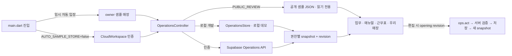

# 설정·화면·저장 연결 관계도

최종 검토: 2026-09-29. 제품 결정은 [project-state.json](project-state.json), 계층과 데이터 경계는 [ARCHITECTURE.md](ARCHITECTURE.md)를 따른다. 이 문서는 **현재 구현**의 화면 진입점, 입력값, 저장 액션, 응답 투영과 소비 화면을 연결한다. 기능을 옮기거나 UI를 바꾸면 같은 변경에서 해당 행과 회귀 테스트를 갱신하고 `npm run check:ui-links`를 실행한다. 시각적 확인만으로 저장을 검증했다고 간주하지 않는다.

## 진입·데이터 모드

| ID | 현재 값과 소유 코드 | 사용자에게 보이는 효과 | 저장/보안 계약 | 검증 |
| --- | --- | --- | --- | --- |
| E01 | `app/lib/main.dart` `AUTO_SAMPLE_STORE=false` 기본값 | 공용 로그인 버튼과 자동 입력 필드. 재방문은 저장된 세션으로 진입 | 임시 UX 결정. 이 플래그는 인증 권한을 부여하지 않음 | Flutter 시작 구성 확인, `operations_test.dart` |
| E02 | `PUBLIC_REVIEW=true`, `scripts/build-site.mjs` `review-data/owner.json` | 명시적 샘플 둘러보기만 시드한 공개 샘플 표시 | `HttpOperationsRepository`가 쓰기 차단. UI 미리보기 변경은 메모리에만 유지 | `manual_workspace_test.dart`, Pages 빌드 |
| E03 | 로컬 `/api/operations`, `.local/operations-demo.json` | 개발 서버 샘플에서 편집 연습 | 서버 revision 검사; 데모 actor는 실제 인증 아님 | `developer/test/*.test.mjs` |
| E04 | `CloudWorkspace`, `developer/supabase_backend.mjs` | 공용 로그인 후 기존 계정 매장 읽기·수정·저장 | JWT 및 매장 멤버십 검증 후 저장. 샘플 진입에서 Supabase 쓰기 없음 | `cloud_workspace_test.dart`, `developer/test/cloud.test.mjs` |
| E05 | `app/lib/ui/components.dart`, `operations_screen.dart` | 업무, 매뉴얼, 근무표, 우리매장 네 목적지 | 탭 변경은 설정 저장 아님. 공통 `AppMotionScope`와 시트 사용 | `operations_test.dart`, `app_motion_test.dart` |
| E06 | `app/web/index.html`, `flutter_bootstrap.js`, `AppStartup`, `AppLoadingScreen` | 웹 엔진 → 기기/인증 초기화 → 매장 읽기 → 실제 메뉴 | 첫 프레임에서 웹 덮개 제거, snapshot 수신 후 메뉴 표시, 실패 시 재시도 | `startup_and_sheet_test.dart`, `startup.test.mjs` |
| U01 | `AppEditorScaffold`, `AppSheetFooter`, `AppSheetPanel` | 매뉴얼/급여/설정/크루 폼의 제목·본문·저장 영역 | 저장 callback·ID·revision은 그대로 전달, snackbar와 키보드가 버튼을 가리지 않음 | 키보드/초안 보호/기존 저장 테스트 |
| U02 | `AppFormSection`, 전역 `InputDecorationTheme`, `AppMotion` | 전체 폼 라벨·간격·모션, 동작 줄이기 | UI 표현만 변경, 저장 또는 권한을 animation에 연결하지 않음 | 가독성 캡처/확대 글자/모션 테스트 |

## 설정 → 화면 → 저장 관계

| ID | 설정/원본 경로 | 입력 UI와 액션 | 저장 후 소비 화면·파생 값 | 검증 기준 |
| --- | --- | --- | --- | --- |
| S01 | `workplace.parts[]` | `workplace_screens.dart` 파트 관리 → `save_workplace_parts` | 업무 전체 파트/개별 파트 필터, 매뉴얼 폴더와 별개, 근무표 요일×파트 열, 크루 파트 선택 | `developer/test/workplace.test.mjs`, 근무표 테스트 |
| S02 | `tappers[].workProfile.partIds[]`, `bands[]` | `workplace_screens.dart` 크루 프로필 → `save_staff_profile`; `team_screen.dart` 크루 편집 → `save_tapper` | 파트별 업무 수행 가능 여부, 근무표 배정 선택지, 크루 카드. 직책/권한과 분리 | `workplace.test.mjs`, `operations.test.mjs` |
| S03 | `workplace.days[weekday].bands[]` | 우리매장 영업시간대 → `save_workplace_day` | `rosterTemplates[]` 생성, 근무표 요일·파트별 기본 슬롯. 전체 영업시간 `store.profile.hours`는 호환 기본값 | `workplace.test.mjs`, `calendar_test.dart` |
| S04 | `rosterOverrides[]` | 근무표 슬롯 클릭 → `save_roster_slot`, `reset_roster_slot` | 선택 날짜의 이름·시작/끝·숨김만 덮어쓰기; 고정 왼쪽 시간축에 반영 | `workplace.test.mjs`, `calendar_test.dart` |
| S05 | `staffShifts[]`, `shiftPatterns[]` | 근무표 배정·반복 → `save_staff_shift`, `save_shift_pattern` | 주간/월간 근무표, 필요 슬롯 충족률, 인건비 계획. 출퇴근 기록과 구별 | `workplace.test.mjs`, `calendar_test.dart` |
| S06 | `store.profile.orderSystem.enabled` | 우리매장 주문처리 시스템 토글 → `save_order_system` | 서버 `orderBoardEnabled`; ON일 때만 업무 주문처리 보드/주문 카드 표시. 주문 기록 유지 | `workplace.test.mjs`, 업무 화면 테스트 |
| S07 | `workplace.restrictions[role]` | 우리매장 직책 권한 → `save_workplace_permissions` | 업무 편집은 서버 `canEditTasks`와 UI를 연결; 재고/직원 등의 서버 액션 권한 검사 | `workplace.test.mjs` |
| S08 | `store.profile` 기본/영업/POS/배달/인력 섹션 | 매장 프로필 → `save_store_profile` | 우리매장 카드, 근무표 기본 시간, 주문·배달 정보. POS 연결 상태는 별도 실제 연동 아님 | `workspace_settings.test.mjs` |
| S09 | `payrollSettings` 및 이력 | 급여·정산 설정 → `save_payroll_settings` | 사장님 전용 인건비 계산·지급 주기/시작일/반올림/규모/주휴. 기존 근무/지급 기록을 역수정하지 않음 | `cloud.test.mjs`, `payroll_settings_test.dart` |
| S10 | `tappers[]`, `attendance[]`, `payAdjustments[]`, `payments[]` | 크루 정보/출퇴근/급여 기록 → `save_tapper`, `clock_in`, `break_start`, `break_end`, `clock_out`, `adjust_attendance`, `add_pay_adjustment`, `record_payment` | 근무표·크루·사장님 인건비 화면. 개인 급여는 역할별 투영으로 보호 | `labor.test.mjs`, `labor_panel_test.dart` |
| S11 | `checklistFolders[]`, `taskTemplates[]` | 업무/매뉴얼 카드 길게 누르기 → `DirectEditFrame` → `edit_work_node` / `edit_manual_node` | 업무 양식·매뉴얼 디렉토리. 미착수 실행은 재생성 가능, 하나라도 완료한 실행은 보존 | `checklist_test.dart`, `checklists.test.mjs` |
| S12 | `taskTemplates[id].steps[id]` | 매뉴얼 > Task > **매뉴얼 편집** → `ManualTaskEditor(templateId, sourceStepId)` → `save_checklists` | 해당 Task의 제목·본문·팁·링크·태그만 갱신, `manualSearch` 재투영. 다른 Task와 기존 진행 기록 불변 | `manual_workspace_test.dart` 단일 Task/형제 불변/POST 검사 |
| S13 | `taskTemplates[id].steps[id].settings.estimatedMinutes` 및 TAP 설정 | 매뉴얼 > Task > Task 설정 → `TapSettingsScreen(initialTemplateId, initialStepId)` → `save_tap_settings` | 선택 Task의 수량·파트/장소 덮어쓰기·시간만 표시. 매뉴얼 시간·TAP 합계·다음 업무 설정 반영; 오늘 실행 규칙은 보존 | `workspace_settings.test.mjs`, 매뉴얼 테스트 |
| S14 | 매뉴얼 폴더/TAP/Task 순서 | 매뉴얼 항목 길게 누르기 → 드래그/이동 선택 → `move_manual_node` | 디렉토리·검색의 위치. 선택한 매뉴얼 본문은 바뀌지 않음 | `manual_workspace_test.dart` 드래그/충돌 |
| S15 | `tasks[].steps[]` 실행 스냅샷 | 업무 카드/단계 상세 → `complete_step`, `reopen_step`, `complete_task`, `save_step_manual` | 오늘 업무 완료 상태·기록; 정의 매뉴얼 수정과 별개. 서버가 완료 규칙 검사 | `operations_test.dart`, `checklists.test.mjs` |
| S16 | `items[]`, `orders[]`, `preparedItems[]` | 재고/발주/입고/준비품 → `save_inventory_item`, `check_stock`, `place_order`, `receive_order`, `save_prepared_item`, `count_prepared_item` | 우리매장 재고, 부족 알림, 준비품·업무 카드. 주문만으로 재고 증가 없음 | `operations.test.mjs`, `prepared_items.test.mjs` |
| S17 | `menus[]`, 주문 양식 | 메뉴 편집 → `save_menu` | 우리매장 메뉴, 메뉴 연계 매뉴얼·주문 업무 | `catalog.test.mjs`, `menu_layout_test.dart` |
| S18 | `layout`, `zones[]` | 매장 배치 편집 → `save_layout` | 우리매장 공간/동선, 재고·업무 위치 참조. 삭제·겹침은 서버 검사 | `layout.test.mjs`, `floor_plan_test.dart` |
| S19 | `hiringDrafts[]` | 근무표 > 채용 초안 → `save_hiring_draft`, `archive_hiring_draft` | 사장/매니저 초안 목록. 외부 공고 발행 없음 | `workspace_settings.test.mjs` |
| S20 | `laborReviews[]` | 인건비 검토 → `save_labor_review` | 사장님 인건비 화면의 검토 상태; 급여 지급 실행과 구별 | `labor.test.mjs` |
| S21 | 기기 내 `WorkController` 학습 진도 | 근무표 > 교육/첫 근무 | 사람별 연습·버디 확인 분리. 매장 공용 설정이나 급여 기록 아님 | `work_controller_test.dart` |

## 화면별 상단과 편집 범위

| 화면 | 상단 동작 | 본문 동작과 다음 화면 |
| --- | --- | --- |
| 업무 / TAP 보드 | 보드 편집만 제공. 전체 TAP 설정 버튼 제거 | 파트 필터 → TAP 카드 → 해당 TAP의 Task 목록 |
| 선택 TAP / Task 목록 | TAP 목록으로, 선택 TAP 이름, TAP 편집 | 제목 클릭은 권한이 있는 미완료 Task 직접 입력·커서. 별도 매뉴얼 버튼은 해당 Task의 방법 열기. 마지막 Task 바로 아래 Task 추가 |
| TAP 편집 | TAP 설정 제목과 선택한 TAP 이름 고정 | 해당 TAP의 반복·일괄완료·순서와 하위 Task 규칙. 다른 TAP 선택기 없음 |
| Task 매뉴얼 상세 | 소속 TAP/Task 경로, 매뉴얼 편집, Task 설정 | 매뉴얼 편집은 정확한 원본 Task. Task 설정은 그 Task의 규칙만 표시; TAP 전체 규칙은 표시하지 않음 |
| 근무표 | 날짜·보기 전환·크루/배정 | 시간 슬롯 및 크루 편집은 별도 시트 |
| 우리매장 상세 | 상세 제목 1회와 닫기 | 재고 상세의 본문 반복 제목 제거. 파트·영업시간·권한·주문·정산은 해당 설정 시트 |

완료·매뉴얼 열기·드래그는 별도 터치 영역이다. Task 목록의 자동 오른쪽 드래그 손잡이는 끄고 왼쪽에 명시적으로 배치한다. 제목은 최대 3줄, 상단 완료/체험 표시는 줄바꿈한다. 메뉴 공통 제목·검색 위치는 유지한다.

| ID | 설정/원본 경로 | 입력 UI와 액션 | 저장 후 소비 화면·파생 값 | 검증 기준 |
| --- | --- | --- | --- | --- |
| S22 | `tasks[id].steps[id].title/manual`, 연결된 `taskTemplates[].steps[]` | 편집 모드에서 Task 제목 클릭 → `TaskStepEditor` → `save_task_step` | 선택한 오늘 미완료 Task와 원본 양식/매뉴얼 검색 갱신. 완료된 형제·다른 실행·과거 기록 보존. 원본 없는 주문 Task는 해당 실행만 수정 | `task_inline_edit_test.dart`, `checklists.test.mjs` |
| S23 | 동일 TAP의 `steps[]` 끝 | 마지막 Task 아래 Task 추가 → 제목/매뉴얼 입력 → `save_task_step(stepId: null)` | 서버가 ID 생성, 오늘 실행과 원본 양식 끝에 추가. 완료된 TAP/입고 반영 준비 TAP 금지, 최대 30개 | 동일 테스트, 공개 체험 POST 0건 |
| S24 | 서버 `canEditTasks` | 보드/TAP/Task/매뉴얼 편집과 순서 UI 표시 | 사장 또는 업무 권한이 활성화된 매니저만 편집. 서버도 `tasks` 제한으로 저장·순서변경 검증 | 매니저 제한·크루 거절·완료 보호 서버/위젯 테스트 |

## 설정 항목별 상속·적용 시점

| 설정 화면 | 각 입력 항목 | 관계·우선순위·적용 범위 |
| --- | --- | --- |
| 파트 관리 | 이름, 순서, 숨김 | 업무 필터·크루 담당·근무표 슬롯의 같은 part ID. 숨김은 기록 삭제 아님. 매뉴얼 폴더와 독립 |
| 크루 파트·시간대 | 담당 파트 복수 선택, 선호 시간대 | **미선택 시 전체 파트 가능**을 화면에 명시. 시간대는 선호이며 근무 배정/권한을 자동 생성하지 않음 |
| 영업시간대 | 요일, 시작·종료, 필요 인원 | 요일별 값 → 매장 기본 영업시간 순으로 슬롯 생성. 날짜 슬롯 덮어쓰기는 해당 날짜에 우선하며 배정과 별도 |
| 직책 권한 | 업무 편집, 완료, 근무표, 재고, 발주 | `workplace.restrictions`로 기존 권한을 제한. 파트 선택으로 권한 상승 불가. 업무 편집/정렬 UI는 `canEditTasks` 소비 |
| 주문처리 | 보드 사용 ON/OFF | 업무 주문 보드 가시성만 변경, 주문 기록 보존. POS 제품/배달 사용 설정은 외부 인증과 별개 |
| TAP 설정 | 유형, 다음 업무 사용, 반복 방식/요일, 일괄완료 허용, 순서대로 수행 | 다음 생성 업무의 기본 규칙. 오늘 스냅샷의 규칙을 바꾸지 않음 |
| Task 설정 | 완료 방식, 수량 단위/목표/소수 자리, 담당 파트, 장소, 예상 시간 | 파트·장소 미지정은 TAP 상속. 시간 미설정은 0분이 아닌 미확인. 시간은 매뉴얼 합계에 반영, 실행 규칙은 다음 업무부터 |
| Task 내용 직접 편집 | 제목, 방법과 완료 기준 | 사용자 확정: 오늘 선택한 미완료 Task와 기본 양식 함께 반영. 완료 증빙 보존. 취소는 저장하지 않음 |
| 매뉴얼 편집 | 제목, 본문, 팁, 연관어, 사진·영상·출처 HTTPS 링크 | 원본 Task 매뉴얼·검색에 반영. 이미 착수한 실행은 유지. 실행 중 매뉴얼 바로 수정은 별도 `save_step_manual` 경로 |
| 매장 프로필 | 기본정보, 기본 영업시간, POS, 배달, 인력 정보 | 기본시간은 요일 설정이 없을 때 호환값. POS/배달 입력은 사용 정보·추천을 위한 값이며 연결 상태를 만들지 않음 |
| 정산 설정 | 지급 주기, 월/주 시작일, 반올림, 사업장 규모, 주휴 포함 | 매장 공통 예상 계산. 크루 시급·출퇴근·실제 지급 기록과 분리. 이전 정책 이력 유지 |
| 재고 품목 | 단위, 공급사, 가격, 최소/기본발주량, 발주 후 확인일, 위치 | 발주 후 N일 1회 점검. 입고에서만 재고 증가. 위치는 배치의 안정적 ID |
| 매장 배치 | 격자 크기, 위치/크기/종류, 테이블 좌석 | 재고·업무 장소와 연결. 좌석은 정원이며 점유 현황 아님. 참조된 장소 삭제와 겹침은 서버 검증 |

### 이번 질의 결과와 남은 제안

2026-09-29 사용자 답변으로 S22/S23의 오늘 미완료 업무+원본 양식 동시 반영, S02의 미선택=전체 파트 가능을 확정했다. `save_task_step`은 편집 시작 시 actor/revision을 고정하며 충돌·저장 실패 시 초안을 유지한다. 공개 체험은 메모리에만 반영한다.

`proposed`: 재고·근무표 등 나머지 기능도 직책별 실제 capability를 응답에 통일하고, 각 입력 바로 옆에 적용 시점/상속 표시를 확대한다. 이번 업무 편집 capability와 달리 전체 capability 전환은 아직 완료된 것으로 표시하지 않는다. 사진 제출·관리자 승인·실제 타이머·외부 POS는 기존 후속 과제다.

## 매뉴얼 링크 계약

`developer/operations.mjs`의 `manualSearchIndex()`는 편집 가능한 양식 Task마다 `templateId`와 `sourceStepId`를 준다. `ManualWorkspace`는 두 ID가 모두 있을 때만 **매뉴얼 편집**을 표시한다. 이 버튼은 `ManualTaskEditor`로만 연결한다. 폴더 ID로 `ChecklistEditor`를 여는 경로를 이 버튼에 다시 연결하면 회귀다. 편집기는 열 때의 actor/revision과 두 ID를 고정하고, 저장할 때 지정한 step만 변경한 양식 목록을 `save_checklists`에 보낸다. 다른 사람이 먼저 저장했다면 409를 표시하고 입력 초안을 유지한다. 공개 샘플에서는 동일 step과 검색 결과를 메모리에서 갱신하고 POST를 보내지 않는다. 시작한 업무의 복제된 단계는 수정하지 않는다.

## 변경 시 검증 순서

1. 설정 키나 버튼의 목적지가 바뀌면 이 표의 **원본 → 입력 → 액션 → 소비**를 같은 커밋에서 갱신한다. 사용자 승인 없는 제안을 현재값으로 올리지 않는다.
2. `npm run check:ui-links`로 주요 파일·액션·잘못된 매뉴얼 경로 재등장을 검사한다. 이 검사는 관계표의 구조 검사이며 실행 결과 검증을 대체하지 않는다.
3. 영향을 받은 화면 위젯 테스트에서 버튼을 실제로 누르고, 저장 요청의 액션·ID·revision 및 형제 데이터 불변을 확인한다. 공개 샘플은 POST가 0건인지 확인한다.
4. 저장 규칙 변경 시 `npm run test:console`로 서버 권한/투영/충돌을, Flutter 변경 시 `flutter analyze`와 관련 테스트를 실행한다. 배포 후 샘플 진입과 대표 연결을 확인한다.

현재 한계: 공개 샘플의 인메모리 편집은 새로고침 후 사라진다. 실제 저장은 임시 자동 진입을 해제하고 인증한 매장에서만 가능하다. 외부 POS·공급사 연동, 채용 공고 게시, 실제 급여 지급은 구현된 저장 액션으로 해석하지 않는다.

## 공용 로그인·저장 변경

`PublicLoginFields` → `public-login` → Auth 세션 → `CloudWorkspace` → 기존 매장의 설정 읽기/저장. 고정 아이디와 마스킹 필드를 제공하되 실제 비밀번호는 배포하지 않는다. 서버 지정 이메일과 활성화 플래그만 허용한다. `public_login.test.mjs`와 `cloud_workspace_test.dart`로 확인한다. SSO는 앱 등록 시 활성화한다.

저장소·변경 감지 계약: [DB와 성능](DATABASE_AND_PERFORMANCE.md). 급여 검토·추천 TAP·채용 초안도 열 때의 revision과 actor를 고정한다.

## 길게 누르는 공통 편집 · 2026-09-29

| ID | 원본 → 컨트롤 → 액션 | 저장 후 소비 | 검증 |
| --- | --- | --- | --- |
| U03 | 업무·매뉴얼·근무표 → `DirectEditFrame` 길게 누르기/우클릭/접근성 동작 → 흔들림·초록 테두리·편집 완료 | 수정 권한이 있을 때만 진입. 동작 줄이기와 TickerMode에서는 흔들림 중지 | `direct_edit_test.dart` |
| S25 | 오늘 TAP/Task → 이름·휴지통 → `edit_work_node` | 오늘 미완료 실행과 연결된 양식을 함께 변경. 완료 기록/재고 반영/실행 주문 보호 | `direct_edit.test.mjs` |
| S26 | 매뉴얼 그룹/TAP/Task → 이름·휴지통·추가 → `edit_manual_node` | 기본 양식만 변경. 진행 기록은 유지되어 ‘오늘 업무’ 매뉴얼로 보일 수 있음. 마지막 Task·기본/사용중 그룹 삭제 금지 | `direct_edit.test.mjs` |
| S27 | 근무표 카드 → 날짜·시간 드래그/이름/휴지통 → `save_staff_shift`, `save_roster_slot`, `delete_roster_slot` | 배정 근무의 label 또는 날짜별 슬롯 name/hidden; 사람 이름·출퇴근 원본 불변. 날짜별 삭제는 영업 기본시간을 변경하지 않음 | `direct_edit.test.mjs`, `direct_edit_test.dart`, `calendar_test.dart` |

업무의 보드 편집 버튼과 매뉴얼 구조 편집 버튼을 제거했다. TAP 규칙·시간/크루 배정·매뉴얼 본문 편집은 카드에서 필요한 세부 입력으로 유지한다. 카드의 위치 이동 메뉴는 드래그 대안이다. 편집 중 휴지통은 확인 후 실행하며 서버 revision/직책 검증을 거친다. 공개 읽기 전용 샘플의 구조 추가·삭제·이름 변경은 저장하지 않고 로그인 안내를 표시한다. 기존 샘플의 Task 직접 입력/드래그 체험은 메모리에만 유지한다.
